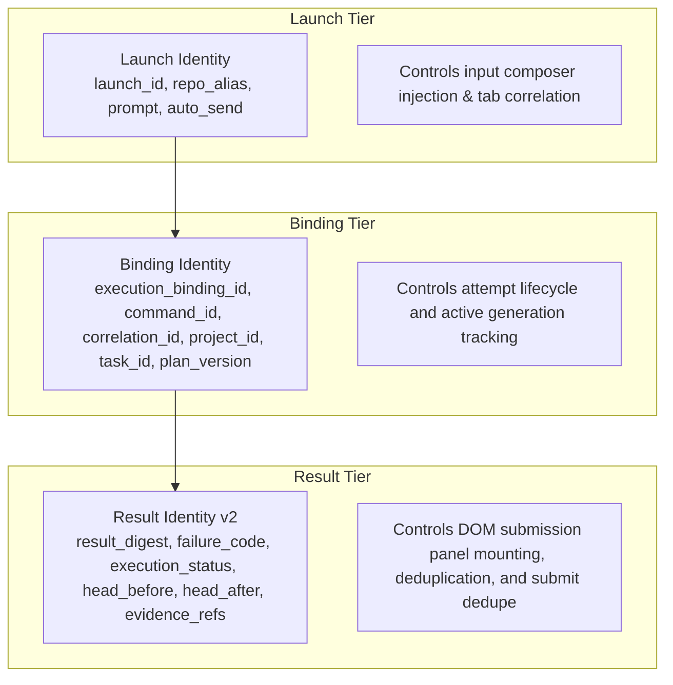

# BDB vNext — NX-005 Browser Semantic Identity & Dedupe Contract

## 1. Context and Problem Statement

Prior to NX-005, the Browser extension (`browser_extension_vnext/content_adapter.js`) keyed DOM submission panels and automatic result submissions using only structural binding fields:
```javascript
// Legacy keying (OMITTED result identity / result digest / failure code):
const PROJECT_EXECUTION_IDENTITY_FIELDS = [
  "schema", "project_id", "plan_version", "task_id", "execution_binding_id", "correlation_id", "command_id"
];
```

This structural keying caused severe semantic collisions:
1. **Result Collision on Same Binding**: If an attempt produced multiple distinct results (e.g. initial `FAIL` with `failure_code="COMPILATION_ERROR"` followed by a second result with `failure_code="TEST_TIMEOUT"`, or `FAIL` vs `PASS`), both results collapsed to the exact same `panelKey`.
2. **Silent Result Suppression**: In `autoSubmitProjectExecution`, `projectAutoSubmissions.has(panelKey)` caused distinct subsequent results to be silently dropped as duplicates.
3. **DOM Panel Ambiguity**: `reusePanel` matched and reused the earlier panel, preventing distinct visual representation and inspection in the browser.

---

## 2. The Three-Tier Browser Identity Architecture

Under NX-005, the Browser extension strictly separates the three distinct operational identity tiers:



### Tier 1: Launch Identity
- **Fields**: `launch_id`, `repo_alias`, `prompt`, `auto_send`, `created_at`, `expires_at`.
- **Scope**: Ephemeral transport intent passed from GUI or poller into ChatGPT composer.
- **Authority**: Does not define or modify Project Memory or attempt execution state.

### Tier 2: Binding Identity
- **Fields**: `(project_id, plan_version, task_id, execution_binding_id, correlation_id, command_id)`.
- **Scope**: Allocated attempt generation.
- **Authority**: Governed by NX-003 `binding_lifecycle.py` and Project Memory state machine.

### Tier 3: Result Identity
- **Fields**: `(identity_version: "v2", failure_code, execution_status, validation_status, promotion_status, head_before, head_after, result_summary, canonically sorted evidence_refs, criteria, canonical_refs)`.
- **Scope**: Distinct execution outcome artifact.
- **Authority**: Governed by NX-004 `result_identity.py` and cryptographically verifiable `result_digest`.

---

## 3. Browser Canonical Semantic Key Construction

In `browser_extension_vnext/content_adapter.js`, `semanticSubmissionKey` incorporates the complete result identity:

```javascript
const PROJECT_EXECUTION_RESULT_FIELDS = [
  "schema", "project_id", "plan_version", "task_id", "execution_binding_id", "correlation_id", "command_id",
  "repo_alias", "head_before", "head_after", "execution_status", "validation_status", "promotion_status", "failure_code", "result_summary"
];

function canonicalSortedEvidence(refs) {
  if (!Array.isArray(refs)) return [];
  return refs.map(String).sort();
}

function canonicalCriteria(criteria) {
  if (!Array.isArray(criteria)) return [];
  return criteria.map((item) => (item && typeof item === "object" ? { ...item } : {}));
}

function semanticSubmissionKey(kind, value) {
  if (kind === PROJECT_EXECUTION_PANEL_KIND) {
    const fields = PROJECT_EXECUTION_RESULT_FIELDS.map((field) => [field, value[field] !== undefined ? value[field] : null]);
    fields.push(["evidence_refs", canonicalSortedEvidence(value.evidence_refs)]);
    fields.push(["criteria", canonicalCriteria(value.criteria)]);
    fields.push(["canonical_refs", value.canonical_refs && typeof value.canonical_refs === "object" ? value.canonical_refs : {}]);
    return JSON.stringify(["bdb-project-execution-result-v2", fields]);
  }
  return JSON.stringify([value.schema, value.submission_key]);
}
```

---

## 4. Deduplication & Reload Invariants

| Invariant | Description | Verification |
|:---|:---|:---|
| **Different Results / Same Binding** | Two distinct failure codes on the same binding produce distinct semantic keys and separate DOM panels. | `test_different_results_same_binding_mount_distinct_panels` |
| **Exact Duplicate Suppression** | Appending identical result blocks or repeating DOM sweeps reuses the canonical panel without creating duplicates. | `test_exact_duplicate_result_suppressed` |
| **Reload Resend Prevention** | An already accepted result found on page reload queries canonical status and suppresses duplicate submissions. | `test_reload_resend_prevention` |
| **Legacy Storage Fail-Closed** | Corrupted or malformed storage entries are filtered out deterministically without causing crashes or false dedupe. | `test_legacy_storage_compatibility_and_fail_closed` |
| **Panel Removal Recovery** | If a panel is removed by DOM mutations, it is recreated on the next sweep with preserved identity. | `test_panel_dom_lifecycle_and_removal_recovery` |
