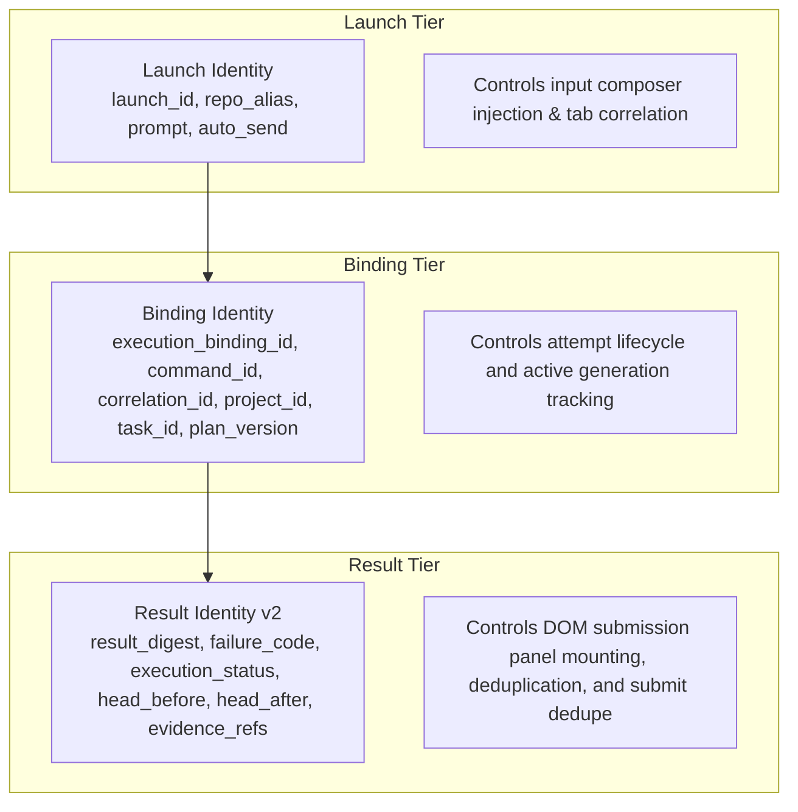

# BDB vNext — NX-005 Browser Semantic Identity & Dedupe Contract

## 1. Context and Problem Statement

Prior to NX-005, the Browser extension (`browser_extension_vnext/content_adapter.js`) keyed DOM submission panels and automatic result submissions using only structural binding fields:
```javascript
// Legacy keying (OMITTED result identity / result digest / failure code):
const PROJECT_EXECUTION_IDENTITY_FIELDS = [
  "schema", "project_id", "plan_version", "task_id", "execution_binding_id", "correlation_id", "command_id"
];
```

This structural keying caused severe semantic collisions:
1. **Result Collision on Same Binding**: If an attempt produced multiple distinct results (e.g. initial `FAIL` with `failure_code="COMPILATION_ERROR"` followed by a second result with `failure_code="TEST_TIMEOUT"`, or `FAIL` vs `PASS`), both results collapsed to the exact same `panelKey`.
2. **Silent Result Suppression**: In `autoSubmitProjectExecution`, `projectAutoSubmissions.has(panelKey)` caused distinct subsequent results to be silently dropped as duplicates.
3. **DOM Panel Ambiguity**: `reusePanel` matched and reused the earlier panel, preventing distinct visual representation and inspection in the browser.

---

## 2. The Three-Tier Browser Identity Architecture

Under NX-005, the Browser extension strictly separates the three distinct operational identity tiers:



### Tier 1: Launch Identity
- **Fields**: `launch_id`, `repo_alias`, `prompt`, `auto_send`, `created_at`, `expires_at`.
- **Scope**: Ephemeral transport intent passed from GUI or poller into ChatGPT composer.
- **Authority**: Does not define or modify Project Memory or attempt execution state.

### Tier 2: Binding Identity
- **Fields**: `(project_id, plan_version, task_id, execution_binding_id, correlation_id, command_id)`.
- **Scope**: Allocated attempt generation.
- **Authority**: Governed by NX-003 `binding_lifecycle.py` and Project Memory state machine.

### Tier 3: Result Identity (v2 Canonical)
- **Fields**: `(identity_version: "v2", failure_code, execution_status, validation_status, promotion_status, head_before, head_after, result_summary, canonically sorted evidence_refs, criteria, canonical_refs)`.
- **Scope**: Distinct execution outcome artifact.
- **Authority**: Governed by NX-004 `result_identity.py` and cryptographically verifiable `result_digest`.
- **Invariant**: `BROWSER_REDEFINES_CANONICAL_RESULT_DIGEST = FALSE`. Browser does NOT create a divergent identity definition; it consumes the canonical Result Identity v2 contract.

---

## 3. Canonical Result Identity Usage in Browser

In `browser_extension_vnext/content_adapter.js`, `browserResultIdentityV2` replicates the exact canonical dictionary structure of NX-004 `result_identity_v2`:

```javascript
function browserResultIdentityV2(value, binding = null) {
  const b = binding || value;
  return {
    canonical_refs: value.canonical_refs && typeof value.canonical_refs === "object" ? value.canonical_refs : {},
    command_id: b.command_id || null,
    correlation_id: b.correlation_id || null,
    criteria: canonicalCriteria(value.criteria),
    evidence_refs: canonicalSortedEvidence(value.evidence_refs),
    execution_binding_id: b.execution_binding_id || null,
    execution_status: value.execution_status || null,
    failure_code: value.failure_code !== undefined ? value.failure_code : null,
    head_after: value.head_after !== undefined ? value.head_after : null,
    head_before: value.head_before !== undefined ? value.head_before : null,
    identity_version: "v2",
    plan_version: b.plan_version !== undefined && b.plan_version !== null ? String(b.plan_version) : null,
    project_id: b.project_id || null,
    promotion_status: value.promotion_status || null,
    repo_alias: b.repo_alias || null,
    result_plan_version: value.plan_version !== undefined && value.plan_version !== null ? String(value.plan_version) : null,
    result_project_id: value.project_id || null,
    result_task_id: value.task_id || null,
    summary: value.result_summary !== undefined && value.result_summary !== null ? String(value.result_summary) : "",
    task_id: b.task_id || null,
    validation_status: value.validation_status || null,
  };
}

function semanticSubmissionKey(kind, value) {
  if (kind === PROJECT_EXECUTION_PANEL_KIND) {
    if (typeof value.result_digest === "string" && value.result_digest.startsWith("sha256:")) {
      return JSON.stringify(["bdb-project-execution-result-v2", value.result_digest]);
    }
    return JSON.stringify(["bdb-project-execution-result-v2", browserResultIdentityV2(value)]);
  }
  return JSON.stringify([value.schema, value.submission_key]);
}
```

---

## 4. Cross-Consumer Golden Vector Parity (NX-004 ↔ NX-005)

Deterministic verification against the complete golden vector suite (`bdb_vnext/nx004_golden_result_vectors.json`):

| Vector ID | Description | Python NX-004 Digest | Browser NX-005 Digest | Parity |
|:---|:---|:---|:---|:---:|
| `GV-01-STANDARD-PASS` | Standard PASS result v2 | `sha256:1617e9e742a4412c9b49c949a2b7e127b23fba44a39658a7cfb370abc712da55` | `sha256:1617e9e742a4412c9b49c949a2b7e127b23fba44a39658a7cfb370abc712da55` | **MATCH (100%)** |
| `GV-02-FORMATTING-PERMUTATION` | Key permutation / reordering | `sha256:1617e9e742a4412c9b49c949a2b7e127b23fba44a39658a7cfb370abc712da55` | `sha256:1617e9e742a4412c9b49c949a2b7e127b23fba44a39658a7cfb370abc712da55` | **MATCH (100%)** |
| `GV-03-FAIL-COMPILATION` | `failure_code=COMPILATION_ERROR` | `sha256:cf346cc7d3b5b6ab4d9937a338fda5d8d69874ca4a90637754d72d8e1da91123` | `sha256:cf346cc7d3b5b6ab4d9937a338fda5d8d69874ca4a90637754d72d8e1da91123` | **MATCH (100%)** |
| `GV-04-FAIL-TIMEOUT` | `failure_code=TEST_TIMEOUT` | `sha256:23240ddd7f33db37899279a2e6974c27794ab58a8edefdb05e802bedce772d48` | `sha256:23240ddd7f33db37899279a2e6974c27794ab58a8edefdb05e802bedce772d48` | **MATCH (100%)** |
| `GV-05-UNICODE-CONTENT` | Unicode Polish diacritics UTF-8 | `sha256:0d8306f83b1eaa929762c13ec1595ff8020945074f2fede8809ac80ce62b0269` | `sha256:0d8306f83b1eaa929762c13ec1595ff8020945074f2fede8809ac80ce62b0269` | **MATCH (100%)** |
| `GV-06-HISTORICAL-V1-FIXTURE` | Historical v1 dual-read fixture | `sha256:e559a00a6e7012f4f6432259723c25f43b6ff63ce7ce0917183a185bde60ed48` | `sha256:e559a00a6e7012f4f6432259723c25f43b6ff63ce7ce0917183a185bde60ed48` | **MATCH (100%)** |

---

## 5. Legacy Storage Migration Mapping

| Legacy Storage State | Migration Decision | Resulting State in Browser |
|:---|:---|:---|
| String or primitive value | **FAIL-CLOSED (DROP)** | Record ignored / omitted from sanitized bindings dictionary |
| `null` or array record | **FAIL-CLOSED (DROP)** | Record ignored / omitted |
| Missing `launch_id` field | **FAIL-CLOSED (DROP)** | Record dropped |
| Empty / whitespace `launch_id` | **FAIL-CLOSED (DROP)** | Record dropped |
| Valid legacy launch record | **MIGRATE & SANITIZE** | Retained with canonical schema `bdb-vnext-project-launch-binding-v1` |
| Old legacy submission key | **NAMESPACE ISOLATED** | Cannot collide with or false-dedupe new `bdb-project-execution-result-v2` |
| Accepted result on page reload | **RELOAD RESEND SUPPRESSED** | Status queried via Native host; duplicate send suppressed |
