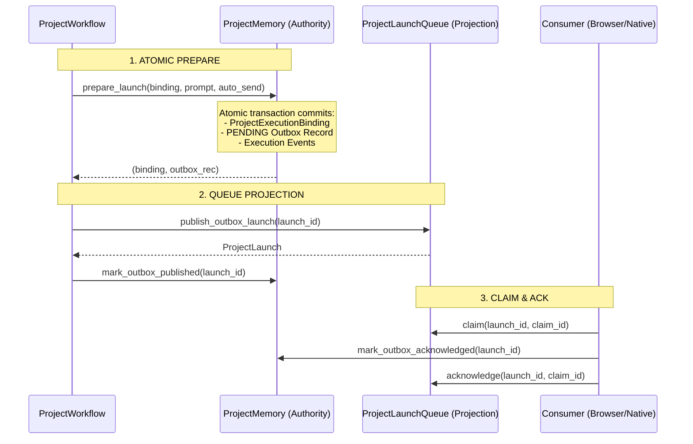

# BDB vNext — NX-006 Canonical Launch Outbox Ordering Contract

## 1. Context and Problem Statement

Prior to NX-006, prompt launches were enqueued into `project-launch-queue.json` directly inside `_queue_execution_prompt` before the corresponding `ProjectExecutionBinding` was persisted to `ProjectMemoryStore`:
```
[PREVIOUS FLOW]
1. new_binding (in-memory)
2. queue.enqueue(...) -> writes project-launch-queue.json
3. execution.persist_binding(...) -> writes ProjectMemory
4. mark_launch_handoff_pending (separate transaction if auto_send)
```

This non-atomic flow created serious crash vulnerability windows:
1. **Crash between step 2 and 3**: Queue contained a launch pointing to an unpersisted `execution_binding_id` (orphan queue entry).
2. **Crash between step 3 and 4**: Binding existed, but handoff status was unrecorded.
3. **Queue as de-facto Authority**: Because no canonical outbox record existed in `ProjectMemory`, the queue file acted as the primary authority rather than a rebuildable projection.

---

## 2. Canonical Outbox Architecture

Under NX-006, the launch outbox is stored directly in canonical Project Memory (`execution["launch_outbox"]`) and is atomically prepared with the execution binding in a single transaction before any queue projection.



---

## 3. Outbox Record Contract

Schema: `bdb-project-launch-outbox-v1`

### Lifecycle States
- `PENDING`: Durably prepared in `ProjectMemory` together with `ProjectExecutionBinding`. Not yet projected or projection unconfirmed.
- `PUBLISHED`: Projected downstream into `project-launch-queue.json`.
- `ACKNOWLEDGED`: Acknowledged by the consumer transport (Browser / Native Host). Terminal outbox state.

### Fields
- `schema`: `"bdb-project-launch-outbox-v1"`
- `launch_id`: UUID string
- `execution_binding_id`: Binding identity
- `project_id`: Project identity
- `plan_version`: String version
- `task_id`: Task identity
- `correlation_id`: Correlation identity
- `command_id`: Command identity
- `repo_alias`: Repository alias
- `prompt`: Launch prompt text
- `auto_send`: Boolean flag
- `status`: `"PENDING" | "PUBLISHED" | "ACKNOWLEDGED"`
- `created_at`: UTC timestamp (ISO 8601)
- `updated_at`: UTC timestamp (ISO 8601)
- `expires_at`: UTC timestamp (ISO 8601)

---

## 4. Invariants and Rules

1. `BINDING_AND_PENDING_OUTBOX_ATOMIC = TRUE`: Binding and PENDING outbox are always committed in the exact same `ProjectMemoryStore` transaction.
2. `QUEUE_WRITE_BEFORE_CANONICAL_PREPARE = FALSE`: No queue write is ever performed before the canonical prepare transaction commits.
3. `QUEUE_IS_REBUILDABLE_PROJECTION = TRUE`: `project-launch-queue.json` is strictly a downstream projection and can be fully rebuilt from `launch_outbox`.
4. `ACK_IDEMPOTENT = TRUE`: Repeated acknowledgments on an already acknowledged outbox record succeed without side effects.
5. `ORPHAN_HANDLING_DETERMINISTIC = TRUE`: Any queue entry without corresponding canonical outbox authority is purged fail-closed by the reconciler.
