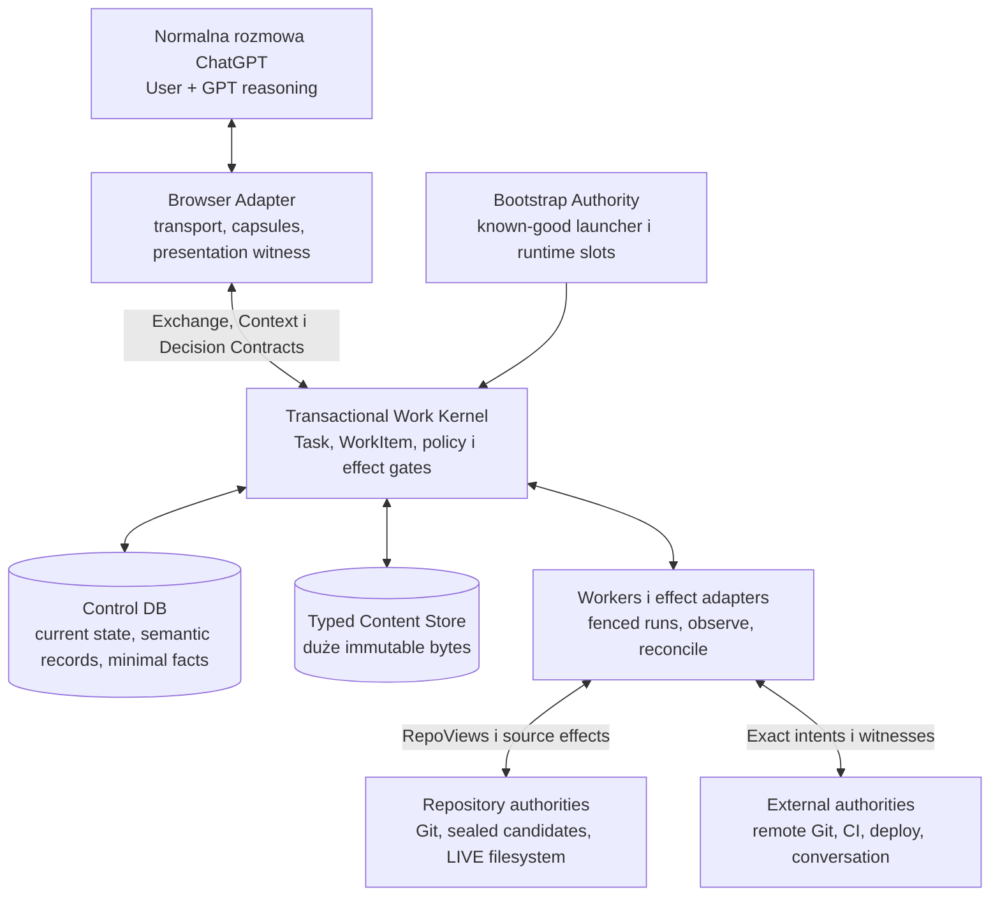

# BDB — Etap 3

## Adversarial Architecture Review, Radical Simplification i Architecture Freeze v1

**Data:** 9 sierpnia 2026  
**Zakres:** falsyfikacja architektury Etapu 2, uproszczenie targetu i decyzja o zamrożeniu  
**Werdykt:** `KEEP WITH MATERIAL REVISIONS`  
**Podstawa kodowa AS-IS:** `03c44734da8829ff42c9c4859ac7b6afe2708a2a`, gałąź `main`, clean przy odczycie

Raport powstał na podstawie pełnego Etapu 1, pełnego Etapu 2, całego `koncepcje.txt`, instrukcji `BDB_INSTRUKCJA_GICLEEAPP_V10_2026-08-08.txt`, planu `plan_rozwoju_i_optymalizacji_BDB_v2.0_2026-08-08(1).md` oraz reprezentatywnych ścieżek kodu AS-IS. Korpus koncepcji traktuję jako zbiór hipotez, nie wymagania. Nie projektuję pod łatwość migracji.

Najważniejsze kotwice AS-IS użyte do falsyfikacji:

| Obserwacja | Kotwica w snapshotcie |
|---|---|
| Liniowy command lifecycle miesza execution, effect, result i acknowledgement | `bdb_bridge/models.py` — `CommandState`, `COMMAND_TRANSITIONS` |
| UI już potrzebuje wielu osi statusu | `bdb-operation-status-v1` w testach/projekcjach `tests/test_gui_schema_contract.py`, `tests/test_operator_session_projection.py` |
| Browser utrzymuje durable mutation guard i może wejść w `mutation_submission_state_unknown` | `browser_extension/background_task_controller.js` — `bdbMutationGuardsV1`, `bdbTaskMutationGuardResume` |
| Submission nonce może być generowany dopiero podczas kompozycji native action | `bdb_bridge/native_actions.py` — obsługa `client_submission_nonce` |
| Native receipt/submission reservations mają osobny JSON store i bounded eviction | `bdb_bridge/native_request_receipts.py` — `NativeRequestReceiptStore`, `_MAX_REQUEST_RECEIPTS` |
| Journal ma current tables, append-only events, plans, effects i outbox | `bdb_bridge/migrations.py` |
| Promoter prowadzi własny persistent `repository_event_seq` | `bdb_bridge/workspace_promoter.py` — `_repository_event_seq` |
| Canonical repository projection interpretuje drugi event sequence w journalu | `bdb_bridge/journal.py` — canonical repository projection |

---

# 1. Executive Verdict

## Werdykt: `KEEP WITH MATERIAL REVISIONS`

Fundamentalna teza Etapu 2 przetrwała falsyfikację, ale nie przetrwał jej deklarowany model pojęciowy.

Przetrwało:

> mały, transakcyjny właściciel mutable coordination; immutable, content-addressed storage dla właściwych dużych payloadów; Git, filesystem i systemy zewnętrzne jako authorities własnego stanu fizycznego.

Nie przetrwało:

> sześć równorzędnych identity-bearing primitives, `Operation` jako wspólna state machine wszystkiego, `Artifact` jako wspólny typ semantyczny wszystkiego, `Delivery` jako drugi job lifecycle, `INDEXED` jako rodzaj RepoView, ogólne `WAIVED` oraz Engineering Intelligence pozostawione jako capability emergentna.

Po uproszczeniu BDB ma tylko **dwie obowiązkowe mutable entity primitives**:

1. `Task` — trwały cel użytkownika i jego jawne rewizje.
2. `WorkItem` — trwała jednostka pracy tylko wtedy, gdy potrzebuje retry, ordering, recovery, background execution, evidence albo może przekroczyć effect boundary.

Pozostałe rzeczy są rekordami, relacjami, wartościami albo storage objects:

- `Repository` → registry/resource record ze stabilnym `repository_id`;
- `Attempt` → opcjonalny, task-scoped branch record, tworzony tylko dla rzeczywiście materializowanej alternatywy;
- `Operation` → zastąpiony zawężonym `WorkItem`; jego effect ma opcjonalny record pod tym samym `work_id`, bez nowej identity;
- `Artifact` → `ContentRef` i typed content storage, nie domenowa primitive;
- `Delivery` → publication–consumer binding + observation, bez `delivery_id` i bez osobnej state machine;
- `RepoView` → fundamentalny value type dla bytes authority; `INDEXED` zostaje z niego usunięty i staje się projection descriptor.

Nie oznacza to „dwóch ID w systemie”. Nadal istnieją scoped keys, digests, revisions, fences i composite run numbers. Oznacza to tylko, że nie udajemy, iż każdy durable record jest autonomicznym bytem domenowym.

## Czy wrócić do Event Sourcingu?

Nie. Najsilniejszy atak na Etap 2 brzmi poprawnie: jeśli `transition_facts` są pełne, stają się ukrytym Event Ledgerem; jeśli nie są pełne, nie odbudują current state. Freeze rozstrzyga ten dylemat jawnie:

- current rows są jedyną authority bieżącego lifecycle;
- minimalny change/fact journal służy causality, auditowi, subscriptions i forensic evidence;
- journal **nie ma kontraktu replay-completeness**;
- corruption recovery opiera się na zweryfikowanym backupie SQLite, invariant scanie i reconciliation z external authorities, a nie na pozornym replayu;
- wybrane facts, intent revisions, approvals, observations i content refs pozostają historyczne, ale nie odtwarzają całej kolejki i każdego indeksu.

| Model | Correctness | Recovery | Koszt ewolucji | Werdykt |
|---|---|---|---|---|
| Mutable state only | dobre transakcje, słaba przyczynowość i audit | backup + external reconcile | najniższy | za mało dla late results, approvals i subscriptions |
| Current state + minimal fact journal | transakcyjny current truth, jawna causality | backup + reconcile; facts pomagają, lecz nie udają backupu | umiarkowany i lokalny | **wybrany** |
| Event log + materialized state | dobry replay, ale dwa operacyjne substrate’y i upcasters | replay tylko dla stanu wewnętrznego; external effects nadal wymagają witnesses | wysoki | brak konkretnej przewagi dla lokalnego BDB |
| Full Event Sourcing | kompletna dyscyplina eventów | nie odtwarza Git/FS/CI/deploy; corruption logu nadal wymaga backupu | bardzo wysoki | `REJECTED` |

## Zrewidowany fundament

> **Browser-First Transactional Work Kernel + Typed Content Plane + Authority-Bound Repository Observations + first-class Engineering Intelligence contracts.**

To nadal jest rozpoznawalny następca Etapu 2, ale jest istotnie prostszy semantycznie i uczciwszy operacyjnie.

---

# 2. Strongest Attacks

Poniższe problemy są uporządkowane według ryzyka dla produktu, nie według łatwości naprawy.

| # | Najsilniejszy atak | Dlaczego jest materialny | Rozstrzygnięcie |
|---:|---|---|---|
| 1 | Engineering Intelligence jako „emergent capability” nie ma gwarancji jakości | Można przez lata zbudować znakomity kernel, który dostarcza GPT za wąski, niepełny albo niewiarygodny obraz repo. To bezpośrednio narusza główny product goal. | Dodać first-class Repository Understanding, Context Quality, Engineering Decision i Benchmark Contracts; bez osobnego daemonu. |
| 2 | Browser Mode nie był domkniętym kontraktem architektonicznym | Bez jawnego modelu context expansion, restartu rozmowy, stale basis i delivery łatwo przypadkiem stworzyć API-first core oraz jakościowo gorszy Browser. | Browser parity jest frozen product invariant; API nie dostaje uprzywilejowanej semantyki. |
| 3 | `Operation` jest God Primitive | Jeden enum miesza scheduler, lease, execution phase, wait, outcome, effect certainty, reconciliation i compensation. Różne klasy pracy nie mają jednej poprawnej state machine. | Zawęzić do `WorkItem`; oddzielić 4-state disposition, terminal outcome i opcjonalną effect certainty. |
| 4 | `LIVE RepoView` sugeruje snapshot, którego zwykły filesystem nie gwarantuje | Wieloplikowy capture może reprezentować różne chwile, zmienną listę plików i index niespójny z bytes. GPT może podjąć decyzję o świecie, który nigdy nie istniał. | Zdefiniować `LIVE` jako interval observation z coverage i instability, nigdy jako domyślnie atomowy snapshot. |
| 5 | Admission key pozostawia nierozstrzygniętą utratę całego client state | Sama transakcja po stronie kernela nie pomaga, jeśli klient po accepted request nie zna klucza i traktuje retry jako nową semantyczną operację. TTL może ponownie otworzyć irreversible effect. | Durable-client-outbox-before-send; bez TTL dla effectful tombstone; po utracie wszystkich anchorów automatyczny retry jest zabroniony. |
| 6 | Ogólne `WAIVED` może stać się mechanizmem obejścia bezpieczeństwa | Ten sam status miesza runtime invariant, policy, evidence i user acceptance. Model lub zwykłe acceptance mogłyby „waive” stale fence albo zmieniony approval digest. | Pięciopoziomowa hierarchia; waiver jest osobną autoryzowaną decyzją tylko dla jawnie waivable evidence obligation. |
| 7 | `Artifact` jest Everything Blob Store w przebraniu | Intent, decision, plan, log, evidence, manifest i environment mają różne schema, retention, trust, query i compatibility. Wspólny rzeczownik przenosi złożoność do metadanych. | `ContentRef` jako storage value; małe immutable semantics w DB; CAS tylko dla dużych/reusable/exact bytes. |
| 8 | `Delivery` duplikuje lifecycle pracy | `PENDING → DISPATCHED → RECEIVED → PRESENTED` nakłada się na scheduler, retry i external witness. Powstaje drugi job system. | Publication–consumer binding, cursor i observations; dispatch jest zwykłym `WorkItem`. |
| 9 | `transition_facts` są semantycznie nieokreślone | Mogą stać się niepełnym Event Ledgerem, drugim current truth albo nieprzydatnym logiem. Każdy wariant generuje inne recovery promises. | Minimalny, transakcyjny journal bez obietnicy pełnego replayu; current rows są jedyną authority. |
| 10 | Known-good launcher jest ukrytą authority | Candidate runtime nie może bezpiecznie kontrolować własnej aktywacji i rollbacku. Launcher ma osobny stan, uprawnienia i failure modes, więc „2 stores” nie było prawdą dla self-hostingu. | Nazwać `Bootstrap Authority`, zaliczyć do TCB i do durable substrates; zachować minimalność. |
| 11 | Uniwersalny effect contract zakłada obserwowalność, której część systemów nie ma | CI POST, deployment, rozmowa albo Shopify mogą nie mieć idempotency key ani wiarygodnego read-after-write. `observe()` nie magicznie usuwa ambiguity. | Każdy adapter deklaruje witnessability i irreversibility boundary; brak witness oznacza fail-closed/manual, nie blind retry. |
| 12 | Deklaracja „6 primitives / 4 state machines / 2 stores” daje fałszywe poczucie prostoty | Admissions, runs, leases, fences, policy activations, obligations, publications, consumer state, migrations i runtime slots nadal mają niezależne invariants. | Liczyć record families, state dimensions, retry semantics i authority boundaries, nie marketingowe rzeczowniki. |
| 13 | `Attempt` jest przydzielany zbyt wcześnie i zbyt często | Każdy recon/repair/alternatywa grozi nowym globalnym ID i lifecycle, choć większość pracy jest liniową rewizją Task. | Opcjonalny branch record tylko dla materializowanej konkurencji; repair pozostaje w tej samej gałęzi. |
| 14 | Brak replay-complete history nie był skompensowany realnym corruption planem | Transition facts nie naprawią uszkodzonego DB, jeśli nie są kompletne. Self-hosting i migracje zwiększają ryzyko. | Zweryfikowany online backup, reachability manifest, integrity/invariant checks i external reconciliation są obowiązkowe. |
| 15 | Conversation delivery nie może obiecać exactly-once presentation | DOM może się zmienić, karta może zniknąć, a ChatGPT nie wystawia stabilnego transactional ACK dla prezentacji. | At-least-once information delivery, derived presentation key, observed witness i jawne `UNKNOWN`; żadnego fałszywego `PRESENTED`. |
| 16 | „Minimal sufficient context” może systematycznie obniżać jakość | Model nie wie, czego nie dostał; lokalne summary może skryć ownership, failure path albo wcześniejszą decyzję. | Depth to minimalny horizon, nie token cap; coverage gaps i context expansion są obowiązkowe; broad context ma pierwszeństwo przed kosztem. |
| 17 | Trust labels bez twardego egress/sandbox boundary nie zatrzymują prompt injection | Oznaczenie README jako `UNTRUSTED` nie zapobiega instalacji hooka, odczytowi sekretu ani wykonaniu szerszego effectu. | Capabilities, path/network/secret isolation, exact approval digest i sandbox są enforcement; label jest tylko informacją epistemiczną. |
| 18 | Jeden Control DB można błędnie rozciągnąć na distributed/multi-tenant system | SQLite jest dobry dla lokalnych krótkich writes, ale nie jest consensus ani network-filesystem database. | Freeze dotyczy jednego lokalnego trust domain; wszystkie klienty piszą przez kernel, remote workers nie otwierają DB. |

## Najmocniejszy falsyfikujący dowód z AS-IS

AS-IS już ujawnia problem `Operation`: dokumentowany `bdb-operation-status-v1` ma osobne osie `execution`, `result`, `promotion`, `delivery`, `session` i `terminal`, podczas gdy `CommandState` ma liniowe stany od `discovered` przez `effect_recorded`, `result_staged`, `result_published` do `acknowledged`. To nie jest tylko historyczny bałagan. To empiryczny dowód, że execution, publication, promotion i presentation nie są jedną state machine.

Drugi dowód to rzeczywisty przebieg:

```text
mutation_submission_state_unknown
→ nowa ścieżka reconciliation
→ spóźniony SUCCESS starej mutacji
→ effect jednak zaszedł i został wypromowany
```

Tego przypadku nie naprawia większy enum. Naprawiają go trwała admission identity, exact effect witness, causal supersession i zakaz nowego effectu podczas nierozstrzygniętej pewności.

---

# 3. Primitive Falsification Table

## 3.1. Wynik zbiorczy

| Element Etapu 2 | Decyzja | Co pozostaje po teście |
|---|---|---|
| `Repository` | `DEMOTE TO RECORD` | Stabilny `repository_id`, trusted binding do lokalizacji/remote i policy scope; bez autonomicznej state machine. |
| `Task` | `KEEP` | Jedyna primitive celu: user intent, intent revisions, close/cancel/supersession semantics. |
| `Attempt` | `DEMOTE TO RECORD` | Opcjonalna gałąź `(task_id, branch_no)` tylko dla materializowanej alternatywy/candidate lineage. |
| `Operation` | `KEEP` jako radykalnie zawężony `WorkItem` | Durable work tylko przy realnej potrzebie recovery/ordering/background/effect; bez 12-state God enum. |
| `Artifact` | `DEMOTE TO VALUE` | `ContentRef` + typed content storage; semantic identity nie wynika ze słowa „artifact”. |
| `Delivery` | `DEMOTE TO RECORD` | Composite publication–consumer binding, cursor i external observations; bez osobnego ID/lifecycle. |
| `RepoView` | `KEEP` jako value | `COMMITTED`, sealed `CANDIDATE`, honest `LIVE observation`; `INDEXED` jest projection descriptor, nie RepoView. |

## 3.2. `Repository`

**Identity Test.** Stabilny `repository_id` jest potrzebny. Ścieżka może się zmienić, dwa klony tego samego remote mogą być różnymi lokalnymi authorities, a remote URL nie jest tożsamością worktree. Sam fakt posiadania ID nie tworzy jednak primitive.

**Lifecycle Test.** Register, relocate, disable i detach są operacjami konfiguracji resource binding. Nie mają niezależnego engineering lifecycle porównywalnego z Task ani WorkItem.

**Failure Test.** Połączenie repository scope z Task byłoby błędem: wiele tasków dotyczy jednego repo, a task może zostać zachowany, gdy repo jest chwilowo unavailable. Wystarcza registry record i foreign key.

**Projection Test.** Repository nie jest projekcją, ale jest configuration/resource recordem.

**Option Zero.** Bez `repository_id` ścieżka lub alias stałyby się authority, co psuje move/clone, capability scope, admission dedup i Git provenance. Nie wolno go usunąć. Należy usunąć tylko rangę autonomicznej primitive.

**Wynik:** `DEMOTE TO RECORD`.

## 3.3. `Task`

**Identity Test.** `task_id` musi przetrwać zmianę karty, rozmowy, intent revision, repair, late result i restart kernela.

**Lifecycle Test.** Task ma niezależny lifecycle: open, intent revised, waiting for user, completed/cancelled/abandoned. Jego zamknięcie nie jest tym samym co sukces pojedynczego WorkItem.

**Failure Test.** Scalenie Task z WorkItem powoduje, że retry albo validation staje się nowym „celem użytkownika”, a late result nie ma stabilnego adresata.

**Projection Test.** Task nie jest query. Jest authoritative recordem przyjętego celu i current intent revision.

**Option Zero.** Powrót do `loop_id`, conversation ID albo command ID jako celu odtwarza AS-IS identity mesh i ghost recovery.

**Wynik:** `KEEP`.

## 3.4. `Attempt`

**Identity Test.** Globalne `attempt_id` nie jest zawsze potrzebne. Rzeczywista potrzeba identity pojawia się dopiero, gdy istnieją dwa równolegle materializowane warianty z odrębnymi candidates, evidence albo work.

**Lifecycle Test.** „Wybrany”, „odrzucony” i „superseded” są konsekwencją decyzji Task oraz stanu przypiętych WorkItems. Nie potrzebują osobnego transition API.

**Failure Test.** Usunięcie wszelkiego branch key pomiesza alternatywne candidates. Zachowanie scoped branch recordu rozwiązuje ten problem bez globalnej primitive. Repair wybranego wariantu jest kolejną candidate revision w tej samej gałęzi, nie nowym Attempt.

**Projection Test.** Attempt w większości jest relation/grouping recordem: basis, parent branch, candidate refs, selection decision.

**Option Zero.** Dla liniowego tasku rezultat jest lepszy: zero Attempt recordów. Dla dwóch fizycznych wariantów potrzebny jest branch key, ale wystarcza `(task_id, branch_no)`.

**Wynik:** `DEMOTE TO RECORD`, alokowany warunkowo.

## 3.5. `Operation`

**Identity Test.** Długotrwała/retryable praca potrzebuje `work_id`. To samo ID musi korelować wszystkie runy i — gdy istnieje — dokładnie jeden effect intent.

**Lifecycle Test.** Istnieje lifecycle durable work, lecz nie lifecycle z Etapu 2. Synchronous, tanie, czyste query nie dostaje WorkItem. Durable identity jest tworzona tylko, gdy praca:

- może przeżyć caller/restart;
- potrzebuje retry, wait, ordering albo resource claim;
- tworzy durable evidence/publication;
- może przekroczyć effect boundary.

**Failure Test.** Scalenie scheduling state, external effect certainty i outcome tworzy niepoprawne przejścia. Rozdzielenie ich na pola jednego recordu jest prostsze niż osobne subsystemy.

**Projection Test.** `CLAIMED`, `PREPARED`, `APPLYING` i `RECONCILING` nie są stanami WorkItem: odpowiednio są lease recordem, obecnością prepared spec, run phase i run purpose.

**Option Zero.** Bez durable WorkItem background test, Git promotion albo ambiguous external effect nie ma stabilnej retry/recovery identity. Nie można go usunąć.

**Wynik:** `KEEP`, ale nazwa i kontrakt zostają zamrożone jako `WorkItem`, nie uniwersalny `Operation`.

## 3.6. `Artifact`

**Identity Test.** Content digest jest potrzebny dla bytes, ale nie dowodzi wspólnej semantycznej identity intentu, decyzji, logu i approval.

**Lifecycle Test.** Immutable content nie ma domenowej state machine. Retention/GC to storage lifecycle, nie engineering lifecycle.

**Failure Test.** Usunięcie CAS całkowicie powoduje wzrost DB, duplikację context/logs i słabe content reuse. Usunięcie wspólnej semantic primitive nie powoduje utraty correctness, jeśli pozostają typed refs i metadata.

**Projection Test.** „Artifact” jest storage mechanism/value. Decision, evidence i result są różnymi immutable record types, które mogą posiadać `body_ref`.

**Option Zero.** Bez jednego Artifact noun projekt jest czytelniejszy. Nie wolno natomiast usuwać typed content storage.

**Wynik:** `DEMOTE TO VALUE` (`ContentRef`).

## 3.7. `Delivery`

**Identity Test.** Semantyczna tożsamość wynika z `(publication_key, consumer_binding_key)`. Losowy `delivery_id` nie wnosi informacji. Idempotency key można deterministycznie wyprowadzić z tej pary i protocol domain.

**Lifecycle Test.** Dispatch ma lifecycle WorkItem. Received/presented są observations external consumera. Nie istnieje jedna maszyna obejmująca oba.

**Failure Test.** Bez consumer binding wynik może trafić do złej rozmowy lub zostać uznany za presented bez witness. Composite record zachowuje tę poprawność.

**Projection Test.** „Inbox” jest query publikacji po cursorze; „delivery status” jest projekcją bindingu i observations.

**Option Zero.** Usunięcie całego consumer state jest błędem. Usunięcie Delivery primitive oraz jej ID usuwa drugi scheduler bez utraty semantics.

**Wynik:** `DEMOTE TO RECORD`.

## 3.8. `RepoView`

**Identity Test.** Descriptor exact subjectu potrzebuje stable digest, ale jest to content-derived value, nie losowe ID.

**Lifecycle Test.** RepoView jest immutable. `STALE` jest relacją między view a aktualnym desired subject, nie mutacją view.

**Failure Test.** Bez RepoView evidence i decision nie mają jednoznacznego subjectu. Łączenie go z Repository recordem odtwarza niejasne „current repo”.

**Projection Test.** `COMMITTED` i `CANDIDATE` opisują bytes authority; `LIVE` opisuje obserwację. `INDEXED` jest projekcją wiedzy i zostaje wyjęty z unionu.

**Option Zero.** Niedopuszczalne: mixed provenance i stale decision wracają natychmiast.

**Wynik:** `KEEP` jako fundamental value.

## 3.9. Uczciwy inventory identity po uproszczeniu

| Rodzaj | Klucz | Charakter |
|---|---|---|
| Core mutable entity | `task_id` | globalna/stabilna identity celu |
| Core mutable entity | `work_id` | globalna/stabilna identity durable work i opcjonalnego effectu |
| Resource record | `repository_id` | stabilne scope i authority binding |
| Optional grouping record | `(task_id, branch_no)` | tylko dla materializowanych wariantów |
| Client retry key | `submission_key` | opaque, generowany przed pierwszą próbą |
| Run | `(work_id, run_no)` | composite counter, nie nowa primitive |
| Publication | digest z task revision + result ref | derived semantic key |
| Consumer binding | `(publication_key, consumer_key)` | composite relation |
| Content | typed semantic digest + raw bytes digest | value identity |
| RepoView | descriptor digest | value identity |

Redukcja primitives nie jest próbą ukrycia pozostałych kluczy. Jest usunięciem niepotrzebnych autonomicznych lifecycle’ów.

---

# 4. Authority Red Team

## 4.1. Reguła nadrzędna

Każde pole ma dokładnie jedną authority **dla danego pytania**. To nie znaczy, że ten sam fakt nie może mieć witness lub cached projection. Znaczy, że konflikt ma z góry określoną interpretację.

| Potencjalne dual-authority | Authority | Druga reprezentacja | Reguła zamknięcia konfliktu |
|---|---|---|---|
| Current row vs transition fact | current row w Control DB | minimalny immutable fact | Fact nie aktualizuje state samodzielnie. Mismatch `state_version` oznacza corruption i quarantine, nie wybór „wygodniejszej” strony. |
| Control DB vs Git branch/ref | Git ref/object database | prepared intent i observed OID | DB mówi, czego chcieliśmy i co zaobserwowaliśmy; Git mówi, jaki ref istnieje. Promotion używa compare-and-swap. |
| Control DB vs LIVE filesystem/index | filesystem i Git index | LIVE observation | Observation nie jest current truth. Mutacja wymaga świeżego preflightu exact paths/index/fence. |
| Candidate manifest vs mutable candidate workspace | sealed candidate manifest/tree | workspace roboczy | Po seal manifest jest authority candidate bytes. Każda późniejsza zmiana workspace unieważnia seal i tworzy nową revision. |
| Content bytes vs content metadata | content store dla bytes | DB metadata/trust/retention/link | Digest mismatch quarantines object. Sam digest nie jest capability ani semantic type. |
| Result content vs publication | typed content object | publication record | Content existence nie oznacza result publication ani Task completion. Publication jest atomic relation w DB. |
| Active policy vs repo policy file | aktywowany policy digest przez policy-management authority | repo file jako untrusted proposal | Repo nie może aktywować własnej polityki. Import wymaga osobnego capability i approval. |
| Approval record vs transcript | committed approval bound to exact digest | tekst rozmowy | Transcript jest wejściem/witness. Effect gate ufa wyłącznie committed approval recordowi i aktualnemu digestowi. |
| Worker memory vs WorkItem/lease | Control DB | PID/progress/cache | Completion wymaga aktualnego fence epoch. Stary worker nie może zatwierdzić wyniku. |
| Index/summary vs source | named RepoView | `IndexView`/summary | Projection zawsze niesie producer, schema, source view digest i coverage. Conflict wygrywa source; summary pozostaje inference. |
| Browser DOM vs presentation | zewnętrzny stan rozmowy dla faktycznej prezentacji | consumer observation w DB | Brak jednoznacznego markera = `UNKNOWN`, nigdy syntetyczne `PRESENTED`. |
| Control DB vs runtime active slot | Bootstrap Authority | DB observation/status | Launcher manifest decyduje, który runtime startuje. Candidate DB nie może sam przepisać tej authority. |
| Local promotion vs remote Git | lokalny Git ref i remote ref jako osobne authorities | local/remote observations | `LOCAL_PROMOTED` nigdy nie implikuje `REMOTE_SYNCED`. Remote sprawdza exact OID/ref lease. |
| DB lifecycle vs CI/deploy/Shopify | external system dla physical effect | exact intent + witness | Adapter obserwuje zewnętrzny stable identifier/version; przy braku obserwowalności stan pozostaje ambiguous. |
| Primary DB vs backup | aktywny Control DB | verified snapshot | Backup nie jest live writerem. Restore jest jawnie serializowanym administrative workflow. |

## 4.2. Current state + fact journal bez ukrytego Event Ledgera

Freeze ustanawia trzy rodzaje danych historycznych:

1. **Semantic immutable records** — intent revisions, decisions, approvals, waivers, publications, effect observations. To rzeczy, które faktycznie zaszły i mają wartość samodzielną.
2. **Minimal transition facts** — `entity_key`, `from_version`, `to_version`, `transition_kind`, causal refs, actor/capability ref i `transaction_seq`. Nie zawierają kopii całego current row.
3. **Telemetry/log payloads** — rotowalne, zwykle w typed content storage; nigdy nie są lifecycle authority.

Każda zmiana current state, dla której wymagany jest fact, następuje w jednej transakcji SQLite:

```text
check expected state_version
→ mutate current row
→ increment state_version
→ append minimal transition fact with the same transaction_seq
→ commit
```

Konsekwencje:

- current state nie jest obliczany przez replay;
- consumer, który utracił cursor albo trafił poza retention, robi current snapshot + nowy cursor;
- stare fact schema nie potrzebują upcasterów, aby uruchomić bieżący kernel;
- time travel obejmuje zachowane semantic records i lifecycle facts, ale nie obiecuje bitowego odtworzenia wszystkich kolejek, leases i projections;
- corruption repair nie wybiera między row a fact. DB jest quarantined, przywracany z verified backupu, a external effects są reconciled.

To świadomie ograniczona obietnica. Pełna rekonstrukcja byłaby argumentem za prawdziwym event sourcingiem, lecz nie jest wymagana do maksymalizacji jakości pracy GPT ani do correct external-effect recovery.

## 4.3. Czy jeden Control DB nadal wystarcza?

Tak, dla zamrożonego scope: jeden lokalny trust domain, wiele repozytoriów i wiele lokalnych klientów.

- writes są krótkie; testy, indeksowanie i eksperymenty nie trzymają transakcji;
- Browser, Control Center i CLI piszą wyłącznie przez kernel, nie otwierają SQLite;
- parallel branches używają osobnych candidate workspaces i resource keys;
- resource lanes serializują tylko non-commutative effects, nie reasoning ani pure work;
- remote worker — jeśli kiedyś istnieje — otrzymuje fenced work przez protocol i nie montuje DB po network filesystem;
- `repository_id` jest semantycznie wymaganym scope, nie „hookiem pod przyszły sharding”.

Jeden Control DB **nie** jest wyborem dla geo-distributed, multi-tenant consensus systemu. Taki produkt byłby inną architekturą. Nie należy teraz komplikować lokalnego BDB hipotetycznym consensus layer.

## 4.4. Recovery po corruption i migracji

Minimalny obowiązkowy kontrakt:

- regularny SQLite online backup lub równoważny consistent snapshot;
- backup manifest wiążący DB snapshot z osiągalnymi typed content objects i wymaganymi Git OIDs;
- `quick_check`/`integrity_check` oraz application invariant scan przed normalnym schedulingiem po nieczystym starcie i po restore;
- quarantine zamiast częściowego „naprawiania” current rows transition facts;
- reconcile wszystkich non-terminal effectful WorkItems z external authorities po restore;
- expand–migrate–contract dla schema; przed nieodwracalną migracją verified backup i jawne rollback compatibility.

Brak verified backupu jest stanem operacyjnego ryzyka, nie argumentem za udawanym Event Ledgerem.

---

# 5. State Model Red Team

## 5.1. Dlaczego enum Etapu 2 nie jest jedną state machine

Lista:

```text
ADMITTED READY CLAIMED PREPARED APPLYING RECONCILING WAITING
SUCCEEDED FAILED CANCELLED COMPENSATED AMBIGUOUS
```

miesza co najmniej sześć różnych pytań:

1. Czy praca może zostać zaplanowana?
2. Czy ktoś ma aktualny lease?
3. Jaką fazę wykonuje bieżący run?
4. Czy external effect mógł zajść?
5. Czy praca czeka, i na co?
6. Jaki jest terminalny outcome?

Nie istnieją poprawne globalne przejścia między tymi odpowiedziami. `AMBIGUOUS` może współistnieć z waiting; `CLAIMED` nie mówi, czy effect jest BEFORE czy AFTER; `COMPENSATED` opisuje inny effect niż pierwotny; `PREPARED` jest właściwością danych, nie scheduler state.

## 5.2. Model po uproszczeniu

### A. Work disposition — jedna mała state machine

```text
READY → RUNNING → FINISHED
  ↑         ↓
  └──── WAITING
```

Dozwolone values:

- `READY` — wszystkie bieżące preconditions spełnione;
- `RUNNING` — istnieje ważny fenced run;
- `WAITING` — brak pracy do wykonania do czasu jawnego condition/reconciliation/user input;
- `FINISHED` — brak dalszego runu dla tego WorkItem.

`FINISHED` ma osobne terminalne `outcome`:

```text
SUCCEEDED | FAILED | CANCELLED
```

Outcome nie jest scheduler state.

### B. Run/lease — child record, nie stan WorkItem

```text
(work_id, run_no, fence_epoch, executor_version, purpose, started_at, ended_at, result_ref)
```

`CLAIMED` oznacza istnienie aktualnego lease. `APPLYING` i `RECONCILING` są `purpose/phase` runu dla obserwowalności. Wygaśnięcie lease nie dowodzi, że effect nie zaszedł.

### C. Optional effect record — ten sam `work_id`, zero nowego ID

Pure WorkItem nie ma effect recordu. Effectful WorkItem ma dokładnie jeden:

```text
work_id
effect_kind
exact_effect_digest
target_resource_key
target_precondition
policy_digest
approval_digest?
prepared_ref
boundary_marker
latest_observation_ref
effect_certainty
```

Minimalna `effect_certainty`:

```text
BEFORE | POSSIBLE | AFTER | AMBIGUOUS | DIVERGED
```

- `BEFORE` — wiarygodny witness mówi, że exact effect nie zaszedł;
- `POSSIBLE` — durable intent istnieje i boundary mogła zostać przekroczona; retry jest zabroniony do observe;
- `AFTER` — exact effect potwierdzony przez witness;
- `AMBIGUOUS` — adapter nie potrafi rozstrzygnąć; wymagana jawna decyzja/manual reconciliation;
- `DIVERGED` — target nie jest ani expected-before, ani expected-after.

`ALREADY_APPLIED`, `SAFE_TO_RETRY` i `SAFE_TO_COMPENSATE` są **decyzjami reconcile**, wyliczanymi z certainty, effect contract i policy. Nie są trwałymi stanami lifecycle.

### D. Wait reason — typed value, nie enum mnożący stany

Przykłady: `USER_INPUT`, `RESOURCE_BUSY`, `RETRY_AT`, `EFFECT_RECONCILIATION`, `POLICY_DECISION`, `DEPENDENCY`, `EXTERNAL_RESULT`. Wait record zawiera exact condition i wake policy. Po spełnieniu condition WorkItem wraca do `READY` w transakcji.

### E. Cancellation i compensation

- cancellation request jest immutable fact;
- przed effect boundary WorkItem może zakończyć się `CANCELLED`;
- po boundary musi najpierw osiągnąć rozstrzygniętą effect certainty;
- compensation jest osobnym WorkItem z `compensates_work_id`, własnym exact effect digest i witness;
- pierwotny WorkItem nie zmienia outcome na magiczne `COMPENSATED`.

## 5.3. `BEFORE → AFTER`: redukcja stanów

| Etap 2 | Architecture Freeze v1 | Powód |
|---|---|---|
| `ADMITTED` | admission record + WorkItem `READY`/`WAITING` | admission jest atomowym faktem, nie długą fazą pracy |
| `READY` | disposition `READY` | zachowane |
| `CLAIMED` | aktualny lease/fence record | claim może wygasnąć niezależnie od lifecycle |
| `PREPARED` | obecność immutable `prepared_ref` + effect digest | property danych |
| `APPLYING` | run phase; effect certainty przechodzi `BEFORE → POSSIBLE` przed call | progress, nie authority state |
| `RECONCILING` | run purpose + zwykle `WAITING(EFFECT_RECONCILIATION)` | reconciliation może być wielokrotna |
| `WAITING` | disposition `WAITING` + typed reason | zachowane i doprecyzowane |
| `SUCCEEDED` | `FINISHED` + outcome `SUCCEEDED` | oddzielenie disposition od wyniku |
| `FAILED` | `FINISHED` + outcome `FAILED` | j.w. |
| `CANCELLED` | `FINISHED` + outcome `CANCELLED` | j.w. |
| `COMPENSATED` | osobny compensation WorkItem + witness | inny effect, nie stan pierwotnej pracy |
| `AMBIGUOUS` | effect certainty `AMBIGUOUS`; WorkItem zwykle `WAITING` | ambiguity i scheduling są ortogonalne |

## 5.4. Minimalne invariants WorkItem

1. Effectful WorkItem i exact effect digest istnieją durable przed pierwszym effect call.
2. Jeden `work_id` identyfikuje najwyżej jeden semantic effect; runy nie tworzą nowych effect identities.
3. Zmiana effect bytes/target/policy/approval tworzy nowy WorkItem albo nową, jawnie autoryzowaną revision przed boundary; nie mutuje wykonanej identity.
4. Przejście do `POSSIBLE` commitnie przed wywołaniem external apply.
5. Z `POSSIBLE`, `AMBIGUOUS` lub `DIVERGED` nie ma blind retry.
6. Completion runu wymaga aktualnego fence epoch.
7. WorkItem związany ze starą intent revision albo nieaktywną branch nie może rozpocząć nowego effectu bez revalidation.
8. `FINISHED/SUCCEEDED` dla effectful work wymaga `AFTER` albo wiarygodnego dowodu, że success nie wymaga effectu.

## 5.5. Delivery — model `BEFORE → AFTER`

### Przed

```text
Delivery(delivery_id)
PENDING → DISPATCHED → RECEIVED → PRESENTED
                      ↘ FAILED / EXPIRED / CANCELLED
```

### Po

```text
Publication
  + ConsumerBinding(publication_key, consumer_key, desired_level)
  + WorkItem(kind = PRESENT_PUBLICATION)
  + immutable ConsumerObservations
  + consumer cursor
```

Binding przechowuje tylko current projection ostatniej wiarygodnej obserwacji:

```text
NOT_OBSERVED | RECEIVED | PRESENTED | UNKNOWN
```

`DISPATCHED` jest faktem runu, a nie durable truth o konsumencie. `FAILED/EXPIRED/CANCELLED` są outcomes dispatch WorkItem, nie końcem prawa konsumenta do późniejszego catch-up. Derived idempotency/presentation key:

```text
H("bdb-presentation-v1", publication_key, consumer_key)
```

Jeżeli rozmowa nie daje stabilnego witness, status pozostaje `UNKNOWN`. Publication nadal istnieje i może zostać przedstawiona ponownie bez ponownego wykonania source effect.

## 5.6. Task i branch state

Task potrzebuje małego lifecycle, np. `OPEN | WAITING_FOR_USER | CLOSED`, z terminalnym close reason. Intent revision jest immutable i monotoniczna. Branch selection jest polem/decision recordem Task, nie osobną state machine. WorkItems zawsze wiążą exact `intent_revision` i opcjonalny branch key.

Ta redukcja usuwa dwa autonomiczne lifecycle’y (`Attempt`, `Delivery`) oraz kilkanaście fałszywych stanów bez utraty recovery semantics.

---

# 6. Storage Red Team

## 6.1. Werdykt storage

Etap 2 poprawnie odrzucił wiele niezależnych stores, ale nazwa `Artifact Store` była zbyt semantyczna. Architecture Freeze ma następujące durable substrates:

1. **Control DB** — current lifecycle, małe immutable semantic records, relations, policy state, exact effect metadata i minimalny fact/change journal.
2. **Typed Content Store** — duże, immutable, content-addressed bytes. Jest mechanizmem storage, nie authority znaczenia.
3. **Git object database i refs** — source authority; nie są „lokalnym store BDB”.
4. **LIVE filesystem i Git index** — physical live authority; również nie są store BDB.
5. **Bootstrap manifest + runtime slots** — osobny, minimalny substrate należący do Bootstrap Authority. Musi istnieć poza candidate-controlled Control DB.

Zatem uczciwy rachunek self-hosted BDB to nie „2 stores”. To **2 główne local data substrates + 1 minimalny bootstrap substrate + external authorities**.

## 6.2. Co trafia do Control DB

W DB pozostają małe, queryable i authority-bearing records:

- repository registrations;
- Tasks i intent revisions;
- optional task branches;
- WorkItems, runs, dependencies, leases i fences;
- exact effect specs, observations i approval bindings;
- admissions i dedup tombstones;
- decisions/approvals/waivers/obligation assessments jako małe immutable records;
- publications i consumer bindings;
- content metadata i typed relations;
- active policy/capability references;
- minimal transition/change facts;
- projection watermarks i compatibility metadata.

Duże bodies są zastępowane `ContentRef`. Fizyczny rozmiar progu inline vs ref jest `IMPLEMENTATION DETAIL`; semantic type i hash pozostają te same.

## 6.3. Co naprawdę powinno być content-addressed

Content addressing jest uzasadniony, gdy potrzebna jest co najmniej jedna z właściwości: exact byte identity, dedup, reuse między Tasks, immutable basis, duży payload, niezależna retencja albo transfer fragmentów.

**Tak:**

- sealed candidate manifests i ewentualne snapshot bytes;
- context package manifests oraz duże fragments;
- exact diffs/patches;
- raw test/benchmark/log outputs;
- environment/tool manifests;
- prepared plans, jeżeli są duże lub muszą być byte-exact;
- result bodies i evidence payloads;
- backup/reproducibility manifests.

**Nie jako domyślność:**

- state transition;
- admission mapping;
- approval lub waiver header;
- small intent revision;
- publication relation;
- consumer acknowledgement;
- current assessment;
- lease/fence.

Te ostatnie są zwykłymi immutable lub mutable DB records. Przeniesienie ich wszystkich do CAS zwiększyłoby cross-store joins i utrudniło policy queries.

## 6.4. Typ i schema uczestniczą w semantic identity

Te same raw bytes nie mogą automatycznie znaczyć tego samego jako log, policy albo approval. Freeze rozdziela:

```text
raw_digest      = H(raw_bytes)
content_id      = H(
  "bdb-content-v1\0" ||
  semantic_type || "\0" ||
  schema_id     || "\0" ||
  canonical_bytes
)
```

- `raw_digest` pozwala fizycznie deduplikować bytes;
- `content_id` zapobiega type confusion;
- zmiana semantic schema tworzy nową identity, chyba że schema jawnie definiuje stabilną canonical form;
- sam `content_id` nie jest bearer capability.

## 6.5. Jak uniknąć Everything Blob Store

Typed Content Store udostępnia tylko cztery ogólne operacje: put verified bytes, get przez authorized typed ref, verify, GC przez reachability. Nie udostępnia uniwersalnego „query all artifacts by arbitrary metadata”. Semantyka pozostaje w konkretnych tables/contracts.

Każdy content type deklaruje:

- schema i canonicalization;
- producer/trust class;
- sensitivity class;
- retention class;
- dozwolone consumers;
- czy object może wejść do model context;
- compatibility reader versions.

Nie oznacza to osobnego subsystemu per type. To registry typów i deterministic resolver.

## 6.6. Git objects bez kopiowania

Committed blobs, trees i commits pozostają w Git i są referencjonowane przez object format + OID + repository binding. BDB kopiuje Git bytes do własnego content store tylko, gdy konkretny retention contract wymaga dostępności niezależnej od późniejszego GC/usunięcia repo. Domyślne kopiowanie całego repo jest odrzucone.

## 6.7. Trust, ACL, retention i GC

- trust/sensitivity są metadata w Control DB, nie nazwą katalogu CAS;
- read capability sprawdza Task, principal, path/source origin i purpose przed resolve bytes;
- secret-bearing content nie jest automatycznie model-readable;
- reachability roots obejmują active Tasks, non-terminal WorkItems, approvals, publications, recovery witnesses, pinned decisions i backup manifests;
- orphan po crashu przed DB commit jest bezpieczny i podlega GC po grace period;
- deletion metadata nie udaje secure erase na każdym nośniku; polityka mówi, jakie gwarancje są realne;
- utrata referenced content oznacza integrity failure, nie „cache miss”, jeśli record wymaga go do recovery.

## 6.8. Runtime activation storage

Bootstrap Authority czyta mały, atomowo wymieniany manifest zawierający co najmniej:

```text
active_slot
previous_slot
candidate_bundle_digest
active_bundle_digest
launcher_protocol_version
control_schema_compatibility_range
activation_generation
last_known_good_health_witness
```

Candidate runtime nie ma uprawnienia do bezpośredniej zmiany aktywnego pointera. Może przygotować slot i poprosić launcher o activation exact digest. Manifest jest trzecią durable granicą i zostaje jawnie policzony.

---

# 7. RepoView Consistency Model

## 7.1. Zasada

`RepoView` odpowiada na pytanie „jakich exact bytes lub jakiej dokładnie obserwacji dotyczy decyzja?”. Nie odpowiada samodzielnie „czy to nadal jest najnowsze?”. Freshness jest osobnym, chwilowym assessmentem.

| Kind | Co identyfikuje | Gwarancja | Czego nie gwarantuje |
|---|---|---|---|
| `COMMITTED` | Git commit/tree OID w konkretnym repository/object format | exact, immutable tree; cross-file coherent według Git | dostępności objectu po przyszłym GC; zgodności z LIVE checkout |
| `CANDIDATE` | sealed tree/manifest + base view + branch/revision | exact, immutable candidate bytes po seal | że backing workspace nie zmienił się; każda zmiana wymaga nowego seal |
| `LIVE` | interval observation of HEAD/index/worktree/untracked scope | jawny zakres, czas, stability per entry i coverage | atomowego wieloplikowego snapshotu, o ile użyty filesystem snapshot tego jawnie nie dowodzi |
| `INDEXED` | **nie jest RepoView**; `IndexView` bound do source RepoView | producer/schema/source digest/coverage | source authority, complete repo knowledge ani świeżości względem innego view |

## 7.2. `COMMITTED`

Minimalny descriptor:

```text
repository_id
kind = COMMITTED
object_format
commit_oid?
tree_oid
submodule/link policy
descriptor_schema
```

Tree OID jest byte subjectem. Ref name jest tylko provenance obserwacji; `main` nie jest identity. Jeżeli commit był obserwowany przez ref, descriptor może przechować observed ref/OID pair, ale późniejsze przesunięcie refu nie mutuje view.

## 7.3. `CANDIDATE`

Candidate staje się RepoView dopiero po seal:

```text
base_repo_view_id
sealed_tree_oid lub canonical_manifest_content_id
branch_key
candidate_revision
producer_work_id
seal_witness
```

Przed seal workspace jest LIVE observation, nie exact candidate. Seal wymaga quiescent apply boundary, wyliczenia manifestu/tree i verification, że bytes nie zmieniły się podczas seal. Późniejsza zmiana unieważnia tylko relację „workspace odpowiada candidate”; immutable CANDIDATE pozostaje ważny.

## 7.4. `LIVE` — uczciwa semantyka

Domyślny LIVE ma consistency level:

> **bounded, validated interval observation; not a simultaneous repository snapshot.**

Descriptor zawiera:

```text
capture_started_at / capture_finished_at
HEAD/ref token before and after
index token before and after
requested scope
enumeration token/set before and after
per-path: type, mode, symlink policy, pre-stat, digest, post-stat, stability
tracked/untracked/ignored inclusion policy
coverage entries and exclusions
unstable/unreadable/vanished/new paths
capture attempts
optional watcher watermark
```

### Capture algorithm

1. Odczytaj HEAD/ref i index token.
2. Enumeruj requested scope, w tym jawnie zdefiniowane untracked semantics.
3. Dla każdego wpisu wykonaj `stat/lstat → read/hash → stat/lstat` z bezpieczną obsługą symlinków.
4. Ponownie odczytaj directory membership, HEAD/ref i index token.
5. Jeżeli membership/token albo którykolwiek wpis zmienił się, wykonaj bounded retry.
6. Po wyczerpaniu retry zwróć observation z niepewnością; nie ukrywaj churnu jako failure-free snapshotu.

### Wynik consistency/coverage

- `COHERENT_FOR_SCOPE` — membership, HEAD/index token i każdy captured entry były stabilne w capture interval. Nie znaczy to, że wszystkie pliki istniały jednocześnie w jednej chwili; znaczy, że nie wykryto zmiany w zdefiniowanym zakresie.
- `UNSTABLE` — wykryto churn; wskazane paths/tokens są niepewne.
- `PARTIAL` — część requested coverage nie została przeczytana z jawnego powodu.
- `UNKNOWN` — system nie potrafi ustalić membership, bytes albo freshness dla wymaganej części zakresu.

`PARTIAL` i `UNKNOWN` są coverage assessments, nie magicznymi substytutami danych. Per-path status może być dokładniejszy niż status całego capture.

## 7.5. Freshness i staleness

RepoView jest immutable. `STALE` oznacza:

```text
freshness_predicate(desired_current_subject, repo_view) = false
```

Freshness nie wynika z samego wieku. Dla COMMITTED/CANDIDATE bytes są wiecznie exact, choć mogą nie być bieżącym targetem. Dla LIVE wymagany jest revalidation tokenów i odpowiednich content hashes. Watcher pomaga szybko wykryć zmianę, ale brak eventu watchera nie jest samodzielnym dowodem świeżości.

## 7.6. `IndexView`

Index jest rebuildable projection:

```text
source_repo_view_id
producer_id/version
index_schema
coverage map
build watermark
known failures/unknowns
content digest
```

Index oparty na `LIVE/PARTIAL` nie może deklarować mocniejszej coverage niż source. Symbol summary jest claim producenta, nie verified source fact. Materialny claim użyty do effectu musi wskazać exact source location albo accepted architecture decision.

## 7.7. Kiedy GPT może bezpiecznie mutować na podstawie LIVE?

GPT może **rozumować** na podstawie LIVE, jeżeli widzi capture interval, coverage gaps i instability. Effect może zostać dopuszczony tylko, gdy przed apply spełnione są jednocześnie:

1. exact current intent revision i decision basis są nadal aktywne;
2. wszystkie declared must-see/dependency entries wymagane dla decyzji są fresh albo model jawnie revalidował zmianę;
3. target paths, directory membership istotny dla patcha, HEAD/index i controlled scope przechodzą finalny authoritative preflight;
4. foreign changes są zachowane i poza write set;
5. runtime kompiluje sealed candidate/effect digest;
6. resource fence i approval digest są aktualne;
7. `PARTIAL/UNKNOWN/UNSTABLE` nie obejmuje materialnego obszaru decyzji.

Dla cross-file redesignu na aktywnie zmienianym repo właściwym wyborem jest COMMITTED, sealed CANDIDATE, cooperative quiescence albo jawny filesystem snapshot. BDB nie może udawać atomic LIVE world.

---

# 8. Safety / Policy / Obligation Hierarchy

```text
NON-WAIVABLE RUNTIME INVARIANTS
        ↓
HARD SAFETY POLICY
        ↓
ENGINEERING EVIDENCE OBLIGATIONS
        ↓
USER ACCEPTANCE
        ↓
ADVISORY QUALITY
```

## 8.1. Non-waivable runtime invariants

Są zakodowane w transition/effect gates, DB constraints i trusted adapters. Nie mają ścieżki waiver.

Przykłady:

- stale fence nie może commitnąć completion;
- effect nie może rozpocząć się bez durable exact intent;
- niedozwolony/reserved path nie może zostać zapisany;
- changed effect digest nie może użyć starego approval;
- WorkItem ze starą intent revision nie może rozpocząć nowego effectu;
- `POSSIBLE/AMBIGUOUS/DIVERGED` nie może wykonać blind retry;
- capability nie może poszerzyć własnego scope;
- active runtime pointer może zmienić tylko Bootstrap Authority;
- admission key z innym request digest jest konfliktem, nie nowym requestem.

Nie może ich waived GPT, zwykły użytkownik Task ani repo config.

## 8.2. Hard safety policy

Policy może zmienić wyłącznie jawny policy-management workflow z odpowiednią administrative authority. Zmiana ma:

- exact old/new policy digests;
- actor/principal i scope;
- ocenę kompatybilności;
- osobny approval dla zwiększenia uprawnień;
- immutable audit fact;
- activation generation;
- brak możliwości aktywacji przez content z repo.

Task-level config może wybierać tylko wartości w granicach aktywnej policy. Nie może ją osłabić.

## 8.3. Engineering evidence obligations

Obligation deklaruje:

```text
subject
requirement
evidence type/coverage/freshness
waivability = NEVER | AUTHORIZED_USER | ADMIN_ONLY
risk if unmet
```

Assessment ma tylko:

```text
SATISFIED | UNSATISFIED | UNKNOWN | STALE
```

`WAIVED` zostaje usunięte ze statusów assessment. Waiver jest osobnym immutable decision recordem, który wskazuje obligation, subject, risk, actor, authority, rationale i expiry/scope. Obligation nadal pozostaje np. `UNSATISFIED`; gate raportuje „allowed by explicit waiver”, nie „satisfied”.

Nie każde evidence obligation jest waivable. Przykład: test UI może zostać świadomie pominięty przez user authority; wymaganie exact target hash przed filesystem write nie jest evidence obligation, tylko invariant.

## 8.4. User acceptance

User acceptance opisuje semantyczny wynik konkretnej intent revision. Użytkownik może:

- potwierdzić spełnienie wymagania jakościowego;
- zmienić intent;
- zaakceptować jawne, waivable residual risk;
- odrzucić rezultat mimo przejścia testów.

Nie może acceptance’em przepisać external facts ani policy. „Akceptuję” nie zmienia `REMOTE_UNVERIFIED` w `REMOTE_SYNCED`.

## 8.5. Advisory quality

Rekomendacje typu dodatkowy simplifier pass, szerszy benchmark albo preferowana lokalna idiomatyka są jawne i nie blokują, dopóki policy lub user intent nie promuje ich do obligation.

## 8.6. Deterministyczny gate

```text
effect_allowed =
  all runtime invariants hold
  AND active hard policy permits exact effect
  AND every NEVER-waivable obligation is SATISFIED
  AND every other required obligation is SATISFIED
      OR has a valid, authorized, exact-subject waiver
  AND current user intent/acceptance authorizes the action
```

Advisory quality nigdy nie jest potajemnym gate’em. Każde veto ma identyfikowalny poziom i reason.

---

# 9. Engineering Intelligence Adequacy

## 9.1. Werdykt

Etap 2 był niewystarczający. RepoViews, Context Packages, Decisions i adaptive depth są potrzebne, ale nie gwarantują Engineering Intelligence. Bez quality contracts najważniejsza wartość produktu może pozostać „na później”, podczas gdy kernel będzie optymalizował własną mechanikę.

Architecture Freeze nie dodaje „Engineering Intelligence daemon”. Dodaje obowiązkowe kontrakty wejścia, wiedzy, decyzji i oceny.

## 9.2. Repository Understanding Contract

Dla named RepoView BDB musi umieć dostarczyć, w zakresie adekwatnym do tasku:

- responsibilities komponentów;
- state/data ownership;
- public i internal contracts;
- error propagation i recovery semantics;
- architecture constraints i accepted historical decisions;
- repository dialect: naming, layout, patterns, testing style, compatibility norms;
- call/import/data/config relationships;
- test-to-code i validation relationships;
- boundaries: process, persistence, network, security, deployment;
- coverage, unknowns, contradictions i provenance każdej klasy claimu.

Tak, BDB potrzebuje **Repository Mental Model**, lecz jako kontraktu i view, nie jako autonomicznego bytu. Jego techniczną postacią jest `RepositoryUnderstandingView`: rebuildable projection + accepted semantic records. Nie jest nową authority i nie ma osobnego store. Structural fact jest związany z exact RepoView; summary pozostaje producer claim. Gdy projection jest niepełna, model mentalny ma jawne holes zamiast syntetycznej pewności.

## 9.3. Context Quality Contract

Każdy Context Package musi zawierać nie tylko bytes i rozmiar, ale:

```text
task_id / intent_revision
decision basis RepoViews
declared depth/horizon
must-see categories and actual coverage
known omissions and why
uncertain/contradictory claims
facts vs inferences vs assumptions
architecture constraints included
on-demand fragment catalog/affordances
invalidation predicates
producer/policy/schema versions
```

Package bez coverage gaps nie jest „kompaktowy”; jest epistemicznie nieuczciwy.

## 9.4. Engineering Decision Contract

Model-authored decision powinien utrwalić to, co potrzebne do wznowienia i review, bez zapisywania prywatnego chain-of-thought:

- exact user intent i constraints;
- basis views/context package IDs;
- established facts;
- inferences, assumptions i hypotheses rozdzielone;
- considered alternatives, w tym Option Zero, gdy materialny;
- trade-offs i wybraną opcję;
- must-preserve / must-not constraints;
- expected effect scope;
- acceptance i evidence obligations;
- uncertainty i requested additional context;
- architecture consequences i revisit trigger.

To jest mały immutable semantic record z opcjonalnym `body_ref`, nie uniwersalny BDB IR.

## 9.5. Requirements według depth

Depth jest minimalnym horyzontem, nie limitem tokenów.

| Depth | Minimalny obowiązkowy kontekst | Kiedy trzeba rozszerzyć |
|---|---|---|
| `D0 Mechanical` | source-of-truth lookup, pełny intended occurrence/scope, exact bytes, local policy, najtańsza wiarygodna walidacja | wiele source locations, generated code, niejednoznaczny renderer/schema |
| `D1 Local` | target definition, callers/callees, local tests, error paths, nearby conventions, side effects | public contract, shared state, nieznany ownership lub failing path poza lokalnym plikiem |
| `D2 Component` | component responsibilities, APIs, state ownership, config/data flow, dependents, test topology, relevant decisions | cross-component invariants, persistence, concurrency, security albo deployment impact |
| `D3 System` | system boundaries, end-to-end flows, authorities, recovery, compatibility, security, architecture history, alternatives i constraints | każdy materialny unknown; context minimalization nie ma pierwszeństwa |
| `D4 Experimental` | D1–D3 według scope + baseline, hypothesis, controlled variables, measurement plan, environment, variants, rollback/stop condition | wynik nie rozróżnia hipotez, environment drift albo measurement noise |

## 9.6. Jak model wie, czego nie wie

- każdy package pokazuje requested vs covered dimensions;
- unknown ownership, omitted dependents i stale projections są widoczne jako gaps;
- GPT może wyemitować semantic `ContextRequest` z potrzebnym horyzontem, pytaniem lub counterexample, bez ręcznego budowania grepów;
- runtime może zaproponować rozszerzenie, ale nie może odmówić tylko z powodu token cost;
- odmowa z powodu secret/path policy jest jawna i pozostawia `UNKNOWN`, nie syntetyczne summary;
- materialny claim z summary może być zweryfikowany on demand przeciw exact source.

## 9.7. Invalidation bez totalnego resend

Context Package jest immutable. Assessor porównuje nowe RepoView z jego dependency/coverage manifestem:

- brak zmiany w dependencies → package nadal applicable;
- znana, lokalna zmiana → powstaje delta package;
- zmiana architecture decision/policy/ownership → invalidacja odpowiednich dimensions;
- niepełny dependency model → conservative `UNKNOWN/STALE`, nie zgadywanie.

Stabilny architecture anchor — accepted decisions, responsibility map i core constraints — może być utrzymywany jako mały versioned set. Browser wysyła delta lub przypomnienie, ale exact source pozostaje dostępny.

## 9.8. Pomiary rozumienia repo

Nie istnieje jeden magiczny „understanding score”. Mierzymy osobno:

- must-see recall i material context omissions;
- root-cause accuracy przed patch;
- liczbę błędnych ownership/contract assumptions;
- rework wywołany brakującym kontekstem;
- architecture constraint violations;
- correctness i semantic outcome w paired context experiments;
- jakość decyzji dla różnych Context Packages przy tym samym modelu/repo snapshot;
- zdolność modelu do jawnego wykrycia uncertainty;
- unnecessary complexity i drift po zmianie.

Counterfactual benchmark porównuje minimal, baseline i broad/context-on-demand variants. Jeżeli szerszy kontekst poprawia outcome, selector ma obowiązek eskalować podobne taski, nawet kosztem większej liczby wiadomości.

## 9.9. Drift i kreatywność

- accepted architecture constraints są jawne, scoped i versioned;
- D2/D3 decision musi wskazać, czy zachowuje, zmienia, czy kwestionuje constraint;
- zmiana constraint wymaga osobnej accepted decision, nie przypadkowego patcha;
- semantic review sprawdza ownership, coupling, public API, recovery i concept count;
- Option Zero i simplifier pass są wymagane dla materialnego redesignu, ale nie dla D0;
- Rule of Three chroni przed nowym frameworkiem dla jednego przypadku;
- eksperymentalne branches pozwalają GPT porównać kreatywne warianty bez przedwczesnej promocji.

Deterministyczny system nie wybiera „najbardziej kreatywnej” architektury. Zapewnia GPT pełny obraz, bezpieczne eksperymenty i wiarygodne porównanie.

---

# 10. ChatGPT Browser Mode Architecture

## 10.1. Frozen product invariant

Pełny engineering workflow musi działać przez:

```text
USER
→ normalna rozmowa ChatGPT
→ GPT reasoning
→ Browser Adapter
→ lokalny BDB
→ repo/Git/testy/eksperymenty/evidence
→ Browser Adapter
→ ta sama rozmowa ChatGPT
```

OpenAI API nie jest wymagane. Browser nie jest fallbackiem, prostym mode’em ani klientem o mniejszej semantycznej przepustowości. Core nie zna DOM; zna tylko stable exchange, context, decision i action contracts.

## 10.2. Transport

Browser Extension komunikuje się z lokalnym adapterem przez Native Messaging albo równoważny lokalny transport. W rozmowie używa dwóch rodzajów widocznego payloadu:

1. **Conversation Capsule** — mały current state: Task, intent revision, basis, pending decisions, status work/effects, coverage gaps i available affordances.
2. **Context Fragment** — bounded, typed, numbered fragment exact source/evidence związany z package i RepoView.

GPT odpowiada naturalnym tekstem i najwyżej jednym machine-readable `bdb-exchange-v1` envelope. Envelope może być `ContextRequest`, `EngineeringDecision`, `ActionRequest`, `UserResponse` albo `Follow`. Browser tylko parsuje i transportuje. Kernel ponownie waliduje wszystko.

Parse failure, obcięty envelope albo nieznany schema nie wykonuje effectu. Adapter prosi w tej samej rozmowie o bounded repair.

## 10.3. Context expansion w normalnej rozmowie

Przebieg:

1. Local BDB buduje Context Package i catalog fragmentów.
2. Browser umieszcza Capsule oraz pierwsze must-see fragments jako zwykłą wiadomość użytkownika, wyraźnie oznaczoną jako techniczny context BDB; nie zakłada dostępu do ukrytego system role ChatGPT.
3. GPT analizuje i może zażądać szerszego horyzontu lub konkretnego dowodu przez `ContextRequest`.
4. Browser pobiera fragment lokalnie i umieszcza go w tej samej rozmowie.
5. GPT kontynuuje reasoning, tworzy Decision lub ActionRequest.
6. Kernel kompiluje mechaniczny plan, wykonuje work i publikuje result/evidence.

Duży log nie jest wklejany w całości. GPT dostaje Failure Capsule: failed nodes, najkrótszy użyteczny traceback, changed symbols, environment i refs do kolejnych slices. Model może zażądać dowolnego dozwolonego slice.

## 10.4. Długie taski i background work

- Task i WorkItems są durable lokalnie; karta nie jest orchestrator authority.
- Testy, indeksowanie i eksperymenty mogą działać po zamknięciu karty.
- Gdy potrzebna jest nowa decyzja GPT, Task przechodzi `WAITING_FOR_MODEL/USER`; BDB nie udaje autonomicznego reasoning.
- Po ponownym otwarciu Browser pobiera current snapshot + cursor, tworzy Resume Capsule i wraca do normalnej rozmowy.
- Jeżeli stara rozmowa jest dostępna i binding jest jednoznaczny, continuation trafia tam. Jeśli nie, nowa rozmowa otrzymuje Resume Capsule z explicit decisions, hypotheses, coverage i pending work.
- Ukryty chain-of-thought nie jest durable dependency. Trwałe są jawne decisions i state wymagane do kontynuacji.

## 10.5. Conversation binding, tab loss i duplicate presentation

Core przechowuje consumer binding do logicznej rozmowy, ale nie ufa bieżącemu DOM jako lifecycle state. Browser przechowuje local locator/cache i przed automatycznym wstawieniem potwierdza:

- właściwy profil/account context;
- właściwą conversation binding;
- visible/focused target albo jawnie dozwolony background handoff;
- brak innej treści użytkownika w composerze;
- presentation key nie jest już jednoznacznie obecny.

Wstawiona result capsule zawiera inert, exact presentation key. Potwierdzona wiadomość z markerem jest witness. Zniknięcie composera, etykieta panelu albo lokalny timeout nie są witness.

Po zmianie DOM adapter może stracić możliwość bezpiecznej prezentacji. Wtedy publication pozostaje dostępna, binding ma `UNKNOWN`, a adapter fail-closed oferuje ponowne wstawienie lub ręczne potwierdzenie. Nie ginie Task ani result.

## 10.6. Stale conversation context i user interruption

Każdy model-authored ActionRequest wiąże:

```text
task_id
intent_revision
decision_id
basis RepoView/Context Package digests
policy/capability generation
```

Kernel odrzuca stale basis przed effect admission. Wiadomość użytkownika zmieniająca cel tworzy nową intent revision; nierozpoczęte old work jest anulowane, pure work może się dokończyć jako obsolete evidence, a effectful work po boundary najpierw przechodzi reconciliation. Late result jest publikowany z causal label, nie nadpisuje current intent.

## 10.7. Admission semantics bez ghost request

### Kto generuje key?

Browser Adapter generuje kryptograficznie losowy `submission_key` **przed pierwszą próbą transportu**. GPT go nie tworzy i nie zmienia. Key jest opaque dla protocol versions.

### Kiedy staje się durable?

Adapter zapisuje record do durable client outbox przed wysłaniem:

```text
submission_key
conversation_binding
task/intent hint
canonical request digest
protocol major
created_at
state = PREPARED_CLIENT_SIDE
```

Transport jest kodowo niedostępny, dopóki zapis nie zostanie potwierdzony. Śmierć przed tym zapisem oznacza brak submitu. Śmierć po zapisie zachowuje key do lookup.

Kernel w jednej transakcji:

```text
INSERT admission(submission_key, request_digest, protocol_major, ...)
INSERT Task/WorkItem/facts as required
COMMIT
```

Ten sam key + ten sam digest zwraca ten sam result/admission. Ten sam key + inny digest jest twardym konfliktem.

### Request accepted, response lost

Client odczytuje swój outbox, wykonuje lookup samego key i odzyskuje ten sam `work_id`/Task binding. Nie tworzy nowej semantic request.

### Browser reinstall / całkowita utrata client state

Exactly-once retry po utracie **wszystkich** client anchors jest informacyjnie niemożliwy: system nie może odróżnić retry od intentional repeat bez trwałego wspólnego identyfikatora. Architecture Freeze nie ukrywa tego.

Recovery:

- presentation/context capsules zawierają durable conversation/task binding możliwy do odzyskania z transcriptu;
- kernel pozwala wylistować recent unresolved admissions dla odzyskanego bindingu i porównać request/effect digest;
- jeśli bindingu również nie da się odzyskać, automatyczne wykonanie nowej effectful request jest zabronione;
- observer sprawdza target. `AFTER` daje `ALREADY_APPLIED`; nierozstrzygalny irreversible effect pozostaje `AMBIGUOUS` i wymaga user reconciliation.

Bezpieczna utrata liveness jest lepsza niż duplicate irreversible effect.

### Retention i TTL

- effectful admission mapping/tombstone nie ma czasowego TTL pozwalającego ponownie wykonać ten sam key;
- po archival można zachować tylko key, request/effect digest, target i terminal classification;
- read-only/pure admissions mogą mieć bounded retention, jeżeli ponowienie nie ma semantic effect;
- GC nie może usunąć tombstone, dopóki istnieje legalny retry/recovery window albo external effect jest nierozstrzygnięty.

### Intentional repeat

Intentional repeat wymaga nowego `submission_key` oraz jawnego `repeat_of`/nowej intent revision. Dla efektu „wykonaj dwa razy” ordinal/count jest częścią exact effect digest i wymaga nowego approval. Zmiana whitespace payloadu nie tworzy prawa do powtórzenia.

### Protocol upgrade

Key pozostaje opaque. Mapping zachowuje protocol major i canonical request digest. Stary key jest lookupable przez minimalny compatibility reader; upgrade nie reinterpretuje go ani nie ponownie przyjmuje pod nowym schema.

## 10.8. Quality parity Browser vs przyszłe API

Parity oznacza:

- ten sam najlepszy model dostępny użytkownikowi w danym oknie;
- te same semantic contracts i RepoView subjects;
- ten sam zestaw must-see information i jawne coverage gaps;
- tę samą możliwość context expansion i eksperymentów;
- te same effect, policy, evidence i recovery gates;
- brak task class dostępnej tylko dla API;
- benchmarkowo niegorszą correctness, semantic quality, architecture consistency i context coverage.

Dozwolone różnice to latency transportu, liczba widocznych message chunks i brak unattended model call po zamknięciu ChatGPT. Browser nie może usuwać must-see content wyłącznie z powodu wygody DOM lub liczby tokenów.

### Najgorszy przypadek: bardzo duży context

Jeżeli must-see set nie mieści się w jednym model context:

1. BDB dzieli pracę na source-grounded analysis fragments w tej samej rozmowie;
2. GPT utrwala jawne interim decisions/claims z exact refs;
3. architecture anchor i coverage map pozostają przypięte;
4. materialny claim jest rehydrated i weryfikowany przed decyzją/effectem;
5. nowa rozmowa może dostać pełny Resume Capsule, jeśli stara osiągnie praktyczny limit.

API również nie może dostarczyć modelowi informacji ponad jego context window bez retrieval/chunking. Browser musi mieć równoważny retrieval loop, choć może być wolniejszy.

## 10.9. `API-ONLY CAPABILITY`

Jedyna fundamentalnie niedostępna capability bez API lub otwartej sesji UI to:

> **unattended new GPT reasoning turns, gdy ChatGPT/browser jest zamknięty.**

To opcjonalna capability autonomii/latency, nie jakości inżynierskiej. Local BDB kontynuuje deterministyczną pracę, a przy następnej semantic decision czeka. Server-side function-call channel i token telemetry mogą być wygodniejsze w API, ale nie są wymagane przez zamrożone kontrakty.

Żadna capability konieczna do repository understanding, design, implementation, experiment, review, repair, recovery ani result delivery nie jest API-only.

---

# 11. Crash / Fault Findings

## 11.1. Uniwersalny crash-at-every-boundary contract

Każdy effect adapter musi wskazać pięć boundary i zachowanie po śmierci procesu:

| Boundary | Co wolno istnieć po restarcie | Wymagana klasyfikacja |
|---|---|---|
| Przed durable intent | brak legalnego external effect | `BEFORE`; jeżeli effect mógł zajść, adapter narusza invariant |
| Po intent, przed apply | exact effect spec i target precondition | `BEFORE`, zwykle `SAFE_TO_RETRY` po revalidation |
| Podczas apply | `POSSIBLE` + adapter-specific partial witness | observe; wynik `BEFORE`, `AFTER`, `SAFE_TO_COMPENSATE`, `TRULY_AMBIGUOUS` lub `DIVERGED` |
| Po effect, przed confirmation | `POSSIBLE`; external target jest authority | read-after-write/query exact witness; blind retry zabroniony |
| Po confirmation, przed state write | durable external witness lub ponownie obserwowalny target | ponowne observe i commit `AFTER`; confirmation w RAM nie wystarcza |

`effect_certainty = POSSIBLE` musi zostać commitnięte przed external call. Adapter, który po timeout nie ma ani idempotency, ani queryable witness, musi jawnie deklarować `TRULY_AMBIGUOUS`. Generic retry policy nie może tego „naprawić”.

## 11.2. Minimalne witnesses dla konkretnych effectów

| Effect | Durable intent i minimalny witness | Crash/reconcile rezultat |
|---|---|---|
| Candidate filesystem mutation | base candidate view, exact write set, before hashes/bytes lub rollback refs, planned after hashes, path/symlink policy, checkpoint manifest | Temp niepodpięty → `BEFORE`; część atomic renames → observe per-path, roll-forward/compensate jeśli preconditions nadal zgodne; foreign change → `DIVERGED`; sealed after manifest → `AFTER`. |
| Direct LIVE mutation | exact LIVE basis, final preflight tokens, per-path before hashes i protected preimages, planned after hashes, directory membership/fence | Brak changed path → `BEFORE`; exact after set → `AFTER`; known partial z niezmienionymi foreign bytes → retry/compensate; concurrent user edit → `DIVERGED`. Direct mode nie jest domyślny. |
| Git promotion | prepared commit OID, target ref, expected old OID, exact `update-ref new old` intent | Ref = old → `BEFORE/SAFE_TO_RETRY`; ref = new → `AFTER/ALREADY_APPLIED`; ref = third OID → `DIVERGED`. Receipt nie jest potrzebny do rozpoznania source truth. |
| Checkout synchronization | source commit, exact path set, before index/worktree tokens, desired bytes/modes, protected foreign paths | Per-path manifest rozróżnia untouched/applied/foreign. Partial sync może roll-forward tylko przy zachowanych preconditions; w przeciwnym razie `DIVERGED`. Nie cofa Git promotion automatycznie. |
| Remote Git push | local exact commit OID, remote/ref, expected remote OID i lease/idempotent ref update | Fetch remote ref: old → retry; exact new → `AFTER`; inny OID → `DIVERGED`. Network timeout nie jest sam w sobie ambiguity po możliwym fetch. |
| CI dispatch | provider idempotency token albo queryable run marker bound do commit/config digest | Marker nie istnieje → retry, istnieje exact → `AFTER`. Provider bez tokenu/query po POST timeout → `TRULY_AMBIGUOUS`, bez blind redispatch. |
| Deployment | immutable release digest, target/environment, expected current release/version, deployment request key i observable active release | Exact release active → `AFTER`; old active → retry tylko jeśli provider gwarantuje idempotency; third release → `DIVERGED`; częściowy rollout → adapter-specific `SAFE_TO_COMPENSATE` albo ambiguous. |
| Conversation delivery | publication key, consumer binding, derived presentation key, exact visible marker/user-message witness | Marker potwierdzony → `AFTER`; wiadomość niewysłana i composer untouched → `BEFORE`; DOM/tab utracone bez witness → `TRULY_AMBIGUOUS/UNKNOWN_PRESENTATION`, ale source effect nie jest ponawiany. |
| Przyszła publikacja Shopify | exact resource identity/version, payload digest, idempotency key jeśli provider go wspiera, read-after-write resource/version | Exact payload/version widoczny → `AFTER`; old version → retry warunkowy; obcy/newer content → `DIVERGED`; nieobserwowalny POST timeout → manual ambiguity. |
| Self-runtime activation | candidate bundle digest, current/previous slot, activation generation, compatibility result, launcher-owned atomic pointer i health witness | Pointer old → `BEFORE`; candidate active + healthy exact digest → `AFTER`; active but unhealthy → rollback WorkItem/launcher action; nieznany pointer/bundle → quarantine, nie start „latest”. |

## 11.3. Nowe crash windows ujawnione przez review

1. **Client outbox saved, request never sent.** Harmless prepared admission; GC lub późniejszy submit samego key.
2. **Kernel admission committed, Browser ACK lost.** Lookup same key zwraca tę samą pracę.
3. **Client state całkowicie utracony po accepted.** Nie istnieje automatyczna bezpieczna inferencja retry; recovery po binding/effect observation albo manual stop.
4. **Prepared content object zapisany, DB link nie commitnął.** Orphan content; brak semantic publication.
5. **Effect certainty zapisane `POSSIBLE`, apply nie wystartował.** Observer może stwierdzić `BEFORE`; dopiero potem retry.
6. **External confirmation istnieje tylko w pamięci worker.** Po crashu traktowane jak brak confirmation; ponowny external observe.
7. **Publication commitnięta, consumer WorkItem jeszcze nie powstał.** Freeze wymaga jednej DB transaction tworzącej binding/wake condition; jeśli dispatch work jest materializowany później, deterministic scanner tworzy go z bindingu bez duplicate presentation key.
8. **Consumer received, marker observation nie commitnął.** Ponowna prezentacja jest dopuszczalna informacyjnie; status pozostaje unknown do witness.
9. **Backup wykonany między DB snapshot a content reachability copy.** Backup manifest nie może zostać oznaczony verified przed kompletnym reachability set.
10. **Schema expand commitnięta, candidate activation nie.** Old runtime musi tolerować expand. Destructive contract nie może być częścią tej samej activation.
11. **Candidate active pointer przełączony, health witness nie zapisany.** Launcher uruchamia bounded health/reconcile; nie ufa candidate DB statusowi.
12. **Rollback code po forward-only data migration.** Automatyczny rollback jest niedozwolony bez declared backward compatibility lub verified restore plan.

## 11.4. Irreversibility boundary i approval

Effect jest `IRREVERSIBLE_OR_NOT_SAFELY_COMPENSATABLE`, jeśli realnego stanu nie można przywrócić w sposób mechaniczny i wiarygodny, nawet gdy API formalnie oferuje „delete” albo „rollback”. Przed boundary wymagane są:

- exact effect digest;
- exact target/resource/version;
- policy digest i capability;
- przedstawiony użytkownikowi materialny skutek;
- approval związany z tym digestem, targetem, Task revision i expiry;
- adapter-declared witnessability;
- jawne zachowanie na timeout.

Jakakolwiek zmiana payloadu, targetu, policy lub precondition unieważnia approval. „Zgoda na deploy” nie jest zgodą na dowolny późniejszy build.

## 11.5. Self-hosting findings

Known-good launcher jest **osobną authority i częścią Trusted Computing Base**. Nie jest siódmą domenową primitive, bo nie reprezentuje engineering entity; jest bootstrap/safety boundary.

Minimalne wymagania:

- active, previous i candidate slot są content-identified;
- launcher jest mniejszy niż runtime i nie linkuje candidate business logic;
- pending WorkItems są pinned do executor/protocol compatibility range;
- przed activation launcher i candidate wymieniają versioned capability manifest: protocol versions, Control DB read/write schema range, supported WorkItem/effect kinds, content schemas i migration generation; mismatch blokuje switch;
- candidate testuje na shadow DB lub verified copy, nie na canonical DB;
- schema uses expand–migrate–contract; contract następuje dopiero po utracie prawa automatycznego rollbacku;
- activation i rollback mają crash-recoverable launcher manifest;
- candidate corruption Control DB nie może przepisać launcher pointera;
- candidate protocol incompatibility blokuje activation przed switch;
- launcher upgrade wymaga dwuetapowej, out-of-band lub OS-trusted wymiany z zachowaniem poprzedniego launchera. Launcher nie może bezwarunkowo „sam zaktualizować siebie” przez candidate runtime.

Jeżeli rollback wymaga cofnięcia forward-only migration bez kompatybilnego old runtime, automatyczny rollback jest nieprawdziwą obietnicą. System musi zatrzymać activation przed taką migracją albo posiadać verified restore/roll-forward path.

---

# 12. Security Findings

## 12.1. Trust boundaries

Trusted w różnym stopniu są: kernel transition/effect gates, active policy, Bootstrap Authority i minimalny secret broker. Browser, GPT output, repository content, candidate runtime, build/test processes, stdout, indexes i systems external nie są automatycznie trusted.

| Próba ataku | Konkretna deterministyczna granica | Residual risk |
|---|---|---|
| Prompt injection w README | Repo bytes mają provenance `UNTRUSTED_DATA`; nie mogą tworzyć capability, approval, policy ani ActionRequest. Kernel przyjmuje tylko valid exchange od adaptera i rewaliduje exact scope. | Tekst może pogorszyć semantic judgment GPT w dozwolonym scope; mitigują quoting, source labels, cross-check i review, ale nie istnieje doskonały deterministic classifier intencji tekstu. |
| Prompt injection w source comment | Identyczna data/instruction separation; source fragment jest cytowany z path/view i nie ma control-channel privileges. | Model może zaproponować zły kod; effect gate ogranicza zasięg, nie gwarantuje semantycznej doskonałości. |
| Prompt injection w test fixture | Fixture jest untrusted bytes; context builder nie interpretuje markerów z fixture jako BDB envelope ani user approval. | Może zatruć oczekiwania modelu; wymagana source/test relationship i provenance. |
| Malicious stdout/log | Runner output jest length-bounded, escaped i oznaczony jako untrusted; parser wydobywa tylko typed fields z trusted runner envelope. Log nie może wywołać akcji. | Treść może wpłynąć na reasoning po pokazaniu; model dostaje minimalny Failure Capsule i może żądać slices. |
| Dependency install hook | Sandboxed runner, read-only/source-isolated input, brak network i sekretów domyślnie, pinned executable/tool manifest, resource limits. Brak dostępnego sandboxu dla untrusted hooka oznacza policy denial/assisted mode. | Kernel/OS sandbox escape pozostaje supply-chain risk wymagającym aktualizacji TCB. |
| Malicious build script | Te same process/network/filesystem capabilities; build output nie może pisać Control DB ani active slot. | Build może fałszować własny stdout; evidence trust zależy od runner/environment witness. |
| Exfiltracja sekretu | Context resolver blokuje secret paths; secret broker nie udostępnia jednocześnie szerokiego networku i sekretu bez exact capability; egress allowlist; output nie trafia automatycznie do chat. | Jawnie autoryzowany tool z sekretem i networkiem nadal jest high-risk; wymaga minimalnego scope i audit. |
| Model żąda zbyt szerokiego context | `ContextRequest` jest tylko requestem. Resolver stosuje repo/path/sensitivity policy, redakcję i purpose-bound capability; odmowa pozostaje widocznym gap. | Szeroki niesekretny context może zwiększyć koszt, co jest dozwolone, jeśli poprawia decyzję. |
| Stale capability | Capability wiąże principal, Task/intent revision, repo, resource/path scope, operation/effect kind, policy generation, basis/effect digest, expiry i fence; wszystko jest rewalidowane przy apply. | Długi task może wymagać odnowienia, ale nie może po cichu odziedziczyć starej zgody. |
| Confused deputy | Adapter nie przekazuje surowego „permission=true”; kernel resolve’uje exact subject i target z trusted repository binding. Capabilities nie są delegowalne przez repo content. | Compromised trusted administrator nadal jest poza ochroną normalnego Task policy. |
| Effect zmieniony po approval | Approval hash obejmuje effect digest, target/precondition, Task revision, policy generation i expiry. Byte/destination mismatch jest twardym veto. | Human może nie zrozumieć przedstawionego diffu; high-risk UI musi prezentować materialny skutek, nie sam hash. |
| Compromised Browser Adapter | Browser nie zapisuje repo, nie ustala runtime facts, nie aktywuje policy i nie posiada bootstrap key. Kernel rewaliduje schema/scope/digest; high-risk policy/irreversible effect wymaga trusted local confirmation pokazującego exact effect. | Adapter może zatruć rozmowę i obniżyć semantic quality w już przyznanym low-risk scope. To realny residual risk; rozszerzenie jest supply-chain componentem, ale nie lifecycle authority. |
| Compromised candidate runtime | Candidate działa bez canonical DB write, active-slot write, szerokich sekretów i nieograniczonego networku; launcher aktywuje tylko exact certified bundle. | Błąd sandboxu/launcher protocol jest TCB risk; dlatego bootstrap musi być mały. |
| Malicious repository zmienia BDB policy | Repo policy file jest proposal/untrusted input. Tylko policy-management authority może aktywować exact reviewed bundle. Repository WorkItem nie ma tej capability. | User/admin może jawnie importować złą policy; audit i diff muszą to ujawniać. |
| Path traversal/symlink race | Trusted path resolver używa repo-relative canonical paths, `lstat/openat`-like no-follow semantics, allowed roots, before/after file identity i final preflight. | Cross-platform filesystem semantics wymagają testów; nie wolno polegać na string prefix. |

## 12.2. Ważne ograniczenie

Deterministyczne granice potrafią zatrzymać nieautoryzowany effect, exfiltration, stale capability i zmianę policy. Nie mogą matematycznie zagwarantować, że GPT nie zaakceptuje logicznie złej sugestii zawartej w untrusted source. Dlatego Engineering Intelligence, provenance, semantic review i benchmark są częścią security-in-depth, ale nie są przedstawiane jako hard sandbox.

---

# 13. Hidden Complexity Accounting

## 13.1. Uczciwy rachunek targetu

| Wymiar | Liczba w minimalnym Freeze | Co jest liczone |
|---|---:|---|
| Core mutable primitives | 2 | Task, WorkItem |
| Mutable record/entity types | 8 | repository registration, Task, branch selection, WorkItem, lease/claim, consumer binding, policy activation, bootstrap slot state |
| Durable semantic record families | 22 | lista poniżej |
| Główne local data substrates | 2 | Control DB, Typed Content Store |
| Dodatkowy bootstrap substrate | 1 | launcher manifest/runtime slots |
| Independent mutable state dimensions | 10 | Task, work disposition, outcome, effect certainty, wait, lease/fence, consumer observation, obligation/waiver, policy activation, bootstrap activation |
| Retry/recovery semantics | 8 | admission transport, pure rerun, reversible local, conditional/CAS source, idempotent external, non-idempotent external, presentation, activation/rollback |
| Authority boundaries | 8 | user intent, Control DB, Git, LIVE FS/index, external services, conversation, policy admin, bootstrap |
| Resource ownership concepts | 7 | repository scope, candidate workspace, path/ref lane, external resource key, lease/fence, conversation binding, runtime slot |
| Logical worker roles | 6 | kernel writer, executor, scheduler/reconciler, index/context builder, Browser Adapter, Bootstrap Launcher |
| Guarded transition families | 7 / około 30 transition kinds | Task, WorkItem, run/lease, effect observation, consumer observation, policy, bootstrap; adapter facts dochodzą osobno |
| Invariant families | 12 | admission, state/version, lease/fence, effect, source CAS, content integrity, views/freshness, policy/approval, evidence, publication/presentation, security/egress, self-hosting |
| Versioned schema families | 11 | exchange, DB, content envelope, RepoView, context, decision, effect/witness, policy/capability, projection/change, bootstrap/runtime, benchmark |

### 22 durable record families

1. repositories;
2. tasks;
3. intent revisions;
4. task branches/selection;
5. WorkItems;
6. work runs;
7. dependencies/wake conditions;
8. resource lanes;
9. leases/fences;
10. effect specs;
11. effect observations;
12. admissions/tombstones;
13. content metadata;
14. typed content/causal links;
15. decisions/architecture constraints;
16. obligations/assessments;
17. approvals/waivers;
18. publications;
19. consumer bindings/cursors/observations;
20. active policies/capability grants;
21. transition/change facts i projection watermarks;
22. runtime/schema compatibility metadata.

Fizyczna liczba tables może być mniejsza lub większa. Łączenie ich w jedną tabelę JSON nie usuwa semantic families.

## 13.2. Czego nie wolno ponownie ukryć

- intent revision i candidate revision mają inne invariants;
- run retry nie jest effect retry;
- lease expiry nie jest effect failure;
- publication nie jest presentation;
- policy activation nie jest Task acceptance;
- content reachability nie jest evidence applicability;
- launcher active slot nie jest zwykłą DB projection;
- wait condition nie jest terminal outcome;
- background priority nie jest osobnym lifecycle, ale nadal jest scheduler concern.

## 13.3. Czy target jest wyraźnie prostszy od AS-IS?

**Tak w topologii authority i recovery; nie w liczbie wszystkich capabilities.** To ważne rozróżnienie.

| Wymiar | AS-IS | Freeze v1 |
|---|---|---|
| Lifecycle writers | Browser state, Chrome guards/checkpoints, Native receipts/spool, Bridge journal, outbox, promoter state | jeden transactional kernel; osobny launcher tylko dla bootstrap authority |
| Command/effect identity | loop/iteration/request/session/command/fingerprint/receipt korelowane konwencją | submission key → Task/WorkItem; effect key = work_id; run composite |
| Status | liniowy command state + wieloosiowe UI projection + promoter/delivery facts | jawne orthogonal fields i jeden projection contract |
| Source truth | Git, workspace, spool, receipt i projekcje często mieszane | Git/FS authority + exact observations; DB tylko intent/lifecycle |
| Recovery | wiele specjalnych pathów i wrapperów | jeden admission invariant + effect-specific observe contract |
| Browser | częściowy orchestrator/lifecycle cache | transport, context/presentation adapter i consumer witness |
| Self-hosting | niepełna/operacyjna wymiana buildów | jawna Bootstrap Authority i slot manifest |

Target będzie większy kodowo, bo realizuje szerszy produkt. Jest jednak prostszy w pytaniu najważniejszym: **kto ma prawo stwierdzić current state i jak po crashu ustalić, czy exact effect zaszedł?**

---

# 14. Simplification Results

| Kategoria | Element | Wynik uproszczenia |
|---|---|---|
| `REMOVED` | Delivery primitive i `delivery_id` | zastąpione composite consumer binding i derived presentation key |
| `REMOVED` | 12-state Operation enum | zastąpiony 4-state disposition + outcome + effect certainty |
| `REMOVED` | `INDEXED` jako RepoView kind | IndexView jest rebuildable projection |
| `REMOVED` | replay-complete implication transition facts | journal jest jawnie minimalny i nie jest backupem |
| `REMOVED` | globalny Attempt dla każdej linii pracy | branch record powstaje tylko przy materializowanej alternatywie |
| `REMOVED` | `COMPENSATED` jako stan pierwotnej pracy | compensation jest nowym exact WorkItem |
| `REMOVED` | `WAIVED` jako assessment status | waiver jest osobną autoryzowaną risk decision |
| `REMOVED` | WorkItem dla każdego pure query | synchroniczne/rebuildable query nie ma durable lifecycle |
| `MERGED` | command/background/validation/promotion/presentation dispatch scheduling | jedna substrate WorkItem, ale bez wspólnej effect state machine |
| `MERGED` | mailbox/result store | publication query + consumer cursor/binding |
| `MERGED` | receipt/outbox dedup | atomic admission + durable client outbox + tombstone |
| `MERGED` | Evidence/Context/Log blob stores | typed content storage z konkretnymi semantic records w DB |
| `MERGED` | status/history projections | jeden current-state projection contract + resettable change cursor |
| `DEMOTED` | Repository | resource registry record |
| `DEMOTED` | Attempt | optional task-scoped branch record |
| `DEMOTED` | Artifact | typed `ContentRef` value/storage object |
| `DEMOTED` | Delivery | relation + observations |
| `DEMOTED` | Candidate | sealed RepoView + branch/revision relation |
| `KEPT` | Task | trwała identity user intent |
| `KEPT` | durable work identity | jako zawężony `WorkItem` |
| `KEPT` | RepoView | z honest LIVE i bez INDEXED |
| `KEPT` | transactional Control DB | current lifecycle authority |
| `KEPT` | content-addressed large payloads | bez universal artifact ontology |
| `KEPT` | Git/FS/external authorities | z typed witnesses i CAS/fences |
| `KEPT` | adaptive D0–D4 i context expansion | quality-first, nie token-first |
| `ADDED BECAUSE REQUIRED` | Browser Quality Parity Contract | wynika bezpośrednio z non-negotiable product constraint |
| `ADDED BECAUSE REQUIRED` | Engineering Intelligence quality contracts | emergent capability nie gwarantowała głównego celu produktu |
| `ADDED BECAUSE REQUIRED` | Bootstrap Authority | self-hosting nie jest bezpieczny, jeśli candidate kontroluje aktywację |
| `ADDED BECAUSE REQUIRED` | explicit irreversibility/witnessability contract | generic retry nie rozwiązuje nieobserwowalnych external effects |
| `ADDED BECAUSE REQUIRED` | LIVE interval/coverage semantics | zwykły filesystem nie daje atomowego snapshotu |

Usunięto więcej lifecycle’ów, niż dodano. Nowe elementy nie są przyszłościowymi hookami; każdy chroni konkretny invariant już wymagany przez Browser parity, external effects albo self-hosting.

---

# 15. Revised Architecture Thesis

> **BDB jest browser-first lokalnym środowiskiem pracy inżynierskiej GPT. Jeden transakcyjny Work Kernel jest jedyną authority przyjętego intentu, durable work, effect authorization, current causal status i publication. Duże immutable bytes trafiają do typed content store, lecz nie tworzą uniwersalnej ontologii Artifact. Git, filesystem, rozmowa i systemy zewnętrzne pozostają authorities własnego stanu fizycznego; kernel przechowuje exact intents, preconditions i witnesses. GPT otrzymuje first-class Repository Understanding, Context Quality i Engineering Decision contracts, a Browser Adapter realizuje pełny semantic protocol przez normalne okno ChatGPT bez API. Historia jest minimalnym audit/change journalem, nie konkurencyjnym source of truth ani ukrytym Event Sourcingiem.**

Konsekwencje tezy:

1. GPT jest maksymalizowany w rozumieniu, designie, debuggingu, eksperymentach, review i simplification.
2. Mechaniczne persistence, retry, polling, fencing, evidence bookkeeping i recovery pozostają lokalne.
3. Mały context jest wynikiem adekwatności, nie celem kosztowym.
4. Żaden client, w tym Browser, nie jest lifecycle authority.
5. Żaden external effect nie dziedziczy generic „exactly once” bez własnego witness contract.
6. Liczba primitives nie jest metryką prostoty; authority i invariant count są.

---

# 16. Revised Final Architecture Diagram



Nie ma osobnego Event Ledger, mailbox daemon, Delivery service, Proof Engine, Task DAG engine, Engineering Intelligence daemon ani publicznego BDB IR. Index/context builders są rolą workerów tworzących projections/content związane z exact RepoViews.

---

# 17. Architecture Quality Benchmark Contract

## 17.1. Cel i zasada regresji

Benchmark ma wykrywać zarówno spadek safety, jak i sytuację, w której BDB „optymalizuje” GPT tak agresywnie, że pogarsza jego programowanie. Nie ma jednego wyniku. Każdy przebieg daje wektor metryk, hard failures i ocenę jakościową.

Porównanie baseline/candidate jest ważne tylko przy:

- tym samym frozen repository snapshot;
- tej samej intent i acceptance;
- tym samym dostępnym modelu/model setting;
- jawnie zarejestrowanym Context Package i depth;
- tej samej klasie środowiska albo jawnie zmierzonej różnicy;
- z góry ustalonych fault injections;
- oddzieleniu model reasoning turns od mechanicznych transport/poll calls.

Reguła:

> poprawa latency, liczby tokenów lub TTJC jest niedopuszczalna, jeśli powoduje regresję correctness, semantic outcome, architecture consistency, context coverage albo recovery.

Dodatkowy reasoning pass nie jest regresją, jeżeli istotnie poprawia rozwiązanie. Mechaniczny model round-trip bez nowej informacji jest regresją efektywności.

## 17.2. Minimalne 12 scenariuszy

| # | Scenariusz | Minimalny setup/oracle | Co benchmark musi wykryć |
|---:|---|---|---|
| 1 | Prosta zmiana mechaniczna | exact source-of-truth występuje w znanym i mylącym drugim miejscu; bounded acceptance | pełny scope bez ceremonii D3, brak zbędnego frameworku, zero duplicate effect, adekwatna walidacja |
| 2 | Lokalny bug | failing local test i jedna myląca nearby hypothesis | poprawna root cause, callers/error path, targeted repair, brak patchowania symptomu |
| 3 | Funkcja komponentowa | public/internal contract, kilku dependents i repository dialect | API consistency, ownership, tests relacji, kompatybilność i brak lokalnej optymalizacji psującej komponent |
| 4 | Architektoniczny redesign | cross-component state ownership, historyczne decision constraints i Option Zero | broad D3 context, alternatywy, simplification, recovery/security, brak architecture drift |
| 5 | Trudny diagnostic bug | sporadyczny failure, konkurencyjne hipotezy, fault trace | hypothesis-driven probes, informacyjny eksperyment, brak blind patch/retry, jawna uncertainty |
| 6 | Performance optimization z eksperymentem | reproducible baseline, workload, noise/environment controls | poprawna metryka, controlled variant, correctness guard, brak benchmark gaming i regresji maintainability |
| 7 | Refactor bez zmiany zachowania | behavior oracle + architecture/coupling objective | equivalence evidence, mniej coupling/complexity, brak ukrytej zmiany public API |
| 8 | Failed validation + repair | pierwsza candidate celowo nie przechodzi istotnego testu | stale evidence nie jest reused, failure capsule ma wystarczający context, repair pozostaje w Task/branch bez duplicate promotion |
| 9 | Late result | timeout/utrata ACK, nowa diagnostyka i późny sukces starego work | causal correlation, supersession, brak drugiej mutacji, poprawne publication bez nadpisania current intent |
| 10 | User intent change | zmiana wymagań przed i po effect boundary | intent revision, anulowanie pre-boundary, reconcile post-boundary, zakaz starej promotion/approval reuse |
| 11 | BDB modyfikuje samo siebie | candidate runtime, schema expand, activation crash i rollback crash | known-good launcher, pinned old work, quarantine, poprawny active slot i brak candidate takeover |
| 12 | Długi task przez normalne okno ChatGPT | D3/D4 task, duże logs, context expansion, zamknięcie karty/browser restart i opcjonalnie nowa rozmowa | pełny workflow bez API, Resume Capsule, brak utraty state, niegorsza jakość, jawne coverage i poprawny result delivery |

Każdy scenariusz ma co najmniej trzy warianty: nominalny, crash/fault oraz stale/change race, jeśli semantycznie możliwe. Scenariusze 4, 5, 6 i 12 mają więcej niż jedną akceptowalną implementację; oracle ocenia właściwości i trade-offs, nie identyczny diff.

## 17.3. Wektor metryk

### A. Correctness i safety

- spełnienie user acceptance;
- test/static/runtime correctness;
- liczba wrong-repo/wrong-path/stale-basis effects;
- duplicate/omitted effects;
- naruszenia hard policy/invariants;
- poprawność crash classification i final external state.

### B. Semantic outcome quality

- trafność root cause/hypothesis;
- kompletność rozwiązania problemu, nie tylko symptomów;
- API/design quality;
- maintainability i readability;
- jakość trade-off analysis;
- adekwatność eksperymentu i pomiaru.

Ocena dla zadań otwartych jest blind/rubric-based, z co najmniej dwoma niezależnymi reviewerami lub ustalonym adjudication contractem. Nie sprowadza się do pass tests.

### C. Architecture consistency i complexity

- złamane accepted constraints;
- błędne state ownership;
- nowe public concepts/dependencies/layers;
- unnecessary abstraction count;
- coupling delta;
- Option Zero consideration dla D3;
- architectural rework po review.

### D. Context i Engineering Intelligence

- must-see coverage recall;
- material omissions i stale claims;
- liczba niejawnych/błędnych assumptions;
- context bytes/turns z rozróżnieniem new vs repeated;
- skuteczność modelowych ContextRequests;
- decision-quality delta przy minimal/baseline/broad packages;
- czy model jawnie rozpoznał unknowns.

### E. Evidence

- exact subject i environment binding;
- required obligation coverage;
- freshness/applicability;
- raw witness dostępny do inspect;
- false proof reuse;
- evidence-to-claim traceability.

### F. Interaction i rework

- GPT reasoning turns;
- mechanical model calls;
- local mechanical operations;
- discarded/reworked decisions i changed lines;
- liczba user interventions i ich przyczyna;
- waiting time, execution time i TTJC jako osobne składowe.

### G. Recovery/liveness

- osiągnięcie `BEFORE/AFTER/AMBIGUOUS/DIVERGED` zgodnego z oracle;
- czas i liczba prób do reconcile;
- preserved foreign work;
- unnecessary manual reconciliation;
- czy terminal state mówi użytkownikowi konkretny następny krok.

### H. Browser/API parity

Jeżeli API powstanie, paired run używa tego samego modelu, RepoViews, semantic contract i must-see set. Porównujemy:

- correctness;
- semantic decision quality;
- architecture consistency;
- context coverage/omissions;
- evidence quality;
- rework.

Latency, liczba transport chunks i unattended continuation są raportowane osobno i nie mogą maskować różnicy jakości. Browser parity fails, jeśli API solution jest systematycznie lepsze dlatego, że Browser Adapter pominął lub skompresował materialny context.

## 17.4. Hard benchmark failures

Niezależnie od pozostałych metryk candidate odpada, jeśli:

- wykona duplicate irreversible/source effect;
- zapisze wrong repo/path albo naruszy foreign change;
- użyje stale fence/approval/effect digest;
- uzna unknown presentation/remote state za potwierdzony;
- zamknie Task jako sukces mimo niespełnionego non-waivable requirement;
- self-host activation pozbawi system known-good recovery;
- Browser scenario wymaga API albo świadomie niższego context/quality tier;
- untrusted repository content uzyska policy/capability authority.

## 17.5. Artefakty benchmarku

Każdy run zapisuje:

- scenario/version i frozen repo views;
- intent/acceptance/policy digests;
- Context Packages i coverage;
- jawne Engineering Decisions;
- WorkItems/effect observations/fault schedule;
- diff/result/evidence refs;
- Browser transcript capsules bez sekretów;
- metric vector i reviewer findings.

Nie powstaje composite magic score. Release/freeze decision pokazuje per-dimension regressions, improvements i uncertainty.

---

# 18. Architecture Freeze v1

## 18.1. Co znaczy Freeze

Zamrożone są authority boundaries, semantic contracts, invariants i primitive model. SQL layout, procesy, UI i algorytmy podlegają zmianie, jeżeli zachowują kontrakt. `REQUIRES EXPERIMENT` oznacza, że właściwość docelowa jest znana, lecz wybór lub wykonalność konkretnej implementacji musi zostać empirycznie potwierdzona.

## 18.2. `FROZEN`

| Decyzja | Status | Treść |
|---|---|---|
| Product goal | `FROZEN` | Maksymalizacja jakości engineering work GPT; redukcja tylko mechanicznych interakcji. |
| Browser Mode | `FROZEN` | Normalna rozmowa ChatGPT + Extension + local BDB jest pełnym mode’em bez API. |
| Browser quality parity | `FROZEN` | Ten sam semantic context/effect/evidence contract i niegorsza jakość decyzji niż opcjonalny API adapter. |
| Core thesis | `FROZEN` | Transactional current-state kernel + typed immutable content + external authorities. |
| Lifecycle authority | `FROZEN` | Jeden Work Kernel jest jedynym writerem current Task/Work state. |
| History model | `FROZEN` | Minimalny transaction-bound fact/change journal; brak replay-completeness i brak drugiego current truth. |
| Core primitives | `FROZEN` | `Task` i `WorkItem`; pozostałe elementy nie stają się autonomicznymi primitives bez nowego niezależnego invariantu. |
| WorkItem admission test | `FROZEN` | Durable identity tylko dla work wymagającego persistence/retry/ordering/background/evidence/effect. |
| Work state | `FROZEN` | Disposition, outcome i effect certainty są ortogonalne; lease/run/wait reason są records. |
| Effect identity | `FROZEN` | Efekt, jeśli istnieje, używa `work_id`; jeden WorkItem ma najwyżej jeden semantic effect digest. |
| Effect recovery | `FROZEN` | Durable exact intent przed apply, `POSSIBLE` przed call, adapter-specific observe, brak blind retry. |
| Repository | `FROZEN` | Stabilny resource record, nie lifecycle primitive. |
| Branch/Attempt | `FROZEN` | Opcjonalny task-scoped branch; brak globalnego Attempt w liniowym tasku. |
| Artifact/content | `FROZEN` | Brak universal Artifact ontology; `ContentRef` i typed content store dla właściwych bytes. |
| Content identity | `FROZEN` | Domain-separated semantic type/schema identity + osobny raw bytes digest. |
| Delivery | `FROZEN` | Publication–consumer binding, derived presentation key, observations; brak Delivery primitive/ID. |
| RepoView | `FROZEN` | COMMITTED exact, CANDIDATE sealed, LIVE interval observation; staleness jest assessmentem. |
| Index | `FROZEN` | `IndexView` jest projection bound do exact source RepoView i coverage, nie RepoView/source authority. |
| Admission | `FROZEN` | Submission key powstaje i jest durable client-side przed pierwszym send; kernel wiąże go atomowo z digest/work. |
| Admission retention | `FROZEN` | Effectful tombstone nie wygasa w sposób umożliwiający duplicate effect; same key/different digest = conflict. |
| Total client-state loss | `FROZEN` | Brak automatycznego retry bez odzyskanego anchoru lub external observation; ambiguity jest jawna. |
| Safety hierarchy | `FROZEN` | Invariants → hard policy → evidence obligations → user acceptance → advisory. |
| Waiver | `FROZEN` | Osobny exact-subject, authority-bound risk decision; nie jest assessment status i nie dotyczy invariants. |
| Approval | `FROZEN` | Wiąże exact effect digest, target, intent revision, policy generation i expiry. |
| Engineering Intelligence | `FROZEN` | Repository Understanding, Context Quality i Engineering Decision Contracts są first-class. |
| Context policy | `FROZEN` | Depth jest minimalnym horyzontem; coverage/unknowns i on-demand expansion są obowiązkowe; quality > token minimization. |
| External authority | `FROZEN` | Git/FS/CI/deploy/remote/conversation są authorities physical state; DB przechowuje intent i observations. |
| Control DB scope | `FROZEN` | Jeden lokalny trust domain; wszystkie writers przez kernel; remote clients/workers nie otwierają SQLite. |
| Backup/corruption | `FROZEN` | Verified DB/content backup + invariant scan + external reconcile; transition facts nie są repair source. |
| Bootstrap Authority | `FROZEN` | Known-good launcher i slot manifest są osobnym TCB/authority poza candidate-controlled DB. |
| Self-host schema | `FROZEN` | Expand–migrate–contract i pinned runtime compatibility; brak fałszywego rollbacku po niekompatybilnej migracji. |
| Security | `FROZEN` | Repo/model/browser/candidate/output nie mają policy/capability authority; exact scopes, sandbox i egress gates są deterministic. |
| Benchmark contract | `FROZEN` | 12 scenariuszy, vector metrics, hard failures, Browser parity; brak jednego score. |

## 18.3. `IMPLEMENTATION DETAIL`

| Decyzja | Status | Granica swobody |
|---|---|---|
| SQL normalization i liczba tables | `IMPLEMENTATION DETAIL` | Semantyczne record families i transakcje muszą pozostać. |
| Inline-vs-content size threshold | `IMPLEMENTATION DETAIL` | Type/content identity nie może się zmieniać zależnie od storage location. |
| Hash algorithm | `IMPLEMENTATION DETAIL` | Musi być kryptograficzny, versioned i domain-separated; migration nie może tworzyć type confusion. |
| Liczba procesów | `IMPLEMENTATION DETAIL` | Single logical owner nie wymaga monolitu; authority nie może się rozszczepić. |
| Scheduler data structure/priorities | `IMPLEMENTATION DETAIL` | Resource/fence/effect invariants są zachowane. |
| Backoff, polling i wake implementation | `IMPLEMENTATION DETAIL` | Nie mogą angażować GPT mechanicznie ani wykonywać blind effect retry. |
| Browser DOM selectors/UI | `IMPLEMENTATION DETAIL` | Adapter pozostaje wymienialny, fail-closed i nieauthority. |
| Context fragment sizing/chunk format | `IMPLEMENTATION DETAIL` | Must-see/coverage/parity contract pozostaje. |
| Index engine/storage format | `IMPLEMENTATION DETAIL` | Exact source binding, producer/schema i coverage pozostają. |
| Physical CAS layout/compression | `IMPLEMENTATION DETAIL` | Integrity, typing, authorized resolve i reachability są zachowane. |
| Nazwy UI statusów | `IMPLEMENTATION DETAIL` | UI jest jedną projection frozen semantic dimensions. |
| Worker language/tooling | `IMPLEMENTATION DETAIL` | Capability/sandbox/witness contract pozostaje. |

## 18.4. `REQUIRES EXPERIMENT`

| Decyzja/hipoteza | Status | Co musi zostać rozstrzygnięte |
|---|---|---|
| SQLite durability/concurrency na target OS | `REQUIRES EXPERIMENT` | WAL/synchronous settings, crash/power-loss, backup restore, contention wielu klientów. |
| LIVE capture implementation | `REQUIRES EXPERIMENT` | Windows/Linux semantics, symlinks, case, rename, index churn, untracked enumeration, bounded retry. |
| Direct LIVE mutation | `REQUIRES EXPERIMENT` | Czy per-path preconditions/rollback rzeczywiście chronią foreign work; candidate mode pozostaje default. |
| Browser transport limits | `REQUIRES EXPERIMENT` | Safe chunk size, rerender/tab changes, composer contention i DOM version drift bez quality loss. |
| Conversation presentation witness | `REQUIRES EXPERIMENT` | Stabilność exact marker/user-message confirmation i zachowanie po zmianach ChatGPT UI. |
| Browser restart/new-chat resume | `REQUIRES EXPERIMENT` | Czy Resume Capsule zachowuje decision quality w długich D3/D4 tasks. |
| Browser/API parity | `REQUIRES EXPERIMENT` | Paired benchmark, jeżeli API adapter powstanie; Browser baseline już obowiązkowy. |
| Context depth/selector quality | `REQUIRES EXPERIMENT` | Omission rate, decision quality i escalation behavior D0–D4. |
| Environment fingerprint | `REQUIRES EXPERIMENT` | Minimalne fields dla applicable test/benchmark evidence bez false reuse. |
| OS sandbox/egress | `REQUIRES EXPERIMENT` | Faktyczna izolacja hooks/builds na supported platforms. |
| Typed content durability/GC/backup | `REQUIRES EXPERIMENT` | Orphans, reachability races, corruption i restore completeness. |
| Self-host activation/rollback | `REQUIRES EXPERIMENT` | Crash injection przy każdym boundary, old/new protocol i schema compatibility. |
| External adapter witnessability | `REQUIRES EXPERIMENT` | Dla każdego realnego CI/deploy/commerce providera osobno; brak generic założenia. |

## 18.5. `LATER`

| Capability | Status | Dlaczego nie należy do frozen minimum |
|---|---|---|
| API i CLI jako dodatkowe model/client adapters | `LATER` | Adaptery opcjonalne; nie mogą zmienić Browser semantics. |
| Remote workers | `LATER` | Local BDB nie potrzebuje distributed execution do core quality. |
| Multi-repository Task/saga | `LATER` | Pojedyncze repo i wiele niezależnych repo są obsługiwane; atomic multi-repo effect nie jest wymagany. |
| CI/deployment/Shopify production adapters | `LATER` | Effect contract jest frozen, konkretne integracje nie. |
| Zaawansowana remote Git/build provenance UI | `LATER` | Exact local/remote authority split już istnieje. |
| Multi-user/multi-tenant service | `LATER` / osobny product decision | Nie wolno przypadkiem rozciągać local trust modelu. |
| Storage sharding | `LATER` | Brak zmierzonej potrzeby; repository scope już wynika z semantics. |
| Długoterminowa archival/time-travel UI | `LATER` | Semantic history istnieje, full replay nie jest obiecany. |

## 18.6. `R&D`

| Koncepcja | Status | Granica |
|---|---|---|
| Learned context retrieval/ranking | `R&D` | Może rekomendować; nie może ukrywać coverage ani być hard safety gate. |
| Dependency-addressed proof reuse | `R&D` | Dopiero z wiarygodnym environment/dependency fingerprint i shadow calibration. |
| Evidence set-cover planner | `R&D` | Optymalizacja kosztu, nigdy zmiana hard obligations. |
| Semantic patch compiler | `R&D` | Musi lowerować do exact candidate/effect contract. |
| Speculative parallel variants | `R&D` | Isolated branches, zero promotion przed decyzją. |
| Model checking/TLA+/stateful property testing | `R&D` | Bardzo użyteczne dla wybranych invariants, nie runtime foundation. |
| Selective writer/witness privilege separation | `R&D` | Tylko gdy konkretny high-risk effect upraszcza się przez niezależny witness. |
| Rich repository mental-model inference | `R&D` | Projection/claim z provenance, nigdy automatic authority. |

## 18.7. `REJECTED`

| Koncepcja | Status | Powód |
|---|---|---|
| Full Event Sourcing jako jedyny truth | `REJECTED` | Nie odtwarza external effects, dodaje replay/upcasters/projection recovery bez wymaganej przewagi. |
| Uniwersalny Event Ledger | `REJECTED` | Minimalny journal wystarcza; current rows są authority. |
| Mutable-state-only bez facts | `REJECTED` | Za słabe dla causality, approvals, observations, subscriptions i forensic audit. |
| Publiczny model-authored BDB IR/effect language | `REJECTED` | Przenosi mechaniczne type/effect bookkeeping do GPT. |
| Mandatory Task DAG/workflow engine | `REJECTED` | Dependencies powstają tylko tam, gdzie rzeczywiście istnieją. |
| Actor Model jako foundation | `REJECTED` | Nie upraszcza local transactional state ani external-effect recovery. |
| Durable Message Bus jako core | `REJECTED` | Dodaje drugi delivery/consumer lifecycle; current query/cursor + WorkItems wystarczają. |
| Delivery primitive/state machine | `REJECTED` | Consumer binding + observations + WorkItem są mniejsze i poprawniejsze. |
| Universal Artifact semantic primitive | `REJECTED` | Tworzy Everything Blob Store i type/retention/ACL complexity. |
| `INDEXED` jako repository bytes view | `REJECTED` | Index jest projekcją claimów o exact source view. |
| Atomowy LIVE snapshot jako domyślna obietnica | `REJECTED` | Zwykły filesystem jej nie zapewnia. |
| `WAIVED` jako ogólny status | `REJECTED` | Umożliwia semantic confusion i potencjalne obejście safety. |
| Fixed GPT role pipeline / obowiązkowy critic swarm | `REJECTED` | Głębokość i passes mają wynikać z tasku, nie ceremonii. |
| Proof Engine jako mandatory subsystem | `REJECTED` | Obligations, evidence links i query wystarczają; optymalizacja pozostaje R&D. |
| Browser jako lifecycle authority | `REJECTED` | Karta/DOM nie są durable ani stabilne. |
| API-first lub jakościowo ograniczony Browser | `REJECTED` | Narusza non-negotiable product constraint. |
| General shell/network capability dla GPT | `REJECTED` | Effects są bounded, typed i policy-scoped. |
| Full reconstruction current state z minimal facts | `REJECTED` | Fałszywa obietnica; backup + reconcile są uczciwsze. |
| Generic exactly-once external effect | `REJECTED` | Exactly-once zależy od idempotency/conditional/witness contract konkretnego targetu. |
| Jeden stały Writer + Witness dla wszystkich operacji | `REJECTED` | Podwaja role bez uniwersalnej korzyści; możliwe selektywnie w R&D. |

## 18.8. Decyzja o zamrożeniu

**Architecture Freeze v1 zostaje ustanowiony.** `REQUIRES EXPERIMENT` nie dotyczy nierozstrzygniętej ontologii ani authority; dotyczy empirycznego wyboru implementation mechanisms spełniających frozen contracts. Jeżeli eksperyment wykaże fundamentalną niemożność Browser parity, effect observation albo bootstrap recovery, Freeze musi zostać jawnie ponownie otwarty — nie obejściem przez API ani dodatkowy ukryty store.

---

# 19. Delta from Etap 2

| # | Etap 2 | Architecture Freeze v1 | Przyczyna zmiany |
|---:|---|---|---|
| 1 | `Transactional Work Kernel + Immutable Artifact Graph + typed Repository Views` | Browser-First Kernel + Typed Content Plane + Authority-Bound Observations + Intelligence Contracts | Browser parity i Engineering Intelligence muszą być w thesis, nie dodatkiem. |
| 2 | 6 identity-bearing primitives | 2 core mutable primitives + jawne scoped keys/records | Repository, Attempt, Artifact i Delivery nie przeszły pełnego Primitive Test. |
| 3 | Repository primitive | resource registry record | ID potrzebne, autonomiczny lifecycle nie. |
| 4 | Attempt primitive zawsze dostępna | optional task branch | Większość tasków jest liniowa; repair nie wymaga nowego bytu. |
| 5 | `Operation` jako command/job/effect algebra | `WorkItem` tylko dla durable work; synchronous pure query bez entity | God abstraction i niepotrzebna identity dla każdej computation. |
| 6 | około 12 Operation states | 4 disposition states + terminal outcome + effect certainty | Rozdzielenie scheduling, outcome i effect knowledge. |
| 7 | `operation_id` zawsze effect identity | effect record opcjonalny, keyed przez `work_id` | Pure work nie ma effectu; bez nowego `effect_id`. |
| 8 | `COMPENSATED` stan Operation | osobny compensation WorkItem | Compensation jest nowym effectem z własnym witness. |
| 9 | Artifact primitive dla intent/decision/result/evidence/log/plan | ContentRef/storage value; małe semantics w DB | Usunięcie Everything Blob Store i type confusion. |
| 10 | Hash canonical bytes jako Artifact identity | domain-separated type + schema + canonical bytes; raw digest osobno | Te same bytes nie mogą mieć dowolnej semantyki. |
| 11 | Delivery primitive z `delivery_id` | consumer binding + observation + dispatch WorkItem | Usunięcie drugiego job lifecycle. |
| 12 | `PENDING → DISPATCHED → RECEIVED → PRESENTED` | `NOT_OBSERVED/RECEIVED/PRESENTED/UNKNOWN` jako observations projection | Dispatch jest run fact; presentation jest external fact. |
| 13 | `INDEXED` wariant RepoView | `IndexView` projection | Indeks nie jest repository bytes authority. |
| 14 | LIVE descriptor bez pełnej consistency semantyki | validated interval observation, per-path stability, coverage, bounded retry | Atomowy multi-file LIVE snapshot jest zwykle nierealny. |
| 15 | current rows + transition facts, niepełna granica znaczenia | journal jawnie non-replay-complete; trzy history data classes | Zatrzymanie dryfu w de facto Event Ledger. |
| 16 | Facts mogły sugerować corruption reconstruction | verified backup + invariant scan + external reconcile | Niepełny log nie naprawia DB. |
| 17 | `SATISFIED/UNSATISFIED/UNKNOWN/STALE/WAIVED` | assessment bez WAIVED; waiver jako osobna risk decision | Non-waivable safety nie może mieć wspólnego bypassu. |
| 18 | Engineering Intelligence emergent | first-class Understanding/Context/Decision/Benchmark Contracts | Główny product value wymaga mierzalnych guarantees. |
| 19 | Browser jako adapter wspomniany ogólnie | pełny Browser exchange/context/resume/admission/presentation/parity contract | Non-negotiable Browser Mode nie może zależeć od implikacji. |
| 20 | Admission mapping w jednej kernel transaction | dodany durable client-outbox-before-send i jawny total-state-loss boundary | Sama server transaction nie rozwiązuje utraty key po stronie klienta. |
| 21 | TTL admission zależny od replay window | effectful tombstone nie może wygasnąć do ponownego effectu | TTL mógł otworzyć duplicate irreversible effect. |
| 22 | Result publication tworzy Delivery rows | publication tworzy consumer bindings/wake condition; dispatch WorkItem materializowany deterministycznie | Brak osobnego Delivery scheduler. |
| 23 | Known-good launcher jako mały boundary, nie w inventory stores | jawna Bootstrap Authority + trzeci minimalny substrate | Candidate nie może być authority własnej aktywacji. |
| 24 | „2 stores” | 2 główne data substrates + bootstrap substrate + external authorities | Uczciwy self-hosting complexity count. |
| 25 | 4 core state machines, 1 retry framework | 10 mutable dimensions i 8 recovery semantics, ale mniej domenowych lifecycle primitives | Jedna biblioteka retry nie oznacza jednej semantyki retry. |
| 26 | Context Package manifest głównie basis/coverage/budget | obowiązkowy quality contract, unknowns, must-see dimensions i expansion | Token minimization mogła obniżyć decyzje. |
| 27 | Effect classes z generic adapter contract | adapter-declared witnessability/irreversibility; brak witness = ambiguity/manual | `observe()` nie istnieje magicznie dla każdego API. |
| 28 | Self-host rollback przez active/previous slot | old-work pinning, expand–migrate–contract i brak rollback promise po incompatible migration | Kod i dane mają różne rollback semantics. |
| 29 | Security trust labels/capabilities | jawne deterministic boundaries dla egress, secret/network combination, policy import, candidate/bootstrap | Label nie zatrzymuje execution ani exfiltration. |
| 30 | Benchmark jako późniejszy validation concern | Architecture Quality Benchmark Contract frozen | Bez niego safety może rosnąć kosztem jakości developmentu. |

Żadna zmiana nie przywraca Event Sourcingu, Actor Modelu, Durable Busa, publicznego BDB IR ani obowiązkowego Proof Engine. Red Team nie znalazł problemu, który te mechanizmy rozwiązałyby prościej niż zrewidowany kernel.

---

# 20. Final Sanity Question

> **Gdybyś dzisiaj zaczynał budowę BDB, znając kod AS-IS, wszystkie failure cases, pełny corpus koncepcji, wymaganie maksymalizacji jakości programowania GPT oraz wymaganie pełnego działania przez normalne okno ChatGPT bez API — czy naprawdę wybrałbyś Architecture Freeze v1 jako fundament systemu na kolejne lata?**

**Tak.** Wybrałbym dokładnie ten fundament: Browser-first semantic workflow, jeden transactional current-state owner, dwie core mutable primitives, honest RepoViews, typed content zamiast Everything Artifact, effect-specific witnesses zamiast magicznego exactly-once, first-class Engineering Intelligence contracts oraz jawny Bootstrap Authority. Nierozstrzygnięte eksperymenty dotyczą sposobu spełnienia kontraktów, nie brakującej decyzji o authority, safety, quality ani Browser parity.
