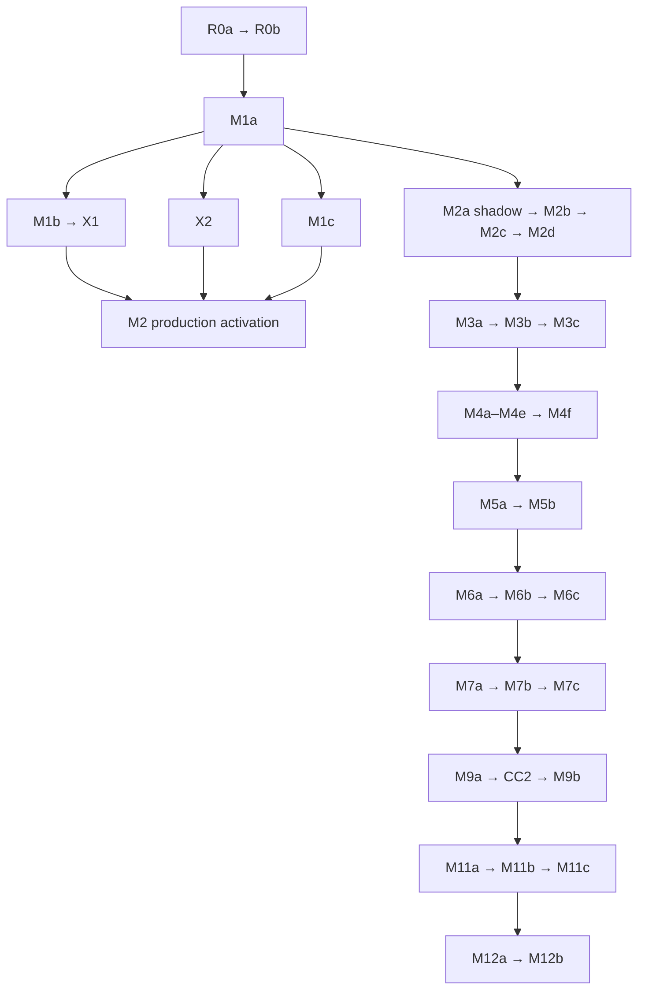

# BDB — Etap 6

## Canonical Execution Map v1 + AI Implementation Playbook v1 + Execution Handoff Freeze

**Status:** `READY FOR AI-GUIDED IMPLEMENTATION`  
**Plan:** `Migration Plan Freeze v1 = READY TO EXECUTE`  
**Architecture:** `Architecture Freeze v1` — bez reopen  
**Repozytorium:** `eagleblastmusic-lgtm/bartosz-dev-bridge`  
**Publiczny branch / HEAD:** `main` / `03c44734da8829ff42c9c4859ac7b6afe2708a2a`  
**GitHub commit time:** `2026-08-08T22:25:12+02:00`  
**Review time:** `2026-08-09`, `Europe/Warsaw`  
**Lokalny runtime użytkownika:** `LOCAL STATE NOT OBSERVED`  
**Repo mutation w Etapie 6:** `NONE`  
**PLAN FREEZE DISCREPANCY:** `NO`  
**ARCHITECTURE REOPEN REQUIRED:** `NO`

Ten dokument jest ostatnim kontraktem planowania wykonawczego. Nie zastępuje Etapu 3 ani Etapu 5. Zamienia ich frozen invariants i Execution Units w procedurę, którą może przejąć nowe AI bez pełnej historii rozmów. Następny krok po akceptacji dokumentu to `R0a — REAL IMPLEMENTATION`.

---

# Part I — Executive Contract

## 1. Executive Verdict

> **READY FOR AI-GUIDED IMPLEMENTATION**

Nie znaleziono nowego dowodu wymagającego zmiany Architecture Freeze lub Migration Plan Freeze. Read-only kontrola GitHub nadal wskazuje `03c44734…`; dostępny `repo_snapshot` jest clean checkoutem tego commitu. Nie jest on jednak dowodem aktywnego lokalnego binary, extension bundle, Journalu, spoolu, receipts, promotera ani niezakończonych efektów użytkownika.

Etap 6 zamraża:

- jedną rekomendowaną kolejkę single-worker;
- osobne implementation i production-activation dependencies;
- status model dokumentu wykonawczego;
- Global AI Execution Protocol;
- stabilny format Execution Card, JIT Implementation Pack i Execution Handoff;
- 41 kart formalnych EU;
- reguły wyboru następnej jednostki, driftu, cutoveru, deletion i recovery;
- R0a Starter Handoff.

Execution Map jest dokumentem koordynacji. Nie jest runtime authority BDB, nie zastępuje repo/runtime/external truth i nigdy nie nadaje lifecycle statusu systemowi produkcyjnemu.

## 2. Source Precedence

W razie konfliktu obowiązuje kolejność:

1. **Fresh observed repo/runtime/external authority** — fakty o bieżącej implementacji, aktywnych writerach, schema, efektach i physical state.
2. **Architecture Freeze v1 — Etap 3** — authority boundaries, invariants, semantic contracts i odrzucone koncepcje.
3. **Migration Plan Freeze v1 — Etap 5** — formalne EU, dependencies, cutovers, rollback classes i compatibility horizon.
4. **Etap 4** — rationale, szersze DoD i historyczna mapa migracji.
5. **V10 i plan BDB 2.0** — historyczny evidence/material roboczy; nie może przywrócić Event Ledger/Proof Engine/Browser authority odrzuconych przez Etap 3.
6. **Handoff, status map i wcześniejsze AI output** — wskazówki/evidence do ponownej weryfikacji, nigdy authority.

Fresh code różniący się nazwą pliku lub symbolem to zwykle Level A drift. Fresh evidence zmieniający dependency/scope EU to `PLAN FREEZE DISCREPANCY`. Dopiero dowód niemożności frozen invariantu uzasadnia `ARCHITECTURE REOPEN REQUIRED`.

## 3. Frozen Execution Set

Canonical set ma 41 formalnych EU:

```text
R0a R0b
M1a M1b M1c
X1 X2
M2a M2b M2c M2d
M3a M3b M3c
M4a M4b M4c M4d CC0 M4e M4f
M5a M5b
M6a M6b M6c
M7a M7b M7c
M8a M8b M8c
CC1
M9a CC2 M9b
M11a M11b M11c
M12a M12b
```

Zamrożone pozostają także:

- Direct LIVE mutation: `DEFERRED UNTIL CAPABILITY ENABLE`; nie blokuje primary CANDIDATE workflow.
- X1/X2: jedyne standalone experiments z wczesnego planu.
- Same physical SQLite: tylko z single canonical writer, bez target joins do legacy, po M1b/X1 i z compatible recovery floor.
- Generation/resource fence przed współdzielonym effect writer cutoverem.
- Browser-first/no-required-API i pełna jakość semantyczna Browser Mode.
- Early Engineering Intelligence przed dużym lifecycle cutoverem.
- Control Center jako projection/query/operator-action client, nigdy authority.
- Recovery po accepted canonical state jako state-forward/roll-forward, nie reaktywacja starego writera.

## 4. Global AI Execution Protocol

Każda karta dziedziczy poniższe reguły. EU-specific karta dopisuje tylko własne authority, scope, fault cases i acceptance.

### Rule 1 — Fresh state beats old implementation detail

Przed mutacją inspect aktualny repo, worktree, wymagane stores/runtime i authority domains. Nie zakładaj istnienia pliku, symbolu, writera, schema, branch/HEAD ani bundle tylko dlatego, że występował w raporcie.

### Rule 2 — Establish authority before changing code

Nazwij current writer, current source of truth, external authority, target writer, target source of truth, bridge i jego death condition. Niejasna authority oznacza `STOP`.

### Rule 3 — One writer per domain and semantic generation

Zakazane są dual admission, lifecycle, promotion, validation, repository i presentation authorities. Shadow/fixture/disabled implementation nie jest production dual-write.

### Rule 4 — Preserve foreign and user state

Dirty/foreign state jest constraintem. Bez jawnej potrzeby nie wykonuj stash, reset, clean, broad checkout, rewrite, delete ani migracji cudzych danych. Overlap z mutation scope oznacza `STOP` lub izolowany worktree zgodny z kartą.

### Rule 5 — Observe before retrying an effect

`POSSIBLE`, `AMBIGUOUS`, `DIVERGED`, utracony ACK i timeout wymagają observe/reconcile. Nie twórz nowego submitu/effectu tylko dlatego, że odpowiedź mogła nie dojść.

### Rule 6 — Schema grows with invariants

Każdy durable record ma obecny invariant, writer/owner, readers i retention/death contract. Nie projektuj future tables ani universal ledger/CAS ontology na zapas.

### Rule 7 — No scope creep

Nie dołączaj następnego EU, sąsiedniego refaktoru, premium UI, hipotetycznej abstrakcji ani cleanupu „przy okazji”. Jeżeli invariant wymaga szerszego scope: `SCOPE EXPANSION REQUIRED`.

### Rule 8 — Root cause before patch

Dla buga: reproduce → localize → root cause → smallest coherent repair → regression/fault test. Objawowy workaround nie spełnia DONE.

### Rule 9 — Exact subject before evidence

Evidence wiąże exact RepoView/Candidate/effect/environment/checker version. Testy na innym workspace, commicie, bundle lub interpreterze nie dowodzą bieżącego subject.

### Rule 10 — FULL is not default

Wybieraj `STRUCTURAL`, `TARGETED`, `REGRESSION` albo `CHECKPOINT/FULL` według blast radius, uncertainty i karty. `tests_required=true` nie oznacza FULL.

### Rule 11 — No implicit cutover

Nowy kod może istnieć disabled/shadow. Writer zmienia się wyłącznie w jawnej `AUTHORITY CUTOVER` EU po spełnieniu activation dependencies.

### Rule 12 — Cutover requires drain and fence

Dla wspólnego resource domain: stop legacy intake → enumerate/classify/drain unresolved effects → activate generation/resource fence → enable target writer → disable legacy writer.

### Rule 13 — Deletion is part of migration

Replacement po acceptance nie pozostawia starego writera „na wszelki wypadek”. Compatibility read może żyć tylko z named consumer, telemetry, direction i death EU.

### Rule 14 — Browser Mode remains first-class

Nie rozwiązuj complexity przez wymaganie OpenAI API, obniżenie context quality, rezygnację z Resume albo przeniesienie lifecycle authority do extension.

### Rule 15 — Control Center is not authority

UI query/explain/request-action; nie przyznaje lease, nie przeprowadza transition i nie interpretuje raw rows/receipts/cache jako własnej truth.

### Rule 16 — Simplicity under frozen invariants

Jeżeli dwa rozwiązania spełniają ten sam invariant, preferuj mniej writers, durable states, processes, recovery branches i mechanicznej wiedzy wymaganej od GPT.

### Rule 17 — STOP is a successful result

`STOP — ASSUMPTIONS NO LONGER VALID` jest poprawnym zakończeniem. Nie optymalizuj na „dokończenie za wszelką cenę”.

### Rule 18 — DONE requires invariant and negative-path evidence

Green tests nie wystarczają. Confirmation sprawdza invariant, właściwego writera, brak alternate path, wymagany writer-off/deletion oraz fault/negative cases wskazane w karcie.

### Rule 19 — Separate current observation, history and handoff

Każdy raport rozróżnia `OBSERVED NOW`, `HISTORICAL`, `INFERRED` i `UNKNOWN`. Poprzedni Handoff nie staje się bieżącym faktem bez reinspection.

### Rule 20 — Every bridge is directional and mortal

Bridge ma ownera, source authority, target consumer, dozwolone generations, telemetry i exact death condition. Nowy unnamed bridge oznacza `STOP`.

### Rule 21 — Approval, capability and fence are exact and fresh

Approval wiąże exact effect digest/target/intent/policy/expiry. Capability handshake i generation fence muszą być aktualne w momencie effectu; stary approval albo fence nie przechodzi przez zmianę basis.

## 5. Global STOP Conditions

AI nie implementuje workaroundu, gdy występuje co najmniej jeden materialny warunek:

1. znaleziono nieoczekiwany writer lub supported alternate write path;
2. bieżący repo/runtime materialnie różni się od basis karty;
3. unresolved external effect blokuje bezpieczną mutację tego samego resource domain;
4. dirty/foreign changes pokrywają się z mutation scope;
5. prerequisite invariant nie istnieje lub jego DONE nie ma evidence;
6. required checker/fixture/platform nie może wykonać wymaganej walidacji;
7. authority, source of truth lub bridge owner jest nieidentyfikowalny;
8. zmiana wymaga dual-write/dual-authority;
9. invariant wymaga rozszerzenia poza EU;
10. plan opiera się na mechanizmie, który nie istnieje albo działa semantycznie inaczej;
11. external target/ref/checkout/schema/bundle zmienił się od approval/preflight;
12. approval, lease, capability lub generation fence jest stale/invalid;
13. schema/runtime/protocol version jest unsupported;
14. lokalnego runtime nie da się obserwować w zakresie wymaganym do effectful/cutover EU;
15. backup/recovery floor lub integrity jest niepotwierdzony przed state-forward boundary;
16. required negative/fault test ujawnia niezlokalizowaną klasę błędu;
17. kontynuacja narusza Architecture Freeze.

Observation/read-only inspection może być kontynuowana tylko w zakresie potrzebnym do sklasyfikowania STOP; nie wolno przejść do mutacji.

## 6. Escalation Taxonomy

| Status | Znaczenie | Rozstrzyga | Zasięg blokady |
|---|---|---|---|
| `CURRENT REPO DISCREPANCY` | Pliki/symbole/writery różnią się od karty, ale znaczenie driftu nie jest jeszcze sklasyfikowane. | Fresh inspection + owner bieżącej EU. | EU; może przejść w Level A/B. |
| `LOCAL RUNTIME NOT OBSERVED` | Nie znamy aktywnego binary/bundle/schema/stores/effects. | R0a/R0b + operator na rzeczywistej instalacji. | Production mutation/cutover; fixture/shadow może pozostać dozwolone. |
| `PREREQUISITE NOT MET` | Wymagany wcześniejszy invariant lub evidence nie jest DONE. | Owner prerequisite EU; Execution Map recompute. | Bieżąca EU i jej descendants. |
| `UNRESOLVED EFFECT` | Physical effect może być POSSIBLE/AMBIGUOUS/DIVERGED. | Adapter observation/reconciler/operator zgodnie z certainty. | Ten resource/effect domain; całość tylko przy współdzielonym fence. |
| `AUTHORITY AMBIGUITY` | Nie da się wskazać jednego writera/truth/bridge. | Principal/Staff review oparty na kodzie i runtime. | EU; cutover całkowicie blokowany. |
| `SCOPE EXPANSION REQUIRED` | Frozen invariant nie mieści się w karcie bez sąsiedniej mutacji. | Minimalna rewizja EU/Execution Map. | EU; architecture zwykle bez zmian. |
| `VALIDATION ENVIRONMENT BLOCKER` | Wymagane evidence nie może powstać na właściwym subject/platform/checkerze. | Operator/toolchain owner; naprawa environment. | Activation/DONE tej EU, nie automatycznie cała migracja. |
| `MIGRATION RECONCILIATION REQUIRED` | Legacy/canonical data/effects wymagają drain/import/archive decision. | R0b/domain cutover owner + operator. | Dany writer cutover/resource generation. |
| `PLAN FREEZE DISCREPANCY` | Scope/dependency/invariant jednej EU jest materialnie niezgodny z kodem, Architecture Freeze nadal możliwe. | Principal-level minimal plan revision z evidence. | Dotknięta gałąź mapy. |
| `ARCHITECTURE REOPEN REQUIRED` | Konkretny dowód falsyfikuje frozen authority/invariant/product constraint. | Jawny architecture review użytkownika/Principal. | Cała zależna migracja; brak obejścia. |

## 7. Plan Drift Policy

### Level A — Implementation drift

Nazwy, pliki, symbole lub lokalny mechanizm zmieniły się, frozen invariant i dependencies pozostają. Wykonaj nowy JIT Pack; karta/plan nie zmieniają statusu semantycznego.

### Level B — Execution Plan drift

Fresh evidence zmienia scope, dependency, bridge death albo granularność jednej EU, lecz Architecture Freeze pozostaje wykonalne. Zgłoś `PLAN FREEZE DISCREPANCY`, wprowadź najmniejszą wersjonowaną rewizję mapy i wskaż affected descendants.

### Level C — Architecture contradiction

Dowód pokazuje, że frozen invariant jest niemożliwy lub fałszywy, np. Browser parity, effect observation, same-SQLite safety lub external Bootstrap TCB nie może spełnić kontraktu. Zgłoś `ARCHITECTURE REOPEN REQUIRED`; nie obchodź przez API, drugą authority lub ukryty store.

Zmiana filename to nie Level C. Awaria jednego implementation experiment również nie jest automatycznie Level C: najpierw zmienia się mechanikę implementation w granicach Freeze.

---

# Part II — Canonical Execution Map v1

## 8. Canonical Single-Worker Queue

Kolejka jest rekomendowaną kolejnością dla jednego użytkownika + jednego aktywnego AI. Pozycja w kolejce nie tworzy dependency. Kolumna `Impl deps` określa, kiedy kod może powstać; `Activation deps` — kiedy wolno uruchomić go na produkcyjnym path/writerze.

| Seq | EU | Parent | Frozen invariant (skrót) | Impl deps | Status prerequisite | Parallelizable | Activation deps | Unlocks |
|---:|---|---|---|---|---|---|---|---|
| 1 | `R0a` | R0 | Bounded read-only inventory albo fail-closed unknown. | — | source checkout dostępny | NO | N/A | `R0b`, reusable diagnostics |
| 2 | `R0b` | R0 | Real runtime ma `SAFE/DRAIN/RECONCILE/UNSUPPORTED`. | R0a | real local access | NO | N/A | production basis dla T1 |
| 3 | `M1a` | M1 | Active runtime/provider/bundle/schema/composition jest explainable. | R0b disposition | no unclassified writer | YES: M2a shadow po DONE | same | M1b/M1c/X2/M2a |
| 4 | `M2a` | M2 | COMMITTED reads mają exact commit/tree binding. | M1a | shadow/fixture allowed | YES: M1b/X2/M1c | M1b + X1 + M1c przed production persistence | early RepoView value, M2b |
| 5 | `M1b` | M1 | Compatible recovery runtime + backup istnieją przed schema write. | M1a,R0b | supported install basis | YES: X2/M1c/M2a shadow | operator restore drill | X1, first schema activation |
| 6 | `X1` | E1 | Same SQLite/single writer przechodzi Windows crash/restore/concurrency. | M1b | current Journal copy + Windows | YES: X2/M1c | PASS przed first canonical DB write | canonical schema activation |
| 7 | `X2` | E2 | Committed typed content nie wskazuje missing/wrong-type bytes. | M1a | content design hypothesis | YES: M1b/X1/M1c | PASS przed M2b production storage | M2b persistence |
| 8 | `M1c` | M1 | Target path używa explicit composition, nie patch/wrapper order. | M1a | provider ownership known | YES: X1/X2/M2a shadow | target routing only after tests | target providers, M2 activation |
| 9 | `M2b` | M2 | Typed fragments transportują się exact albo jawnie failują. | M2a,X2,M1c | transport basis known | NO | M1b+X1; Browser handshake | M2c, ContextRequest loop |
| 10 | `M2c` | M2 | Understanding/coverage/unknowns/Request/Decision są first-class. | M2a,M2b | exact RepoView/context | NO | M2b production-safe | M2d, decision binding |
| 11 | `M2d` | M2 | Real-repo quality non-inferior small, better/complete complex. | M2c | paired fixtures/model/browser | NO | PASS przed lifecycle tranche | M3, quality baseline |
| 12 | `M3a` | M3 | Submission/Task identity/digest invariants działają shadow. | M1b,X1,M1c,M2d | no production routing | YES: M4a shadow po DONE | none; remains shadow | M3b, M4a implementation |
| 13 | `M3b` | M3 | Browser outbox/lookup survives lost ACK/restart/version skew. | M3a,M2b | capability handshake | YES: M4a shadow | no accepted production until M3c | M3c |
| 14 | `M3c` | M3 | Canonical submission→Task tx jest jedyną vNext admission authority. | M3b | drain/backup/checkpoint/operator | NO | authority-cutover checklist | target Task admission; old vNext admission off |
| 15 | `M4a` | M4 | WorkItem/runs/waits/leases/fences/facts mają one writer/query v1. | M3a,M1b,X1 | shadow may precede M3c | YES: M3b pre-cutover | M3c przed production routing | M4b,CC0 build start |
| 16 | `M4b` | M4 | Local mutation yields sealed exact CANDIDATE or honest uncertainty. | M4a,M2a | candidate workspace isolated | NO | M3c; no Git promotion | M4c, effect subject |
| 17 | `M4c` | M4/M6 | One checker yields exact subject/env/applicability assessment. | M4b | checker available | YES: CC0 skeleton | target capability only | M4d/M4e, seed M6 |
| 18 | `M4d` | M4 | Publication/consumer/presentation/Resume are not command/Browser lifecycle. | M4a,M2b,M3c | consumer binding known | YES: CC0/M8a | target subscription path | CC0,M8a,M4e |
| 19 | `CC0` | M4/M10 | One canonical query/view-model contract powers MOV and vNext UI. | M4a; full MOV M4d | query v1 exists | YES: M4b–M4d/M8a | read-only only | operator visibility, CC1 basis |
| 20 | `M8a` | M8 | Target queries never mix COMMITTED/CANDIDATE/LIVE authority. | M2a,M4b,M4d | enabled query catalog known | YES: CC0/M4e | per-flow query migration | M9 prerequisite, CC1 repo contract |
| 21 | `M4e` | M4 | Full Browser real-repo rehearsal passes faults/quality without cutover. | M2d,M3c,M4a–d,CC0,M8a | supported Windows/Chrome/repo | NO | N/A; rehearsal only | M4f |
| 22 | `M4f` | M4 | Generation-fenced WorkItem writer replaces Command/Session/Browser for allowlist. | M4e | drain/fence/operator | NO | cutover checklist | M5, target lifecycle authority |
| 23 | `M5a` | M5 | Every core effect has exact intent, POSSIBLE and typed observation. | M4f | adapter inventory | NO | enabled adapters rehearsed | M5b,M6a |
| 24 | `M5b` | M5 | Core adapter witnesses replace target-local retry/watch loops. | M5a | witness matrix green | NO | per-adapter migration gate | clean effect recovery, CC1 dep |
| 25 | `M6a` | M6 | Promotion-grade obligation/evidence/assessment/env/waiver are exact. | M4c,M5a,M2c | exact candidate/process effect | YES: later M7 design | additive only | M6b,M7a |
| 26 | `M6b` | M6 | Runtime selects deterministic CheckPlan without model profile authority. | M6a | registry/process policy known | YES: M7a after contract stable | shadow only | M6c,M7a |
| 27 | `M7a` | M7 | Tree/commit/expected ref durable before ref effect. | M4b,M5a,M6a,M6b contract | isolated Git fixture | YES: M6c | no production ref write | M7b/M7c |
| 28 | `M7b` | M7 | Ref result and checkout result are separate effects. | M7a,M5a | dirty/foreign matrix | YES: M6c | no automatic sync before tests | M7c |
| 29 | `M6c` | M6 | Canonical evidence/policy is sole gate for enabled vNext flows. | M6a,M6b | shadow parity + operator gate | YES: M7a/b implementation | cutover checklist | M7c production eligibility |
| 30 | `M7c` | M7 | Git ref truth + CAS replaces watcher/seen/seq promotion authority. | M6c,M7a,M7b | promotion drain/fence/operator | NO | cutover checklist | Git authority, CC1 full flow |
| 31 | `M8b` | M8 | Index/Understanding are rebuildable projections of exact RepoView. | M8a,M2c | projection rebuild plan | YES: M8c/CC1 | per-query cutover | enriched intelligence |
| 32 | `CC1` | M10 | Main UI reads canonical queries; legacy history namespaced. | CC0,M5b,M6a/b,M8a; M7c if Git enabled | operator comprehension | YES: M8c | main-navigation gate | M9 drain UI, CC2 |
| 33 | `M8c` | M8 | LIVE is interval/coverage/unknown, never false snapshot. | M8a + integrated E4 | supported FS matrix | YES: CC1/M9 prep | capability enable only after PASS | honest LIVE observation; no M9 block |
| 34 | `M9a` | M9 | No new supported request enters legacy; active legacy is drained/classified. | M4f,M5b,M6c,M7c,M8a,CC1 | fresh deep inventory/operator | NO | ingress cutover checklist | CC2,M9b |
| 35 | `CC2` | M10 | Legacy heuristics no longer interpret active state. | M9a,CC1 | active legacy drain view empty | NO | deletion gate | M9b/M12 archive-only |
| 36 | `M9b` | M9 | Browser lifecycle stores/wrappers/watches/retries are extinct. | M9a,CC2 + parity benchmark | extension migration/operator | NO | deletion protocol | target-only Browser, M11/M12 |
| 37 | `M11a` | M11 | External A/P/C slots and compatibility identities are exact. | M1b,M7c,CC1,M9b | Bootstrap TCB basis | NO | candidate only until M11c | M11b |
| 38 | `M11b` | M11 | Every activation crash boots known-good or deterministic blocked. | M11a | real Windows fault harness | NO | experiment PASS | M11c |
| 39 | `M11c` | M11 | External Bootstrap alone activates; candidate cannot self-activate. | M11b | backup/compat/operator | NO | cutover checklist | full self-host authority, M12 |
| 40 | `M12a` | M12 | Every bridge has usage zero and archive/drop/contract disposition. | M9b,M11c + all death gates | full inventory/telemetry | NO | validation gate | M12b |
| 41 | `M12b` | M12 | Production bundle contains no active legacy lifecycle/composition. | M12a | final benchmark/operator release | NO | roll-forward contract/deletion | Architecture Freeze v1 release |

### Queue interpretation

- `M2a` ma wczesny sequence, ponieważ implementation może powstać shadow po M1a. Produkcyjny canonical write nadal czeka na M1b/X1/M1c.
- `M8a` jest w T4, ponieważ exact query semantics są prerequisite Browser extinction i CC1; enrichment M8b może czekać.
- `M7a/M7b` są implementowane po stabilnym kontrakcie M6b, ale przed M6c cutoverem. M7c czeka na M6c.
- `M8c` nie blokuje CC1/M9; w kolejce jest po CC1, aby optional LIVE nie opóźniało main UI.

## 9. Dependency Graph



Cross-cuts:

- `CC0` startuje po M4a i dojrzewa przez M4d; `CC1` wymaga stabilnych target queries, `CC2` wymaga M9a drain.
- `M8a` może być wdrażane od M4d; `M8b` i `M8c` nie blokują M4f. Tylko M8a blokuje M9.
- M4a implementation może iść równolegle z M3b; activation czeka na M3c.
- M7a/b implementation nie wymaga M6c; M7c activation wymaga M6c.
- `Direct LIVE mutation` nie występuje w graphie minimum; otrzyma osobną capability-enable kartę dopiero po świadomej decyzji.

## 10. Parallelization Map

| Ready fork | Bezpieczna równoległość implementation | Zakazana równoległość |
|---|---|---|
| Po M1a | M1b, X2, M1c, M2a shadow | Dwa production schema/content writers; M2 production write przed gates. |
| Po M3a | M3b oraz M4a shadow | Dwie admission authorities; WorkItem production route przed M3c. |
| Po M4a/M4d | CC0, M8a, przygotowanie M4e | Effectful pilot bez fence albo bez exact candidate/evidence. |
| Po M6a/M6b | M7a/M7b implementation oraz M6c preparation | Git ref mutation przed M6c i M7c. |
| Po M8a | M8b, M8c, CC1 (gdy pozostałe deps green) | Optional LIVE jako blocker CC1/M9. |
| Po M9b | M11a preparation i M12 inventory design | Self-activation przez candidate; contract deletion przed M11c/M12a. |

Single-worker domyślnie bierze najwcześniejszą READY pozycję w kolejce. Inna READY parallel branch może być wybrana świadomie, gdy bieżąca jest zablokowana przez environment/operatora i nie dzieli unresolved external resource.

## 11. Initial Status Map

Stan na koniec Etapu 6:

| Status | EU | Evidence |
|---|---|---|
| `READY` | `R0a` | Migration Plan Freeze zaakceptowany; publiczny clean snapshot dostępny; implementacja jeszcze nierozpoczęta. |
| `BLOCKED` | `R0b` | R0a nie jest DONE i realny local runtime nie został zaobserwowany. |
| `PLANNED` | `M1a–M12b`, `X1`, `X2`, `CC0–CC2` | Frozen cards istnieją, lecz dependencies/handoff nie są jeszcze DONE. |
| `IN_PROGRESS` | — | Etap 6 jest planning-only. |
| `DONE` | — | Żadna formalna EU nie została uznana za wykonaną na podstawie planów lub snapshotu. |
| `SUPERSEDED` | — | Brak. |
| `REMOVED` | — | Brak formalnych EU; Direct LIVE mutation jest deferred capability, nie removed EU. |

Status aktualizuje się wyłącznie z Completion Evidence + Execution Handoff zweryfikowanym wobec repo/runtime. Handoff bez fresh inspection nie wystarcza.

## 12. Validation / Risk / AI Mode Matrix

Risk jest advisory, nie runtime requirement:

- `NORMAL` — bounded read-only, prosty adapter lub lokalny refactor; `Wysoki` wystarcza.
- `HIGH` — cross-module, durability, restart, schema, Browser transport, evidence albo reconciliation; preferowany `Bardzo wysoki`.
- `CRITICAL` — writer cutover, state-forward migration, Git/Bootstrap/security/authority boundary; `Maks.` dla inspection/review/JIT Pack, potem bounded implementation — nie większy scope.

| EU | Primary type | Risk | Recommended reasoning | AUTO granularity | Validation | Manual gate |
|---|---|---|---|---|---|---|
| R0a | IMPLEMENTATION | HIGH | Bardzo wysoki | MULTIPLE ORDERED AUTO LOOPS | REGRESSION | NO |
| R0b | VALIDATION GATE | HIGH | Bardzo wysoki | MANUAL / OPERATOR PREREQUISITE | CHECKPOINT/FULL | YES — real local runtime |
| M1a | IMPLEMENTATION | HIGH | Bardzo wysoki | ONE AUTO LOOP | TARGETED + composition regression | NO |
| M2a | IMPLEMENTATION | HIGH | Bardzo wysoki | ONE AUTO LOOP | TARGETED | NO; production activation gated |
| M1b | BOOTSTRAP | CRITICAL | Maks. review; bounded loops | MULTIPLE ORDERED AUTO LOOPS | CHECKPOINT/FULL | YES — restore drill/install |
| X1 | EXPERIMENT | CRITICAL | Maks. experiment review | EXPERIMENT ONLY | TARGETED crash/concurrency/restore | YES — supported Windows/NTFS |
| X2 | EXPERIMENT | HIGH | Bardzo wysoki | EXPERIMENT ONLY | TARGETED durability/type/corruption | Environment prerequisite |
| M1c | MIGRATION | HIGH | Bardzo wysoki | MULTIPLE ORDERED AUTO LOOPS | REGRESSION | NO |
| M2b | IMPLEMENTATION | HIGH | Bardzo wysoki | MULTIPLE ORDERED AUTO LOOPS | REGRESSION | Browser harness prerequisite |
| M2c | IMPLEMENTATION | HIGH | Bardzo wysoki | MULTIPLE ORDERED AUTO LOOPS | TARGETED + real fixture | NO |
| M2d | BENCHMARK | HIGH | Bardzo wysoki | EXPERIMENT ONLY | CHECKPOINT paired benchmark | Human semantic review |
| M3a | IMPLEMENTATION | HIGH | Bardzo wysoki | MULTIPLE ORDERED AUTO LOOPS | REGRESSION | NO; shadow only |
| M3b | IMPLEMENTATION | HIGH | Bardzo wysoki | MULTIPLE ORDERED AUTO LOOPS | REGRESSION | Browser/Native harness |
| M3c | AUTHORITY CUTOVER | CRITICAL | Maks. cutover review | MANUAL / OPERATOR PREREQUISITE | CHECKPOINT/FULL | YES |
| M4a | IMPLEMENTATION | CRITICAL | Maks. design review; bounded loops | MULTIPLE ORDERED AUTO LOOPS | REGRESSION | NO; activation gated |
| M4b | IMPLEMENTATION | CRITICAL | Maks. effect review | MULTIPLE ORDERED AUTO LOOPS | REGRESSION + FS fault matrix | Safe fixture/operator repo |
| M4c | IMPLEMENTATION | HIGH | Bardzo wysoki | ONE AUTO LOOP | TARGETED | Checker environment |
| M4d | IMPLEMENTATION | CRITICAL | Maks. cross-process review | MULTIPLE ORDERED AUTO LOOPS | REGRESSION | Browser harness |
| CC0 | CONTROL CENTER | HIGH | Bardzo wysoki | ONE AUTO LOOP | TARGETED | NO |
| M8a | MIGRATION | HIGH | Bardzo wysoki | MULTIPLE ORDERED AUTO LOOPS | REGRESSION | NO |
| M4e | VALIDATION GATE | CRITICAL | Maks. rehearsal review | EXPERIMENT ONLY | CHECKPOINT/FULL | YES — real repo/Browser |
| M4f | AUTHORITY CUTOVER | CRITICAL | Maks. cutover review | MANUAL / OPERATOR PREREQUISITE | CHECKPOINT/FULL | YES |
| M5a | IMPLEMENTATION | HIGH | Bardzo wysoki | MULTIPLE ORDERED AUTO LOOPS | REGRESSION + crash boundaries | NO |
| M5b | MIGRATION | HIGH | Bardzo wysoki | MULTIPLE ORDERED AUTO LOOPS | REGRESSION | Per-adapter cutover review |
| M6a | IMPLEMENTATION | HIGH | Bardzo wysoki | MULTIPLE ORDERED AUTO LOOPS | REGRESSION | NO |
| M6b | IMPLEMENTATION | HIGH | Bardzo wysoki | MULTIPLE ORDERED AUTO LOOPS | REGRESSION + shadow comparison | NO |
| M7a | IMPLEMENTATION | CRITICAL | Maks. Git effect review | MULTIPLE ORDERED AUTO LOOPS | REGRESSION + Git fault matrix | Isolated Git fixture |
| M7b | IMPLEMENTATION | CRITICAL | Maks. foreign-state review | MULTIPLE ORDERED AUTO LOOPS | REGRESSION + dirty matrix | Isolated checkout |
| M6c | AUTHORITY CUTOVER | CRITICAL | Maks. cutover review | MANUAL / OPERATOR PREREQUISITE | CHECKPOINT/FULL | YES |
| M7c | AUTHORITY CUTOVER | CRITICAL | Maks. cutover review | MANUAL / OPERATOR PREREQUISITE | CHECKPOINT/FULL | YES |
| M8b | MIGRATION | HIGH | Bardzo wysoki | MULTIPLE ORDERED AUTO LOOPS | REGRESSION + rebuild | NO |
| CC1 | CONTROL CENTER | HIGH | Bardzo wysoki | MULTIPLE ORDERED AUTO LOOPS | CHECKPOINT operator benchmark | YES — main navigation sign-off |
| M8c | IMPLEMENTATION | HIGH | Bardzo wysoki | MULTIPLE ORDERED AUTO LOOPS | REGRESSION + LIVE fault matrix | Supported FS environment |
| M9a | AUTHORITY CUTOVER | CRITICAL | Maks. drain review | MANUAL / OPERATOR PREREQUISITE | CHECKPOINT/FULL | YES |
| CC2 | DELETION | HIGH | Bardzo wysoki | MULTIPLE ORDERED AUTO LOOPS | REGRESSION | Deletion evidence review |
| M9b | DELETION | CRITICAL | Maks. deletion review | MULTIPLE ORDERED AUTO LOOPS | CHECKPOINT/FULL + parity | YES — extension migration |
| M11a | BOOTSTRAP | CRITICAL | Maks. TCB review | MULTIPLE ORDERED AUTO LOOPS | REGRESSION + platform targeted | YES before production install |
| M11b | EXPERIMENT | CRITICAL | Maks. | EXPERIMENT ONLY | CHECKPOINT/FULL fault matrix | YES — supported platform |
| M11c | AUTHORITY CUTOVER | CRITICAL | Maks. cutover review | MANUAL / OPERATOR PREREQUISITE | CHECKPOINT/FULL | YES |
| M12a | VALIDATION GATE | CRITICAL | Maks. release review | MULTIPLE ORDERED AUTO LOOPS | CHECKPOINT/FULL | YES — archive/contract disposition |
| M12b | DELETION | CRITICAL | Maks. release review | MANUAL / OPERATOR PREREQUISITE | CHECKPOINT/FULL + full benchmark | YES — release |

## 13. Writer / Cutover / Deletion Map

| Authority domain | Current writer/truth at baseline | Replacement implementation | Production cutover | Legacy demotion/deletion |
|---|---|---|---|---|
| Runtime/composition identity | Python import-time patch chain; Browser `importScripts`/global wrappers; deployed manifests/files | M1a identity manifest; M1c explicit providers/root | Per target provider in M1c; no implicit cutover | Python provider-by-provider, M12b max; JS legacy bundle M9b |
| Canonical SQLite state | Legacy Journal Command/Session/workspace writers | M1b/X1 substrate; M3/M4 canonical repositories | M3c admission; M4f WorkItem | Legacy protocol writes close M9a; code/schema/archive M9b/M12b |
| Admission | Browser guards + Native receipt reserve + spool | M3a canonical Submission/Task; M3b client outbox/lookup | M3c | vNext receipts/spool off M3c; legacy store/runtime M9b; archive/code M12b |
| Task/intent lifecycle | Browser ledger/checkpoints + Session | M3a Task/current revision | M3c | Target Browser lifecycle dependency ends M4f; store/code M9b/M12b |
| Durable work/execution | Command/Session/service scheduler | M4a WorkItem/runs/waits/leases/facts | M4f allowlist; M9a all supported | Command/session worker path M9b; transition/schema compatibility M12b |
| Candidate/local mutation | Legacy operation plan/checkpoint/executor mechanics; filesystem truth | M4b typed exact Candidate/Effect adapter | M4f for allowlist | Legacy semantics off M4f/M5b; code/read anchors M12b |
| Effect certainty/retry | Service loops, Browser watches/guards, outbox/promoter local policies | M5a certainty/reconciler + typed witnesses | M5b per core adapter; Git separately M7c | Target local loops M5b; Browser M9b; residual readers M12b |
| Publication/presentation | Legacy result/outbox + Browser delivered/watch state; conversation external truth | M4d Publication/consumer observation/Resume | M4f target flow; M9a legacy writer closure | Browser watches M9b; old outbox/archive M12b |
| Validation/policy | Model-facing profiles, staged validation rows, Browser/native guards | M4c minimal; M6a evidence; M6b deterministic CheckPlan | M6c | Legacy target profile authority M6c; legacy flow M9a; code/history M12b |
| Git promotion | File watcher, receipts, `seen`, repository sequence; Git ref physical truth | M7a prepared commit/ref CAS; M7b checkout effect | M7c | Watcher/seen/seq target death M7c; process/archive M9b/M12b |
| Checkout synchronization | Coupled promoter/mirror mechanics; index/worktree physical truth | M7b separate effect/WorkItem | M7c capability enable | Coupled logic M12b after dirty/foreign matrix and zero use |
| Repository reads | Implicit HEAD/mixed snapshot/index projections; Git/FS physical truth | M2a COMMITTED; M4b CANDIDATE; M8a exact query contracts | Per query in M8a | Mixed endpoint M9b; compatibility M12b |
| Index/Understanding | Existing index/relationship rows sometimes treated as state | M8b exact RepoView-bound rebuildable projections | M8b per consumer | Unbound rows rebuild/archive; compatibility M12b |
| LIVE observation | Moving filesystem plus implicit reads | M8c interval/coverage/unknown observation | Only after E4-integrated PASS | False snapshot paths removed in M8c/M12b; Direct LIVE mutation remains deferred |
| Browser lifecycle | `bdbTaskLedgerV1`, checkpoints, watches, replay claims, mutation guards, wrappers | M3/M4/M5 kernel/adapters | M3c/M4f/M9a incrementally | Full extinction M9b |
| Control Center active meaning | Legacy Observability/Session projections and receipt heuristics | CC0 canonical query/view-model; CC1 main | CC1 navigation | CC2 active interpretation; archived reader M12b |
| Runtime activation/self-host | Installer/hotfix/in-place process mechanics; OS files/PID | M1b minimum recovery; M11a slots; M11b fault proof | M11c external Bootstrap | Old installer/hotfix path M12b |
| Compatibility readers | Legacy schema/files/stores | Directional versioned readers only | Never authority | Usage-zero/archive gate M12a; final removal M12b |

Writer cutover never oznacza, że external physical authority przenosi się do DB. Git, filesystem, conversation i Bootstrap slot nadal rozstrzygają własny physical state; kernel przechowuje exact intent/certainty/observations.

## 14. Rollback Boundary Map

| Boundary / EU | Class | Co jest dozwolone | Co jest zakazane |
|---|---|---|---|
| R0a/R0b/M1a | FULLY REVERSIBLE | Usunąć/wyłączyć read-only artifacts/manifesty; powtórzyć gate. | Traktować incomplete jako SAFE. |
| M1b przed schema activation | FULLY REVERSIBLE | Odrzucić candidate recovery slot/backup. | Pisać schema przed restore drill. |
| First canonical schema write po M1b/X1 | CODE REVERSIBLE / STATE FORWARD | Disable feature; boot compatible recovery runtime; reconcile/roll-forward. | Boot starego binary nierozumiejącego schema. |
| M1c przed target routing | FULLY REVERSIBLE | Wyłączyć explicit target root, zachować legacy generation. | Mieszać root i patch order w jednej target instance. |
| M2a–M2c additive/shadow | CODE REVERSIBLE / STATE FORWARD | Wyłączyć feature/readers; zachować immutable rows/content. | Udawać, że accepted content/records nie istnieją. |
| M2d/X1/X2/M4e/M11b | FULLY REVERSIBLE jako experiment | Zachować result i zmienić implementation decision. | Przepisać FAIL na PASS bez nowego evidence. |
| M3a shadow | CODE REVERSIBLE / STATE FORWARD | Retain test/shadow rows; brak production acceptance. | Route shadow submission jako legacy po acceptance. |
| M3b przed accepted vNext | FULLY REVERSIBLE | Disable route; client outbox remains unaccepted. | Mylić pre-send outbox z Task acceptance. |
| M3b po accepted test / M3c | CODE REVERSIBLE / STATE FORWARD → ROLL-FORWARD ONLY at cutover | Stop intake; compatible target recovery; terminally classify Task. | Create legacy Session for accepted target submission. |
| M4a–M4e pre-cutover | CODE REVERSIBLE / STATE FORWARD | Disable capability; drain canonical WorkItems/effects. | Drop facts/candidates or route them to Command enum. |
| M4f | ROLL-FORWARD ONLY | Keep generation fence; stop intake; reconcile target effect. | Reactivate legacy Command/Browser writer for same repo/capability. |
| M5b | ROLL-FORWARD ONLY per migrated effect adapter | Disable new intake; observe/repair target certainty. | Restore blind legacy retry loop. |
| M6c | ROLL-FORWARD ONLY | Fix policy/evidence forward; unavailable checker → UNKNOWN/WAITING. | Fallback single flow to model-selected old profile. |
| M7c | ROLL-FORWARD ONLY | Observe Git ref; CAS/compensation as new exact effect; sync separately. | Trust receipt/seen, broad reset, silently undo ref. |
| CC1/CC2 | CODE REVERSIBLE / STATE FORWARD | Roll UI bundle to prior canonical-query client. | Restore legacy active interpretation. |
| M9a/M9b | ROLL-FORWARD ONLY | Compatible UI/adapter over canonical protocol; recover outbox/cursor. | Restore Browser lifecycle ledger writer. |
| M11c | ROLL-FORWARD ONLY after incompatible contract; conditional slot rollback before | Launcher selects compatible known-good slot or recovery bundle. | Candidate self-activation; boot incompatible previous runtime. |
| M12a/M12b | ROLL-FORWARD ONLY | Restore verified data only with compatible bundle; finish contract/deletion forward. | Reintroduce legacy writers/readers into production bundle. |

Operacyjny recovery po state-forward boundary:

```text
stop intake
→ preserve external/user state
→ run compatible recovery runtime
→ inventory + observe external authorities
→ reconcile accepted work/effects
→ repair or roll-forward
→ revalidate exact subject
```

### 14.1. Frozen Minimal Process Topology Through M4

Role nie oznacza procesu. Minimalny physical topology pozostaje:

1. Chrome/MV3 extension — conversation/context/presentation adapter, client outbox/cursor; no lifecycle authority.
2. Native Host ingress — local handshake/transport; no canonical SQLite writer/admission ledger.
3. Jeden local Work Kernel/service — jedyny canonical SQLite writer; scheduler, executor, reconciler i publication dispatcher są rolami/WorkItem kinds.
4. Bounded checker child processes — powstają tylko na czas checka; nie są daemonami.
5. Opcjonalny Control Center GUI — query + confirmed commands, no authority.
6. Bootstrap launcher — external invocation/start/update/recovery boundary, nie stały domain daemon.

Późniejszy osobny worker process jest dozwolony wyłącznie przez fenced lease/protocol; nie otwiera canonical SQLite jako drugi writer.

---

# Part III — BDB AI Implementation Playbook v1

## 15. Execution Card Standard

Każda formalna karta jest stabilnym kontraktem EU, nie future patch planem. Dziedziczy Rules 1–21 i zawiera:

1. Sequence; ID/name; parent milestone.
2. Primary type, secondary tags, risk, AUTO granularity, best environment.
3. Frozen invariant; why now; what it unlocks.
4. Implementation dependencies i activation dependencies osobno.
5. Preconditions.
6. Current authority → target authority; external authority.
7. Bridge before/after; death condition.
8. Required fresh inspection i assumptions to revalidate.
9. Scope i explicit out of scope.
10. Mechanics allowed to reuse i reuse boundary dowodząca braku semantic authority reuse.
11. Must preserve; must not do; preferred implementation strategy.
12. Durable state/schema/process/Browser/Control Center/security implications.
13. Expected failures i required fault cases.
14. Validation level/required evidence; measurable DONE.
15. Writer-off, legacy demotion, cleanup/deletion.
16. Rollback class i recovery semantics.
17. EU-specific STOP/escalation.
18. Required completion evidence, Handoff delta i next READY candidates.

Nie wpisuje się kruchych line numbers, future filenames ani exact patch sequence. Te informacje powstają tylko w JIT Implementation Pack.

## 16. JIT Implementation Pack Standard

Bezpośrednio przed każdą implementacją powstaje jeden bieżący dokument:

```text
# EU IMPLEMENTATION PACK

## EU ID

## Observed basis
- repository / branch / HEAD / upstream
- worktree dirty state i foreign overlap
- active runtime/bundle/schema/protocol generation relevant to EU
- observed writers, readers, stores and external authorities
- previous Handoff verification result

## Assumption check
| Assumption | CONFIRMED / CHANGED / UNKNOWN | Evidence |

## Current code ownership map
- actual files/modules/symbols/providers/consumers found now
- writer and read paths
- tests/fixtures/diagnostics currently owning the contract

## Exact mutation scope
- actual files/symbols allowed for this patch

## Intended changes

## Explicit no-go files/areas

## Test plan
- structural / unit / integration / regression / platform

## Fault plan

## Acceptance mapping
| Card DONE condition | Planned evidence |

## Rollback / recovery

## Stop assessment
- stop conditions checked
- unresolved unknowns

## Ready to implement?
YES | NO — <escalation class and evidence>
```

Pack jest ephemeral względem konkretnego HEAD, ale powinien zostać zachowany w Handoff/evidence, jeśli zawiera decyzje wpływające na następne AI. `CHANGED` nie oznacza automatycznie STOP: Level A drift aktualizuje ownership map. Materialne `UNKNOWN` oznacza observation albo STOP.

## 17. EU Basis Check

Przed pierwszą mutacją AI zapisuje krótką odpowiedź na dziewięć pytań:

1. Czy mam aktualny repo/branch/HEAD/upstream?
2. Czy worktree state i foreign changes są znane?
3. Czy current writer, target writer, source of truth i external authority są nazwane?
4. Czy wszystkie implementation prerequisites są rzeczywiście DONE i zweryfikowane?
5. Czy relevant external effect/resource domain jest rozstrzygnięty?
6. Czy mutation scope nie koliduje z foreign/user state?
7. Czy frozen card nadal pasuje do bieżącego kodu?
8. Czy właściwy validation environment/checker/platform jest dostępny?
9. Czy approval/capability/lease/fence/backup są aktualne, jeśli karta ich wymaga?

Wynik:

- wszystkie materialne odpowiedzi `YES` → utwórz JIT Pack;
- `UNKNOWN`, które można rozstrzygnąć read-only → wykonaj bounded observation;
- materialne `NO/UNKNOWN` → STOP z jedną klasą eskalacji; brak workaroundu.

## 18. INSPECTION → IMPLEMENTATION → CONFIRMATION

### INSPECTION

- ustal exact basis i ownership;
- zweryfikuj Handoff i assumptions;
- znajdź wszystkie write/read/alternate paths domeny;
- wykonaj Basis Check;
- przygotuj JIT Pack.

### IMPLEMENTATION

- najmniejsza spójna zmiana ustanawiająca invariant;
- jedna authority, bez next-EU work;
- zachowanie foreign state;
- schema/durable state tylko wynikające z bieżącego invariantu;
- testy odpowiednie do ryzyka;
- shadow first, jeśli karta oddziela implementation od activation.

### CONFIRMATION

- test invariant i negative path;
- potwierdzenie writer/authority after;
- wyszukanie unintended alternate write/read path;
- wymagany writer-off/deletion/bridge telemetry;
- fault cases i exact-subject evidence;
- resulting HEAD/worktree/schema/protocol basis;
- Execution Handoff.

Te fazy są logiczne, nie wymagają trzech rozmów. Jedno AI może przejść cały green path. Osobny operator gate występuje wyłącznie tam, gdzie karta jawnie go wymaga.

## 19. Execution Handoff Standard

Po każdej próbie EU powstaje:

```text
# EXECUTION HANDOFF RECORD

## EU ID
## Result
DONE | BLOCKED | STOPPED | SUPERSEDED

## Basis before
## Basis after
- commit/HEAD, branch/upstream, dirty state
- schema/protocol/runtime generation
- relevant active bundle and external-resource identity

## Files/modules materially changed
## Invariant established
## Authority before → after
## Writer disabled/deleted
## Bridges remaining
## Death conditions remaining
## Validation executed
## Evidence/results (exact subjects)
## Fault cases executed
## Known limitations
## Outstanding reconciliation
## Foreign/user state preserved
## Rollback class now in force
## Next READY Execution Unit
## Context next AI MUST know
- decisions
- evidence/facts
- constraints
- unknowns
```

Handoff nie zawiera hidden chain-of-thought. `DONE` bez basis-after, authority transition, evidence i required cleanup jest invalid. `BLOCKED/STOPPED` nie oznacza porażki — zachowuje obserwacje i jednoznaczny next action.

### Handoff is evidence, not authority

Handoff dokumentuje obserwowany wynik poprzedniej sesji. Następne AI nie może uznać `DONE` za bieżącą truth bez fresh repo/runtime/external-authority verification. Konflikt wygrywa actual state; Handoff zostaje oznaczony stale/discrepant i uruchamia właściwy Level A/B/C drift path.

## 20. New-chat / New-AI Resume Procedure

Nowa sesja otrzymuje:

1. `ARCHITECTURE_FREEZE_V1`;
2. `MIGRATION_PLAN_FREEZE_V1`;
3. ten `AI_IMPLEMENTATION_PLAYBOOK_V1`;
4. aktualny `EXECUTION_MAP`;
5. ostatni `EXECUTION_HANDOFF`;
6. bieżący EU ID.

Następnie wykonuje:

```text
read frozen contracts
→ locate current Execution Card
→ inspect actual repo/runtime/external authority
→ verify Handoff against observed state
→ EU BASIS CHECK
→ JIT Implementation Pack
→ implement or STOP
→ confirmation + new Handoff
```

Pełna historia czatów nie jest dependency. Jeśli którykolwiek potrzebny fakt istnieje tylko w starej rozmowie, należy go wprowadzić do explicit frozen contract/Handoff/evidence przed mutacją.

## 21. ChatGPT Bootstrap Prompt

```text
Zapoznaj się z Architecture Freeze v1, Migration Plan Freeze v1 i BDB AI Implementation Playbook v1. Aktualna Execution Unit to <EU_ID>. Odczytaj jej canonical Execution Card oraz ostatni Execution Handoff. Zweryfikuj Handoff wobec aktualnego repo/runtime, wykonaj EU BASIS CHECK i przygotuj just-in-time EU IMPLEMENTATION PACK. Realizuj wyłącznie tę jednostkę zgodnie z jej invariantem, authority boundary, validation i death condition. Nie wymagaj OpenAI API i nie przenoś lifecycle authority do Browsera ani Control Center. Jeśli assumption jest nieaktualne, authority niejasna, effect nierozstrzygnięty albo występuje STOP condition, nie obchodź problemu — zakończ właściwą klasą eskalacji i evidence. Po pracy wygeneruj EXECUTION HANDOFF RECORD.
```

## 22. Codex Bootstrap Prompt

```text
Pracuj nad BDB wyłącznie w Execution Unit <EU_ID>. Najpierw przeczytaj Architecture Freeze v1, Migration Plan Freeze v1, AI Implementation Playbook v1, kartę <EU_ID> i ostatni Handoff. Wykonaj read-only inspection rzeczywistego repo: branch/HEAD/upstream/status, repo instructions, active writers/readers/stores oraz tests relevant to EU. Zweryfikuj foreign changes i previous Handoff, wykonaj EU BASIS CHECK, a następnie utwórz JIT EU IMPLEMENTATION PACK z exact files/symbols/no-go scope. Nie mutuj przed wynikiem READY=YES. Implementuj najmniejszy coherent change ustanawiający invariant; nie wykonuj następnej EU, dual-write, broad cleanup ani destructive Git operations. Dobierz validation zgodnie z kartą, sprawdź fault/negative paths i alternate writers. Przy discrepancy lub uncertainty STOP z właściwą escalation class. Na końcu podaj basis after i pełny EXECUTION HANDOFF RECORD.
```

## 23. BDB AUTO Bootstrap Prompt

```text
Uruchom bounded execution dla BDB Execution Unit <EU_ID> zgodnie z tą samą canonical kartą i Global AI Execution Protocol. Loop 1: fresh inspection, Handoff verification, EU BASIS CHECK i JIT Implementation Pack; brak mutacji, jeśli READY != YES. Kolejne loop(s) tylko jeśli karta ma MULTIPLE ORDERED AUTO LOOPS i poprzedni wynik jednoznacznie odblokował następny. Nigdy nie twórz nowego effectu dla accepted/pending/POSSIBLE/AMBIGUOUS state — odzyskaj exact work/effect i observe. Nie przekraczaj scope EU ani nie kontynuuj po terminalnym STOP/policy/fence failure. Zakończ measurable confirmation i EXECUTION HANDOFF RECORD; operator gate pozostaw jawnie BLOCKED zamiast automatycznie go omijać.
```

Te prompty są adapterami do jednego playbooku. Nie definiują trzech architektur pracy.

## 24. Experiment Protocol

Każdy standalone lub integrated experiment zapisuje:

- **Hypothesis** — jedno falsyfikowalne zdanie.
- **Decision depending on result** — konkretna implementacja/capability/gate, którą wynik zmienia.
- **Minimal setup** — najmniejszy faithful harness i exact basis.
- **Controlled variables** — OS/filesystem/runtime/schema/tool versions i load.
- **Required observations** — nie tylko exit code; state, integrity, crash boundary, timing/coverage.
- **PASS** — mierzalne kryteria.
- **FAIL** — mierzalny falsifier.
- **INCONCLUSIVE** — czego nie udało się kontrolować/zaobserwować.
- **Consequence** — next implementation choice albo capability disabled.
- **Architecture reopen?** — domyślnie `NO`; `YES` tylko gdy wynik falsyfikuje frozen assumption, nie wybrany mechanizm.

Nie wykonuj eksperymentu bez decision, którą może zmienić. X1/X2 są standalone; pozostałe E3–E14 uruchamiają się just-in-time w swoich EU/capability gates; E15 umbrella pozostaje usunięte.

| Etap 4 experiment | Frozen disposition w wykonaniu |
|---|---|
| E1 SQLite durability/concurrency | Standalone `X1`. |
| E2 Typed Content durability | Standalone `X2`. |
| E3 CAS GC/backup/recovery | Deferred do capability-enable; subset backup/restore w M11, GC tylko przed jego produkcyjnym włączeniem. |
| E4 Honest LIVE capture | Integrated just-in-time w M8c. |
| E5 Direct LIVE mutation | Deferred wraz z capability; nie blokuje planu minimum. |
| E6 Windows filesystem + Git faults | Integrated w M1b, M4b, M7a i M7b według authority. |
| E7 Browser transport limits | Integrated w M2b/M4d. |
| E8 Browser restart + lost ACK | Integrated w M3b. |
| E9 New-chat Resume | Integrated w M4d/M4e. |
| E10 Presentation witness | Integrated w M4d/M4e. |
| E11 Environment fingerprint | Integrated w M6a. |
| E12 Sandbox/egress/process | Integrated w M6b. |
| E13 Self-host activation/rollback | Minimum w M1b; pełna matrix M11b. |
| E14 Context depth/quality selector | Integrated w M2d. |
| E15 Generic external witnessability | Removed jako umbrella; adapter-specific fault/witness tests są obowiązkowe w odpowiedniej EU. |

## 25. Writer Cutover Protocol

Każda `AUTHORITY CUTOVER` karta wymaga wszystkich kroków:

1. target implementation istnieje;
2. shadow/rehearsal i required benchmark przeszły;
3. exact writer before i alternate paths są znane;
4. stop legacy intake jest sprawdzony;
5. unresolved legacy work/effects są enumerated;
6. drain/reconcile/classification zakończone;
7. fresh resource generation fence/capability/approval jest aktywny;
8. target writer zostaje enabled;
9. legacy writer zostaje disabled w tej samej operacyjnej zmianie;
10. post-cutover observe/invariant scan przechodzi;
11. negative test dowodzi braku duplicate route/write;
12. nowa rollback class jest jawnie zaakceptowana;
13. bridge/death map i telemetry są zaktualizowane;
14. canonical query/Control Center pokazuje nową authority bez heurystyki.

Niepotwierdzony krok = **no cutover**. Rollback kodu po cutoverze nie może reaktywować starego writera.

## 26. Deletion Protocol

Deletion zaczyna się dopiero, gdy istnieją:

- canonical replacement i DONE evidence;
- zero supported writers starego path;
- zero active consumers albo named immutable archive consumer;
- drain/reconciliation i zero unresolved effects;
- telemetry/usage-zero w reprezentatywnym okresie/scenarios;
- tests dowodzące target independence oraz absence tests/import scans;
- exact deletion scope;
- aktualna recovery/rollback classification.

Deletion nie bazuje na „wydaje się nieużywane”. Nie zostawia martwego flag/adaptera bez death contract. Archive jest read-only/offline i nie może zasilać active query.

## 27. Schema Migration Protocol

Przed pierwszą production canonical schema activation wymagane są:

1. R0b fresh local disposition;
2. M1b compatible recovery floor i supported recovery binary;
3. verified DB/WAL/content backup;
4. migration checksum + integrity/application invariant scan;
5. X1 PASS na wspieranym Windows/NTFS;
6. unresolved effect inventory;
7. additive/expand migration z single canonical writer;
8. brak target joins do legacy authority.

Po first canonical schema write obowiązuje `CODE REVERSIBLE / STATE FORWARD`. Stary binary nierozumiejący schema nie jest rollbackiem. Contract/drop następuje dopiero po M11/M12 compatibility gates. Same-SQLite nie oznacza shared semantic authority; legacy i canonical tables mają rozdzielonych writerów/generations bez sync layer.

## 28. Tool and Evidence Use Policy

- **Repo questions:** inspect actual repo/HEAD/status/instructions; nie zgaduj z planu.
- **Tests:** najwęższy zestaw dowodzący karty; FULL tylko zgodnie z matrix lub material uncertainty.
- **External state:** observe before act/retry; zapisuj exact IDs/OIDs/digests.
- **Git:** read before write; exact refs/commit OIDs; preserve dirty/staged/unstaged/untracked; no broad reset.
- **Browser:** semantic transport/context/presentation adapter, nie lifecycle authority.
- **Control Center:** canonical query i commands przez Kernel/Bootstrap; no raw-state transition.
- **Long logs:** Failure Capsule + requested slices; nie wklejaj całości bez potrzeby.
- **Experiments:** hypothesis → minimal setup → observation → decision.
- **Security:** allowlisted roots/capabilities, local-only where frozen, no secret/payload leakage in diagnostics.

## 29. Browser Work Protocol

Browser Mode pozostaje primary. Każda Browser EU zachowuje:

- capability/version handshake przed acceptance;
- typed Context Packages i exact fragment integrity;
- client submission key/outbox przed first send;
- Task/intent/decision/basis binding;
- MV3 restart, lost ACK, background result, cursor/subscription i Resume;
- per-consumer presentation witness z `UNKNOWN`, gdy DOM nie daje dowodu;
- user typing/interruption bez utraty/duplikacji effectu;
- kilka Tasks rozróżnialnych, effectful resource serializowany/fenced;
- brak wymaganego API i brak mechanicznego fragment bookkeeping po stronie GPT.

Pierwszy slice może mieć wąski capability catalog, ale nie słabszą semantic quality. Exactly-once presentation nie jest obiecywane; source effect nie jest ponawiany z powodu niepewnego DOM.

## 30. Engineering Intelligence Protocol

M2/M8 optymalizują przede wszystkim:

- must-see recall;
- ownership/root-cause correctness;
- architecture constraint awareness;
- coverage gaps i known unknowns;
- jakość ContextRequest;
- grounding Engineering Decision w exact RepoView;
- mniej reworku i violations.

Token count, fragment count, index size i model-call count są drugorzędne, dopóki nie powodują materialnego liveness/resource problem. Projection/inference zawsze niesie provenance, coverage i source/inference separation.

## 31. Control Center Protocol

`CC0 → CC1 → CC2` używa jednego canonical semantic query/view-model contractu. Control Center:

- pokazuje contract version, runtime generation, watermark/freshness i unknown;
- query/explain/request-action;
- wysyła exact command do Kernel/Bootstrap po confirmation;
- czeka na canonical/external observation;
- nie tworzy własnej DB/status truth;
- nie interpretuje raw Command/Session/receipts jako target lifecycle;
- namespacuje legacy drain/history;
- po CC2 nie ma active legacy heuristics.

---

# Part IV — Full Canonical Execution Cards

## 32. Card Reading Convention

Karty poniżej nie powtarzają Rules 1–21. Pola `Durability / topology / clients / security` składają durable state, schema, process, Browser, Control Center i capability implications. `Evidence & Handoff` jest EU-specific delta do standardu sekcji 19.

### Sequence 1 — R0a / Minimal Reconciliation Inventory

- **Parent / type / tags / risk / AUTO / environment:** R0; `IMPLEMENTATION`; `INSPECTION`; HIGH; `MULTIPLE ORDERED AUTO LOOPS`; najlepiej Codex + fixture harness, później Windows verification.
- **Invariant / why / unlocks:** każda dalsza effectful karta zna exact observed runtime/store basis albo fail-closed unknown. Publiczny HEAD nie dowodzi lokalnej instalacji. Odblokowuje R0b oraz jeden reusable provider dla System Health/Bootstrap/CC0.
- **Dependencies:** implementation: frozen contracts i dostępny source checkout; activation: N/A — provider jest read-only.
- **Preconditions:** fresh repo instructions/HEAD/status; izolowany worktree; fixtures/kopie supported store formats; brak potrzeby dostępu do produkcyjnej instalacji.
- **Authority / external / bridge / death:** authority pozostaje w Git/FS, bundle manifests, Journal, receipts/spool, promoter/Git i OS locks/processes. Inventory jest timestamped evidence, nie truth. Dopuszczalny bridge to versioned legacy-format collector; jego contract ewoluuje, a one-off scripts umierają w R0a.
- **Fresh inspection / revalidate:** locate config/path resolution, migrations/checksums/WAL/integrity helpers, diagnostics/sanitization, runtime/browser/native identity sources, unresolved classifiers i każdy collector, który mógłby pisać/claimować/ackować.
- **Scope / out:** versioned deterministic report; repo/worktree, deployed component identities/digests, declared store paths, read-only DB/schema/WAL/lock observations, bounded unresolved IDs/counts, source status/completeness, semantic digest, atomic private/sanitized outputs. Out: drain, repair, migration, full history/export, global process census, UI, lifecycle DB, SAFE decision.
- **Reuse / boundary:** bounded diagnostics, config parsers, Git readers, read-only SQLite helpers, sanitizers, atomic report writer. Reuse jest legalne tylko gdy source store nie jest mutated i legacy classifier jest generation-qualified, nie target status authority.
- **Preserve / prohibit / strategy:** preserve offline/local-only, privacy, containment, Windows locks/paths, bounded time/output. Prohibit start/stop, WAL checkpoint, receipt/spool claim, broad glob, secret/full payload collection. Strategy: allowlisted collectors → pre/post identity → typed status/completeness → canonical serialization.
- **Durability / topology / clients / security:** no DB schema; immutable report poza Journalem; CLI/provider, bez daemona; Browser/CC tylko przyszli konsumenci tego samego sanitized contractu; restrictive permissions, symlink/junction containment, no egress.
- **Failures / faults:** unavailable, unstable, invalid, unsupported, busy, permission, cap/truncation, output disk-full; receipt-without-spool, spool-without-receipt, WAL change, promoter/ref disagreement, PID reuse, rename/truncate during read.
- **Validation / DONE:** `REGRESSION`; deterministic digest, truth-table completeness, privacy/containment, clean/corrupt/locked/large fixtures, zero source writes, Windows targeted suite. DONE tylko gdy missing/conflict never means ready, provider is reusable and documentation states omissions.
- **Writer-off / cleanup:** no legacy writer affected; delete/merge any competing one-off inventory implementation.
- **Rollback / recovery:** `FULLY REVERSIBLE`; remove provider/report artifacts, source state untouched.
- **STOP / escalate:** unexpected writer/format, collector needing repair/write/process control, path escaping root, overlapping foreign changes, unsupported Windows read path. Use `CURRENT REPO DISCREPANCY`, `AUTHORITY AMBIGUITY`, `VALIDATION ENVIRONMENT BLOCKER` or `PLAN FREEZE DISCREPANCY`.
- **Evidence & Handoff / next:** provider/schema version, exact test subjects, write-call absence proof, Windows result, resulting HEAD and limitations. Next: R0b.

### Sequence 2 — R0b / Observed Local Gate

- **Parent / type / tags / risk / AUTO / environment:** R0; `VALIDATION GATE`; `INSPECTION`; HIGH; `MANUAL / OPERATOR PREREQUISITE`; real user Windows installation + R0a CLI/provider.
- **Invariant / why / unlocks:** real runtime and every authority domain needed by the next tranche receives exact `SAFE_TO_MIGRATE`, `DRAIN_REQUIRED`, `RECONCILIATION_REQUIRED` or `UNSUPPORTED_RUNTIME`; unknown never passes. Unlocks M1a or an explicit reconciliation path.
- **Dependencies:** implementation: R0a DONE; activation: operator access to actual install/profile, no stale report.
- **Preconditions:** identify intended local BDB profile, declared roots and supported privacy mode; pause before any mutation, not necessarily stop processes unless observation contract requires and operator approves.
- **Authority / external / bridge / death:** no authority changes. External runtime/DB/Git/FS/Browser exports remain truth. R0a report is evidence with observation interval; no persistent gate ledger. Domain-specific deep collectors remain extensions and die as independent scripts when merged into inventory contract.
- **Fresh inspection / revalidate:** local source HEAD/dirty/upstream; deployed kernel/native/extension/CC digests; schema/checksum/integrity/WAL; active writers/locks; unresolved command/session/effect/outbox; active receipts/spool/promotion/ref/checkout relationships; protocol/capabilities.
- **Scope / out:** execute inventory, request bounded extra observation only for blockers, classify next-tranche domains, emit blocker/remediation list. Out: auto-drain, repair, migration, install, cleanup, guessing local HEAD from GitHub or V10.
- **Reuse / boundary:** R0a provider and existing sanctioned Browser diagnostic export; export remains observation only and cannot ack/delete ledger state.
- **Preserve / prohibit / strategy:** preserve all local/user state and secrets; prohibit automatic kill/cleanup/migration. Strategy: fresh inventory → stability check → domain policy evaluation → operator-visible disposition.
- **Durability / topology / clients / security:** no schema; store signed/hashed report artifact only if user policy permits; Browser export sanitized; CC may display, never decide truth independently.
- **Failures / faults:** runtime changes during scan, unsupported schema/bundle, DB busy/corrupt, unknown lock owner, ghost receipts/spool, ref/checkout mismatch, Browser export unavailable.
- **Validation / DONE:** `CHECKPOINT/FULL` on supported local runtime plus integrity/diagnostic regression. DONE requires exact observed identities, completeness per required domain, no unclassified effect, fresh result and one disposition with reasons.
- **Writer-off / cleanup:** none. A SAFE result expires when relevant runtime/store/resource identity changes.
- **Rollback / recovery:** `FULLY REVERSIBLE`; repeat observation.
- **STOP / escalate:** any incomplete/unstable/unsupported domain; use `LOCAL RUNTIME NOT OBSERVED`, `MIGRATION RECONCILIATION REQUIRED`, `UNRESOLVED EFFECT` or `VALIDATION ENVIRONMENT BLOCKER`.
- **Evidence & Handoff / next:** attach sanitized report ID/digest, private exact location, observation interval, blockers and expiry conditions. Next: M1a only if disposition permits; otherwise reconciliation work is not silently invented as a new EU.

### Sequence 3 — M1a / Runtime Identity + Composition Manifest

- **Parent / type / tags / risk / AUTO / environment:** M1; `IMPLEMENTATION`; diagnostics/composition; HIGH; `ONE AUTO LOOP`; Codex + current repo, Windows packaging smoke where identity differs.
- **Invariant / why / unlocks:** active service/native/browser/CC provider, bundle, schema and composition source are explainable and comparable; mismatch is explicit. Removes import-order blindness and unlocks M1b, M1c, X2 and M2a shadow.
- **Dependencies:** implementation/activation: R0b disposition adequate for source mutation/deployment context; no schema write.
- **Preconditions:** active composition points and package/extension manifests locatable; foreign changes do not overlap.
- **Authority / external / bridge / death:** deployed files/launcher/Browser bundle remain physical truth; versioned runtime/composition manifest is canonical observation contract, not lifecycle authority. Legacy patch/wrapper registrations are explicitly listed as providers. Target bypass in M1c; JS legacy bundle dies M9b; Python patch count reaches zero by M12b.
- **Fresh inspection / revalidate:** all import-time installers/setattr, constructors/registries, `importScripts`/global replacements, entrypoints, version/digest sources, package/build manifests and diagnostics consumers.
- **Scope / out:** stable component/runtime IDs, provider registry/composition graph, protocol/schema ranges, active bundle digests, mismatch diagnostics and query/export hook. Out: provider rewrite, schema migration, full Bootstrap slots, UI redesign.
- **Reuse / boundary:** existing release/module manifests, diagnostic export, config/version helpers. A manifest may report patch order but cannot make order an accepted target composition mechanism.
- **Preserve / prohibit / strategy:** preserve current legacy behavior and packaging. Prohibit import side effects in new target providers or assuming manifest=activation pointer. Strategy: additive manifest + explicit provider descriptors + architecture tests.
- **Durability / topology / clients / security:** manifest outside candidate-controlled domain DB where startup diagnostics can read it; no daemon; Browser bundle identity via signed/hashed package metadata, CC consumes read-only; sanitize paths/config.
- **Failures / faults:** missing/duplicate provider IDs, manifest/binary mismatch, old extension/new host, partial install, unknown patch, cyclic/ambiguous registration.
- **Validation / DONE:** `TARGETED` plus composition/packaging regression; deterministic identities, mismatch fail-closed, all active providers enumerated on baseline, no behavior change. DONE includes query/report evidence.
- **Writer-off / cleanup:** none yet; competing version sources are unified or explicitly marked derived.
- **Rollback / recovery:** `FULLY REVERSIBLE`; disable manifest consumers while legacy behavior remains.
- **STOP / escalate:** provider cannot be identified without executing unknown code, active install differs from R0b, manifest would become activation authority. Escalate `AUTHORITY AMBIGUITY` or `CURRENT REPO DISCREPANCY`.
- **Evidence & Handoff / next:** manifest schema/digest, provider coverage scan, package smoke, known mismatches. Next READY: M2a shadow, M1b, X2, M1c.

### Sequence 4 — M2a / COMMITTED RepoView Foundation

- **Parent / type / tags / risk / AUTO / environment:** M2; `IMPLEMENTATION`; Engineering Intelligence; HIGH; `ONE AUTO LOOP`; Codex + Git fixture/real read-only repo.
- **Invariant / why / unlocks:** every COMMITTED read has exact repository/commit/tree/provenance binding; no durable `latest/HEAD` meaning. Gives GPT named basis early and unlocks M2b.
- **Dependencies:** implementation: M1a; activation/persistence: M1b + X1 + M1c, and no unsupported local basis.
- **Preconditions:** trusted repository resource resolution; exact Git object reads available; target provider explicitly constructible in tests.
- **Authority / external / bridge / death:** Git object database is bytes/tree truth; immutable RepoView record names observation. Existing GitObjectReader/index mechanics may sit behind adapter. Implicit HEAD/mixed reader bridge dies per-query in M8a, endpoint M9b, residual compatibility M12b.
- **Fresh inspection / revalidate:** locate all commit/tree/search/blob/context consumers, repository alias resolution, implicit HEAD/default branch reads, current index bindings and cache keys.
- **Scope / out:** minimal Repository resource + immutable COMMITTED RepoView, exact tree/commit validation, provenance/creation facts, typed query interface and property tests. Out: CANDIDATE/LIVE, full index redesign, generic graph, Task lifecycle.
- **Reuse / boundary:** pure Git object/search/index builders may be reused only with explicit RepoView input/output; cache/index never becomes source authority.
- **Preserve / prohibit / strategy:** preserve read-only semantics and repo containment; prohibit implicit mutable ref binding or target dependency on legacy Session/workspace. Strategy: adapter boundary, immutable identity, shadow first.
- **Durability / topology / clients / security:** additive record only when gates allow; Git bytes need not be copied; query in kernel/service, no process; Browser/CC receive provenance-qualified view; repository capabilities remain allowlisted.
- **Failures / faults:** ref moves between resolve/read, missing object, wrong repository, stale cache/index, shallow/incomplete object set.
- **Validation / DONE:** `TARGETED`; exact identity/property tests, moving-ref test proves recorded commit stable, mismatched cache rejected, real repo query returns provenance. Production activation also requires schema gates.
- **Writer-off / cleanup:** no old writer yet; new target consumers must not call implicit HEAD APIs.
- **Rollback / recovery:** `CODE REVERSIBLE / STATE FORWARD` after persistence; disable feature, retain immutable rows.
- **STOP / escalate:** Git reader cannot expose exact tree, production persistence requested before M1b/X1, or repository resolution is ambiguous.
- **Evidence & Handoff / next:** exact RepoView examples, property/fault results, shadow vs activation state. Next: M2b after X2/M1c/gates.

### Sequence 5 — M1b / Expand-Compatible Bootstrap Floor

- **Parent / type / tags / risk / AUTO / environment:** M1; `BOOTSTRAP`; migration safety; CRITICAL; `MULTIPLE ORDERED AUTO LOOPS`; Codex + operator/Windows install and restore drill.
- **Invariant / why / unlocks:** bootable known-good compatible recovery runtime and verified backup exist before first canonical schema write. Prevents false binary rollback and unlocks X1/schema activation.
- **Dependencies:** implementation: M1a,R0b; production activation: operator install/preflight/restore evidence.
- **Preconditions:** exact active bundle, schema, stores, startup path, backup roots and health check observable; supported previous/candidate packaging available.
- **Authority / external / bridge / death:** external launcher/installed bundle manifest owns boot choice; active Kernel DB cannot activate itself. Minimal launcher/previous recovery bridge evolves into M11a slots; legacy installer authority dies M11c/M12b.
- **Fresh inspection / revalidate:** startup/install/update scripts, active binary resolution, release manifests/digests, DB/content/Git backup dependencies, migration runner compatibility, service health and Windows process controls.
- **Scope / out:** exact active/recovery bundle identity; verified previous copy; coordinated DB/WAL/declared-content backup manifest; expand-only compatibility preflight; bounded health check; manual tested recovery command/status. Out: full A/P/C UX, self-host cutover, contract/drop migration, candidate self-activation.
- **Reuse / boundary:** packaging/smoke/status and existing launcher mechanics may be reused only if candidate cannot rewrite final activation pointer and recovery boots without canonical DB business logic.
- **Preserve / prohibit / strategy:** preserve current install and user data; prohibit in-place destructive update, contract migration, unverified backup, stale previous binary. Strategy: external minimal TCB + content identities + expand-compatible recovery.
- **Durability / topology / clients / security:** launcher manifest outside candidate DB; no domain tables; invocation-only process; CC/CLI read status; exact allowlisted bundles, restrictive permissions and digest verification.
- **Failures / faults:** crash during copy/backup/switch/start, corrupt/missing bundle, DB/WAL mismatch, disk-full, stale schema range, health timeout, concurrent launch.
- **Validation / DONE:** `CHECKPOINT/FULL`; package/compat tests, backup restore + integrity/invariant scan on supported Windows, health failure returns known-good/blocked. DONE before any production schema activation.
- **Writer-off / cleanup:** no domain writer; unsafe in-place installer path is not yet deleted but cannot be used for canonical migration activation.
- **Rollback / recovery:** `FULLY REVERSIBLE` before schema use; afterward recovery is `CODE REVERSIBLE / STATE FORWARD` with compatible runtime.
- **STOP / escalate:** no external boot boundary, previous runtime not schema-compatible, backup cannot cover required content/Git roots, restore drill fails. `ARCHITECTURE REOPEN REQUIRED` only if external TCB invariant is materially impossible.
- **Evidence & Handoff / next:** bundle/compat digests, backup manifest, restore/health transcript capsule, new rollback boundary. Next: X1; X2/M1c/M2a shadow remain parallel candidates.

### Sequence 6 — X1 / SQLite Authority Gate

- **Parent / type / tags / risk / AUTO / environment:** E1; `EXPERIMENT`; same-SQLite gate; CRITICAL; `EXPERIMENT ONLY`; supported Windows/NTFS + copy of current Journal.
- **Invariant / why / unlocks:** same physical SQLite with one canonical writer safely supports additive schema, legacy readers, crash recovery, backup/restore and bounded contention. Result decides migration mechanics before production DB write.
- **Dependencies:** implementation/experiment: M1b, fresh R0b basis and current Journal copy; activation: PASS.
- **Preconditions:** falsifiable settings/design candidates, fault harness, no production DB mutation.
- **Authority / external / bridge / death:** SQLite file/WAL remains storage truth; experiment report is evidence. No second DB or sync bridge is introduced.
- **Fresh inspection / revalidate:** migration runner, open modes, WAL/synchronous/transactions, legacy readers/writers, future-schema rejection, backup helpers and actual Windows locking behavior.
- **Scope / out:** BEGIN/commit crash boundaries, WAL backup/restore, checksum/forward compatibility, single-writer enforcement, legacy read contention, corruption blast/recovery time and accidental-join architecture test. Out: final schema, performance tuning unrelated to safety, production migration.
- **Reuse / boundary:** current Journal/migration/backup helpers on disposable copies; no semantic reuse of Command/Session tables.
- **Preserve / prohibit / strategy:** preserve production DB; prohibit live experiment, second authority or interpreting benchmark success as all future schema proof. Minimal matrix over concrete hypotheses.
- **Durability / topology / clients / security:** disposable DB copies; one writer process under test, readers only; no Browser/CC authority impact; private data replaced/sanitized fixture where possible.
- **Failures / faults:** kill/power-loss simulation at migration boundaries, busy reader/writer, WAL loss/mismatch, disk-full, future schema open, corrupted page/header, restore with content manifest mismatch.
- **Validation / DONE:** `TARGETED` experiment. PASS requires integrity/invariants, deterministic recovery and acceptable documented contention on supported platform; FAIL names implementation correction; INCONCLUSIVE blocks activation.
- **Writer-off / cleanup:** none; dispose test copies safely.
- **Rollback / recovery:** experiment `FULLY REVERSIBLE`; production boundary after PASS is state-forward.
- **STOP / escalate:** no supported Windows harness/current schema copy, observed legacy writer violates one-writer premise. Use `PLAN FREEZE DISCREPANCY`; second DB only after repeatable material falsifier.
- **Evidence & Handoff / next:** hypothesis, matrix, versions/settings, crash observations, PASS/FAIL/INCONCLUSIVE and decision. Next: production schema eligibility; queue then X2/M1c.

### Sequence 7 — X2 / Typed Content Durability Gate

- **Parent / type / tags / risk / AUTO / environment:** E2; `EXPERIMENT`; content integrity; HIGH; `EXPERIMENT ONLY`; filesystem harness on supported Windows plus cross-platform unit fixtures.
- **Invariant / why / unlocks:** committed `ContentRef(type,schema,semantic digest,raw digest)` never resolves silently to missing, partial or wrong-type bytes. Unlocks M2b production persistence.
- **Dependencies:** M1a and concrete minimal content-store hypothesis; activation requires PASS.
- **Preconditions:** typed identity contract from Architecture Freeze; append-only/no-GC early scope.
- **Authority / external / bridge / death:** content store owns immutable bytes; DB metadata owns semantic link/trust/retention. Experiment report is evidence. No universal Artifact ontology.
- **Fresh inspection / revalidate:** existing hashes/atomic writes/checkpoint/result storage, path containment, type/schema conventions, backup interaction and possible dedup/type confusion.
- **Scope / out:** atomic write/rename/fsync behavior, domain-separated identity, concurrent same-object writers, crash/orphan handling, digest/type mismatch quarantine, backup/restore minimum. Out: production GC, reachability optimizer, Proof Store, compression tuning.
- **Reuse / boundary:** hashing and atomic file utilities only after proving semantic type is not inferred from path/raw digest alone.
- **Preserve / prohibit / strategy:** preserve offline/local/private bytes; prohibit overwrite-in-place, silent missing, cross-type resolution or GC. Strategy: append-only typed object + verify-before-commit/resolve.
- **Durability / topology / clients / security:** bytes outside SQLite; metadata later additive; no daemon; Browser transports authorized typed fragments, CC sees refs/status not arbitrary raw files; root/capability containment.
- **Failures / faults:** crash before/after temp/rename/link, partial file, wrong type/schema, digest collision simulation, concurrent writers, permission/disk-full, backup missing object.
- **Validation / DONE:** `TARGETED`; PASS matrix shows no committed dangling/type-confused ref and deterministic orphan/quarantine handling. INCONCLUSIVE blocks M2b activation.
- **Writer-off / cleanup:** none; dispose harness objects, retain report.
- **Rollback / recovery:** `FULLY REVERSIBLE` experiment.
- **STOP / escalate:** implementation requires mutable blob semantics or second metadata authority; supported filesystem behavior cannot be observed.
- **Evidence & Handoff / next:** exact hypothesis/layout, fault matrix and chosen minimal mechanism. Next: M1c or M2b when its other deps are DONE.

### Sequence 8 — M1c / Explicit vNext Composition Root

- **Parent / type / tags / risk / AUTO / environment:** M1; `MIGRATION`; composition; HIGH; `MULTIPLE ORDERED AUTO LOOPS`; Codex + import/Browser bundle/packaging tests.
- **Invariant / why / unlocks:** target implementation is constructed through explicit registered providers/ports; import order/global replacement is not behavior authority. Unlocks safe target activation and provider-by-provider legacy death.
- **Dependencies:** implementation: M1a; activation per target flow only after its functional gates.
- **Preconditions:** complete active provider manifest; stable typed ports and legacy behavior fixtures.
- **Authority / external / bridge / death:** explicit composition root chooses target providers; deployed bundle manifest identifies active generation. Legacy providers may be registered only for legacy protocol. Target patch dependency dies in this EU per port; remaining Python providers by M12b, JS wrapper bundle M9b.
- **Fresh inspection / revalidate:** all import side effects, monkey patches, class/global replacements, JS entry/wrapper order, CLI/service/native/gui constructors and test boot paths.
- **Scope / out:** explicit constructors/registry/pipeline, generation-qualified provider selection, architecture scans, legacy bundle isolation and observable active composition. Out: rewriting provider internals, Browser lifecycle deletion, full installer/Bootstrap.
- **Reuse / boundary:** existing pure mechanics become injected providers; they may not install themselves, create legacy lifecycle rows for target or read legacy state as target transition truth.
- **Preserve / prohibit / strategy:** preserve legacy generation behavior during drain; prohibit target fallback to patch order or silent provider selection. Strategy: strangler root + typed adapters + feature-disabled target first.
- **Durability / topology / clients / security:** no domain schema; manifest/registration metadata only; no new process; Browser explicit pipeline/bundle; CC service injection reused; capability checks at boundary.
- **Failures / faults:** missing/duplicate provider, different import order, partial bundle update, old host/new extension, provider throws during construction, hidden alternate entrypoint.
- **Validation / DONE:** `REGRESSION`; randomized/import-isolation tests, all entrypoints construct same declared graph, target works without installers/wrappers, legacy remains generation-isolated.
- **Writer-off / cleanup:** remove target-path patch installers/wrappers for migrated ports; keep named legacy provider only with telemetry/death.
- **Rollback / recovery:** `FULLY REVERSIBLE` before target routing; disabled root may coexist, never dual-write.
- **STOP / escalate:** a required mechanic cannot run without legacy state authority, active entrypoint absent from manifest, scope would rewrite unrelated core.
- **Evidence & Handoff / next:** composition graph/digest, provider coverage, zero-hidden-entry scan, migrated-port deletions. Next: M2b/activation and later provider migrations.

### Sequence 9 — M2b / Typed Context Transport

- **Parent / type / tags / risk / AUTO / environment:** M2; `IMPLEMENTATION`; Browser transport/content; HIGH; `MULTIPLE ORDERED AUTO LOOPS`; Codex + Browser/MV3/Native harness.
- **Invariant / why / unlocks:** exact typed Context Package/fragments reassemble completely and verifiably or fail `INCOMPLETE/CORRUPT`; no silent truncation. Unlocks ContextRequest and full-quality Browser intelligence.
- **Dependencies:** implementation: M2a,X2,M1c; activation: M1b,X1 and compatible Browser/Native handshake.
- **Preconditions:** package/fragment semantic types, allowed size/bounds, conversation transport channel and exact RepoView binding.
- **Authority / external / bridge / death:** local content store/RepoView owns source bytes; Browser transports/cache only. Existing continuation/chunk mechanics may bridge until all target payloads use typed protocol; legacy mixed transport dies M9b/M12b.
- **Fresh inspection / revalidate:** current Native Messaging limits, message framing, DOM/composer insertion, continuation logic, truncation fields, storage quotas, extension version skew and payload sanitization.
- **Scope / out:** package ID/digest, ordered fragments, per-fragment digest/type/schema/length, total/count digest, bounded repair/retry, capability handshake and incomplete errors. Out: lifecycle/admission cutover, full Understanding selector, API adapter.
- **Reuse / boundary:** current inspect/context/continuation transport only as byte mechanics; Browser cannot choose semantic omissions or infer package completeness.
- **Preserve / prohibit / strategy:** preserve must-see quality, local-only privacy and normal chat; prohibit silent truncation, untyped fragments, GPT sequence bookkeeping. Strategy: manifest-first typed chunks + exact reassembly verification.
- **Durability / topology / clients / security:** content store refs and minimal package records; Browser durable cache only as transport; Native Host no canonical DB writes; CC diagnostic can show integrity status; no egress/API requirement.
- **Failures / faults:** loss/reorder/duplicate/corrupt chunk, quota/restart, version skew, DOM rerender, oversized must-see, host disconnect, malicious path/type.
- **Validation / DONE:** `REGRESSION`; boundary/size/loss/reorder/digest/MV3 tests and real Browser transfer. DONE when exact reconstruction or explicit incomplete is guaranteed and GPT need not track chunks.
- **Writer-off / cleanup:** no lifecycle writer; remove target legacy unverified chunk path.
- **Rollback / recovery:** `CODE REVERSIBLE / STATE FORWARD`; retain content/packages, disable target transport; no accepted effect implied.
- **STOP / escalate:** Browser quality requires dropping must-see content, unsupported protocol silently falls back, content store not durable.
- **Evidence & Handoff / next:** package/fragment subjects, limit matrix, restart/repair results and active protocol generation. Next: M2c.

### Sequence 10 — M2c / Understanding, ContextRequest and Engineering Decision Slice

- **Parent / type / tags / risk / AUTO / environment:** M2; `IMPLEMENTATION`; Engineering Intelligence; HIGH; `MULTIPLE ORDERED AUTO LOOPS`; ChatGPT normal Browser + Codex fixtures.
- **Invariant / why / unlocks:** Repository Understanding, coverage/must-see/known unknowns, ContextRequest and Engineering Decision are explicit, versioned and bound to exact RepoView/intent; omissions are not hidden. Unlocks M2d and later Task/WorkItem decision grounding.
- **Dependencies:** M2a,M2b; activation uses production-safe context/content substrate.
- **Preconditions:** representative real-repo scenarios and source-vs-inference distinction defined by Freeze.
- **Authority / external / bridge / death:** RepoView/source content is authority; Understanding is versioned claim/projection; Engineering Decision is immutable semantic record, not code authority. Existing context pack/index summaries may be adapted; unbound legacy packs archive/expire M8b/M12b.
- **Fresh inspection / revalidate:** current context pack fields, symbol/relationship/architecture docs, continuation requests, model-facing schema and consumers of result/decision metadata.
- **Scope / out:** minimal architecture/ownership/constraints/coverage/unknown claim set; Context Package/Request-resolution links; Decision intent,basis,constraints,options/risks,choice/evidence. Out: rich knowledge graph, learned ranker, Task DAG, Proof Engine, token minimizer.
- **Reuse / boundary:** commit-bound index/relationship data as claims with producer/schema/coverage; cannot overwrite source or claim completeness without evidence.
- **Preserve / prohibit / strategy:** preserve creative engineering judgment and on-demand expansion; prohibit one magic score, unknown suppression, stale decision reuse. Strategy: narrow first-class contracts + honest partiality + Browser loop.
- **Durability / topology / clients / security:** immutable semantic records/content refs; Understanding projection rebuildable; no process; Browser presents capsules/requests, CC later queries state; repo content exposure capability-scoped.
- **Failures / faults:** missing must-see, stale RepoView, unresolved request, conflicting claims, context window overflow, changed intent after decision.
- **Validation / DONE:** `TARGETED` semantic/contract tests + real fixtures; Decision rejects stale basis; ContextRequest repairs a seeded gap; coverage/unknowns visible. DONE requires no protocol mechanics in GPT output.
- **Writer-off / cleanup:** target unnamed snapshot/context outputs disabled; legacy unbound data remains advisory only.
- **Rollback / recovery:** `CODE REVERSIBLE / STATE FORWARD`; immutable decisions/content retained, feature disabled.
- **STOP / escalate:** quality depends on unverifiable hidden context, schema tries to freeze model reasoning/CoT, or source/inference authority is mixed.
- **Evidence & Handoff / next:** example exact packages/requests/decisions, omission/stale tests, current contracts. Next: M2d.

### Sequence 11 — M2d / Paired Engineering Quality Gate

- **Parent / type / tags / risk / AUTO / environment:** M2; `BENCHMARK`; integrated E14; HIGH; `EXPERIMENT ONLY`; normal ChatGPT Browser, same model/repo/tasks across arms.
- **Invariant / why / unlocks:** new context/understanding path is non-inferior for mechanical/local tasks and materially better or more complete for at least one component/architecture/diagnostic task. Prevents infrastructure-only migration and unlocks M3.
- **Dependencies:** M2c and stable benchmark subjects; activation: PASS.
- **Preconditions:** frozen scenario/vector definitions, controlled model/settings, exact RepoViews, adjudication rubric and no hidden API-only advantage.
- **Authority / external / bridge / death:** benchmark result is evidence, not runtime authority. Baseline old context path may exist only as experimental comparator and is not production fallback after later cutovers.
- **Fresh inspection / revalidate:** current model/browser capabilities, scenario fixtures, repo commits, must-see ground truth, prior benchmark artifacts and known environment differences.
- **Scope / out:** paired small/mechanical plus complex scenarios; measure correctness, must-see recall, root cause/ownership, unknowns, constraint violations, rework and Browser continuity. Out: single aggregate score, token-only optimization, full 12-scenario release suite unless needed.
- **Reuse / boundary:** Architecture Benchmark harness and real repo pilots; comparator cannot mutate shared repo or use different evidence subjects.
- **Preserve / prohibit / strategy:** preserve same model/task/basis; prohibit cherry-picked outputs, post-hoc rubric changes or calling lower token count quality. Strategy: paired blinded/structured review where practical.
- **Durability / topology / clients / security:** immutable benchmark artifacts/content refs when substrate active; Browser primary; no API requirement; sanitize user repo data in shareable summary.
- **Failures / faults:** context request fails, missing must-see, stale package, Browser chunk recovery, judge disagreement, model variance.
- **Validation / DONE:** `CHECKPOINT`; PASS vector as frozen above, with hard fail on authority/safety/context regression. INCONCLUSIVE reruns controlled factor, not architecture redesign.
- **Writer-off / cleanup:** no writer; benchmark-only baseline adapter may be removed once no longer needed or retained explicitly as harness.
- **Rollback / recovery:** `FULLY REVERSIBLE` experiment.
- **STOP / escalate:** arms use different RepoViews/model/capabilities, must-see ground truth unavailable, Browser path knowingly degraded. Architecture reopen only if faithful Browser parity is materially impossible.
- **Evidence & Handoff / next:** scenario IDs, exact commits/packages/model surface, vector results, omissions and PASS/FAIL/INCONCLUSIVE decision. Next: M3a.

### Sequence 12 — M3a / Submission + Task Substrate (Shadow)

- **Parent / type / tags / risk / AUTO / environment:** M3; `IMPLEMENTATION`; identity/schema/shadow; HIGH; `MULTIPLE ORDERED AUTO LOOPS`; Codex + concurrent/fault DB fixtures.
- **Invariant / why / unlocks:** immutable submission key + canonical request digest atomically maps to one Task/intent revision; same key/same digest replays, same key/different digest conflicts — without production routing. Unlocks M3b and M4a shadow.
- **Dependencies:** implementation: M1b,X1,M1c,M2d; activation: none in this EU.
- **Preconditions:** compatible recovery floor active for test schema; canonical request versioning and effectful tombstone retention rules understood.
- **Authority / external / bridge / death:** current production admission remains Browser/Native receipt/spool. Shadow canonical tables/repository own only explicit test/shadow namespace. No old→new dual write. Shadow route becomes production authority only in M3c; test bridge/flag dies or becomes cutover routing there.
- **Fresh inspection / revalidate:** current receipt reserve/spool/order, nonce/session/task IDs, all submit/replay/lookup paths, DB transaction/migration ownership, retention/eviction and conflict handling.
- **Scope / out:** minimal Submission, Task current, immutable intent revision, conversation/consumer binding, acceptance/rejection/tombstone, atomic transaction and read/query; no production Browser send, no WorkItem lifecycle, no 1:1 Session import.
- **Reuse / boundary:** canonical JSON/digests/SQLite transaction helpers and legacy IDs as import aliases only. Target identity may not derive from Session/Command or require receipt/spool state.
- **Preserve / prohibit / strategy:** preserve legacy production path and user data; prohibit shadow write from a real accepted request, sync markers or TTL that re-enables effectful duplicate. Strategy: additive schema + isolated feature flag + property/concurrency tests.
- **Durability / topology / clients / security:** additive same-SQLite record families after gates; Kernel test writer only; Browser not yet connected; CC test query may inspect shadow generation; payload/content capability/retention bounded.
- **Failures / faults:** concurrent same/same and same/different, tx crash, DB busy/disk-full, canonicalization version mismatch, tombstone/retention, stale intent revision.
- **Validation / DONE:** `REGRESSION`; schema/migration, idempotency, concurrency, conflict, crash and no-production-route tests. DONE includes architecture test proving no receipt/spool/legacy lifecycle write from shadow.
- **Writer-off / cleanup:** none; shadow flag must be explicit and non-production by construction.
- **Rollback / recovery:** `CODE REVERSIBLE / STATE FORWARD`; retain shadow rows, disable feature.
- **STOP / escalate:** implementation requires writing both legacy and canonical for same submission, schema gates absent, request digest cannot be canonicalized without ambiguous legacy state.
- **Evidence & Handoff / next:** migration/version, transaction tests, production-route absence, resulting schema boundary. Next READY: M3b and M4a shadow.

### Sequence 13 — M3b / Restart-safe Browser Admission

- **Parent / type / tags / risk / AUTO / environment:** M3; `IMPLEMENTATION`; Browser/Native/lost-ACK; HIGH; `MULTIPLE ORDERED AUTO LOOPS`; Codex + Chrome MV3/Native Host harness.
- **Invariant / why / unlocks:** Browser persists opaque submission key/request digest before first send; lookup after lost ACK/restart returns the same canonical admission; unsupported generation never silently falls back. Unlocks M3c.
- **Dependencies:** M3a,M2b,M1c; production acceptance remains disabled until M3c.
- **Preconditions:** capability handshake contract, durable local storage semantics, bounded outbox retention and canonical lookup endpoint.
- **Authority / external / bridge / death:** Browser outbox is client recovery state before/on send, not Task authority; shadow Kernel admission answers lookup. Legacy guards/receipts/spool remain production authority until M3c and only for legacy afterward. Target dependence on them dies M3c/M4f; stores M9b/M12b.
- **Fresh inspection / revalidate:** all submit wrappers/guards/nonce creation, Chrome storage keys/quotas/migrations, Native capability/version routing, receipt lookup, extension update/reinstall and conversation binding.
- **Scope / out:** pre-send durable outbox, send/ACK/lookup state, immutable protocol generation, same-key retry, explicit unsupported/conflict, MV3 restart/update and total-client-loss fail-closed UX. Out: WorkItem execution, result subscription, legacy store deletion, automatic retry after total anchor loss.
- **Reuse / boundary:** Chrome storage and Native transport; Browser never concludes Task acceptance except from canonical ACK/lookup and never creates lifecycle transitions.
- **Preserve / prohibit / strategy:** preserve drafts/user composer and current legacy operations; prohibit transport before durable write, new key for timeout, silent legacy fallback. Strategy: outbox-first state machine + capability route sealed before send.
- **Durability / topology / clients / security:** Browser outbox/draft only; Kernel canonical acceptance records; Native transport no DB writer; CC may show admission conflict via query; local account/conversation binding and payload privacy.
- **Failures / faults:** crash pre-write/post-write/pre-send/post-send/pre-ACK, duplicate delivery, MV3 kill, host restart, old host/new extension, quota/full/corrupt storage, reinstall/total loss.
- **Validation / DONE:** `REGRESSION`; Browser/Native E2E and fault matrix prove one Task, exact lookup, conflict and unsupported behavior; no production cutover implied.
- **Writer-off / cleanup:** target path no longer needs Native-generated nonce; actual legacy writer-off waits M3c.
- **Rollback / recovery:** `FULLY REVERSIBLE` before accepted target test; after accepted test `CODE REVERSIBLE / STATE FORWARD`, target runtime must classify it.
- **STOP / escalate:** storage cannot durably precede send, handshake missing, old host accepts vNext as legacy, total-loss UX would auto-resubmit effectful request.
- **Evidence & Handoff / next:** browser/host versions, storage migration, crash-point outcomes, accepted test IDs and any target state requiring drain. Next: M3c.

### Sequence 14 — M3c / Admission Authority Cutover

- **Parent / type / tags / risk / AUTO / environment:** M3; `AUTHORITY CUTOVER`; `DELETION`; CRITICAL; `MANUAL / OPERATOR PREREQUISITE`; Codex review + operator on supported local runtime/Browser.
- **Invariant / why / unlocks:** accepted vNext request exists only through canonical Submission→Task transaction; no vNext receipt/spool/Browser ledger acceptance and no fallback. Establishes first target lifecycle authority and unlocks production WorkItem routing later.
- **Dependencies:** M3b, M2d, M1b/X1/M1c, fresh R0b; activation checklist and operator approval.
- **Preconditions:** backup/recovery runtime, target shadow/restart matrix green, exact old writers/envelopes enumerated, vNext intake kill switch, protocol generation routing sealed.
- **Authority / external / bridge / death:** admission authority changes Native receipt+spool/Browser mechanics → Work Kernel canonical tx. Browser outbox remains transport recovery. Legacy protocol path is named drain bridge; no request crosses generations. Legacy ingress closes fully M9a; code/stores M9b/M12b.
- **Fresh inspection / revalidate:** every Browser/Native/CLI submit/lookup/replay path, current unresolved receipts/spool/guards, active bundle compatibility and alternate entrypoints.
- **Scope / out:** enable vNext route, disable vNext legacy reservation/spool/ledger writes, drain/classify pre-cutover accepts, exact lookup routing by generation, telemetry/query and negative duplicate tests. Out: WorkItem cutover, legacy-all shutdown, broad Browser deletion.
- **Reuse / boundary:** Native transport and Browser outbox only; they cannot allocate Task/Session/Command or certify acceptance independently.
- **Preserve / prohibit / strategy:** preserve in-flight legacy generation and foreign state; prohibit dual admission, fallback or rewrite legacy Session into Task. Strategy: stop → inventory/drain classification → enable target → disable old vNext writer → observe.
- **Durability / topology / clients / security:** canonical same-SQLite single writer; Native/Browser clients only; CC/query shows generation/admission conflicts; exact capability and protocol authentication.
- **Failures / faults:** ACK lost during cutover, old/new version skew, duplicate send, old request late result, client state loss, DB busy/disk-full, kill after route switch.
- **Validation / DONE:** `CHECKPOINT/FULL`; full admission suite + Windows/Chrome E2E + post-cutover write telemetry zero + negative alternate-path scan. DONE requires canonical query proof and tested kill switch.
- **Writer-off / cleanup:** vNext Native receipts/spool, Browser lifecycle/admission ledger and Native identity generation off; legacy-only bridge remains with owner/death.
- **Rollback / recovery:** `ROLL-FORWARD ONLY`; stop intake, run compatible target runtime, reconcile Tasks. Never create legacy Session for accepted vNext.
- **STOP / escalate:** any unresolved acceptance could enter both paths, old writer cannot be disabled, recovery runtime stale, capability/fence/report changed. Use `MIGRATION RECONCILIATION REQUIRED` or `AUTHORITY AMBIGUITY`.
- **Evidence & Handoff / next:** exact pre/post writer map, route/bundle generation, drain inventory, duplicate negative test, rollback class acknowledgement. Next: M4a production eligibility.

### Sequence 15 — M4a / WorkItem Kernel Substrate

- **Parent / type / tags / risk / AUTO / environment:** M4; `IMPLEMENTATION`; kernel/state machine; CRITICAL; `MULTIPLE ORDERED AUTO LOOPS`; Codex + model/property/restart harness.
- **Invariant / why / unlocks:** current WorkItem disposition, runs, waits, leases/fences and required facts have one transactional writer and canonical query v1; outcome/disposition/effect certainty remain orthogonal. Unlocks M4b and CC0 start.
- **Dependencies:** implementation: M3a,M1b,X1; production activation: M3c.
- **Preconditions:** single Kernel writer boundary and minimal state contracts from Architecture Freeze; no full catalog import requirement.
- **Authority / external / bridge / death:** current production work remains Command/Session until M4f; target WorkItem owns only shadow/allowlisted target state. Existing scheduler/executor mechanics behind typed port; bridge dies M5b/M9b/M12b when no legacy lifecycle dependency.
- **Fresh inspection / revalidate:** Command/Session transitions, service/scheduler loop, claims/leases/recovery, outbox/result status consumers, all DB writers and duplicate status projections.
- **Scope / out:** WorkItem current row/state_version, immutable Run/Wait/transition facts, lease/fence/resource claim minimum, scheduler/reconciler roles, query v1 and restart behavior. Out: full effect adapter catalog, Git promotion, Task DAG, generic event sourcing, multiple daemons.
- **Reuse / boundary:** atomic claim/service loop/executor pure mechanics; all target transitions must enter Kernel repository and cannot depend on legacy rows/files.
- **Preserve / prohibit / strategy:** preserve one writer, bounded transactions and legacy drain; prohibit one mega-status, global Attempt primitive, long-running DB tx or target Command mirroring. Strategy: additive kernel substrate + shadow/allowlist.
- **Durability / topology / clients / security:** minimal current rows + immutable facts/runs/waits/leases; one Kernel process, bounded child workers later; Browser/CC query only; capability-scoped work kinds.
- **Failures / faults:** crash before/after claim/transition/fact, expired fence, duplicate worker, wait wake race, corrupt projection, process restart.
- **Validation / DONE:** `REGRESSION`; transition/property/concurrency/restart/query tests, same-tx fact, stale fence rejection and architecture scan for non-Kernel canonical writes.
- **Writer-off / cleanup:** none before M4f; no production target-to-legacy sync.
- **Rollback / recovery:** `CODE REVERSIBLE / STATE FORWARD`; disable routing, retain/classify WorkItems with compatible runtime.
- **STOP / escalate:** state model needs legacy enum truth, second DB writer/process, or scope expands to full orchestration catalog.
- **Evidence & Handoff / next:** state invariants, writer scan, restart traces, schema generation/query contract. Next: M4b; CC0 may begin.

### Sequence 16 — M4b / Exact Candidate + Local Effect

- **Parent / type / tags / risk / AUTO / environment:** M4; `IMPLEMENTATION`; effect/CANDIDATE/filesystem; CRITICAL; `MULTIPLE ORDERED AUTO LOOPS`; Codex + isolated repo/worktree + Windows FS harness.
- **Invariant / why / unlocks:** prepared exact local mutation either produces immutable sealed CANDIDATE RepoView or honest `POSSIBLE/DIVERGED/UNKNOWN`; base/paths/before/after are exact. Unlocks M4c and later Git preparation.
- **Dependencies:** M4a,M2a; activation requires M3c and isolated target capability; no Git promotion.
- **Preconditions:** one allowlisted safe-change class, exact source RepoView, foreign-state policy and rollback/preimage mechanics.
- **Authority / external / bridge / death:** candidate manifest/tree becomes candidate bytes authority after seal; filesystem is apply observation authority; Kernel owns effect intent/certainty. Existing exact replacement/checkpoint mechanics are adapter bridge; semantic legacy lifecycle dependency dies by M5b, remaining code M12b.
- **Fresh inspection / revalidate:** exact replacement/multi-file patch/checkpoint/rollback, temp/atomic replace, path/symlink/encoding/mode handling, workspace isolation and every local mutation entrypoint.
- **Scope / out:** prepare intent/digest/write set/preimages, mark POSSIBLE before apply, per-path observation, seal manifest/tree/content refs, invalidate on later mutation. Out: direct LIVE mutation, Git ref, arbitrary operation catalog, broad cleanup.
- **Reuse / boundary:** tested parser/planner/atomic/checkpoint mechanics only through typed effect adapter; no Command/Session transitions, receipt authority or legacy retry.
- **Preserve / prohibit / strategy:** preserve user dirty/untracked/staged data and exact line endings/modes; prohibit broad reset/checkout, blind retry or sealing mutable workspace. Strategy: candidate-isolated prepare→POSSIBLE→apply→observe→seal.
- **Durability / topology / clients / security:** Effect current certainty + immutable observations + CANDIDATE RepoView/typed manifest; Kernel writer, filesystem adapter; Browser receives exact candidate; CC shows certainty; path/capability containment.
- **Failures / faults:** crash at temp/write/rename/seal, partial multi-file apply, concurrent edit, symlink/junction escape, disk-full/AV lock, encoding/mode mismatch, candidate changes after seal.
- **Validation / DONE:** `REGRESSION` + Windows FS fault matrix; candidate tree equals planned after set, uncertain states honest, foreign change yields DIVERGED, retry only after BEFORE observation.
- **Writer-off / cleanup:** no Git/legacy all-path cutover; target allowlist must not create legacy operation lifecycle.
- **Rollback / recovery:** `CODE REVERSIBLE / STATE FORWARD`; stop capability, reconcile effect/candidate; compensation is separate WorkItem.
- **STOP / escalate:** cannot protect foreign state, effect may occur before durable POSSIBLE, exact seal impossible, scope demands Direct LIVE.
- **Evidence & Handoff / next:** source/candidate IDs, effect digest, fault matrix, preserved foreign-state evidence. Next: M4c.

### Sequence 17 — M4c / Minimum Candidate Evidence

- **Parent / type / tags / risk / AUTO / environment:** M4/M6; `IMPLEMENTATION`; `VALIDATION GATE`; HIGH; `ONE AUTO LOOP`; Codex + one real deterministic checker environment.
- **Invariant / why / unlocks:** one required checker yields immutable Evidence and Assessment bound to exact Candidate, environment and applicability; missing checker is UNKNOWN/NOT_APPLICABLE, never PASS. Seeds final M6 without throwaway schema.
- **Dependencies:** M4b; activation only for pilot capability.
- **Preconditions:** exact candidate identity, one concrete obligation/checker and observable interpreter/tool availability.
- **Authority / external / bridge / death:** Kernel records obligation/plan/evidence/assessment; process/tool output is observation. Existing fixed/staged checker executes mechanic. Minimal subset expands in M6a/b; model-facing legacy profile authority dies M6c.
- **Fresh inspection / revalidate:** staged validation/profile registry, process invocation/environment, validation rows, output/truncation, current success/acceptance mapping and all profile inputs exposed to GPT.
- **Scope / out:** minimal Obligation, one CheckPlan, EnvironmentFingerprint, Evidence ContentRef, applicability and PASS/FAIL/UNKNOWN/NOT_APPLICABLE Assessment. Out: waiver/policy catalog breadth, FULL default, Proof Engine, evidence reuse optimizer.
- **Reuse / boundary:** existing checker command/process mechanics; target selection is runtime contract and legacy row without exact subject/env cannot satisfy obligation.
- **Preserve / prohibit / strategy:** preserve conservative safety and bounded output; prohibit result-success=acceptance, wrong interpreter evidence or `WAIVED` assessment. Strategy: additive target subset exact enough for later expansion.
- **Durability / topology / clients / security:** semantic records + log ContentRef; checker bounded child process, not daemon; Browser/CC show exact missing/unknown; sandbox/egress/capability per checker.
- **Failures / faults:** spawn unavailable, wrong interpreter, timeout/kill, partial output, candidate reseal, env changes, evidence write crash.
- **Validation / DONE:** `TARGETED`; exact subject/env/applicability/stale tests and one real checker. DONE when candidate change invalidates evidence and unavailable checker never passes.
- **Writer-off / cleanup:** no profile cutover; target pilot must not accept via a second profile gate.
- **Rollback / recovery:** `CODE REVERSIBLE / STATE FORWARD`; evidence retained, capability can wait/disable.
- **STOP / escalate:** checker environment cannot be fingerprinted, minimal schema would be discarded later, or two validation authorities gate same pilot.
- **Evidence & Handoff / next:** obligation/checker/env/candidate IDs, assessment and fault results. Next: M4d and seed M6a.

### Sequence 18 — M4d / Publication, Presentation and Resume

- **Parent / type / tags / risk / AUTO / environment:** M4; `IMPLEMENTATION`; cross-process Browser/result; CRITICAL; `MULTIPLE ORDERED AUTO LOOPS`; Codex + Kernel/Native/MV3/conversation harness.
- **Invariant / why / unlocks:** result publication, per-consumer observation/presentation certainty and Resume Capsule are independent of Command/Browser lifecycle; late/replayed delivery cannot duplicate source effect. Unlocks CC0 full MOV, M8a and M4e.
- **Dependencies:** M4a,M2b,M3c; exact Task/Work binding and target content.
- **Preconditions:** canonical consumer/conversation binding, durable publication transaction, Browser cursor/locator and honest presentation witness model.
- **Authority / external / bridge / death:** Kernel owns Publication/consumer state; conversation DOM is physical presentation authority, Browser records observation/witness only. Legacy result/outbox/watch bridge serves legacy generation through M9a; runtime/code dies M9b/M12b.
- **Fresh inspection / revalidate:** result/outbox transaction/recovery, Browser async polling/watches/delivered flags, conversation binding/markers, refresh checkpoint/resume, user composer interruption and all resend paths.
- **Scope / out:** immutable Publication, consumer binding, derived presentation key, current consumer observation/cursor, PRESENTED vs UNKNOWN, result subscription, Resume Capsule and reconnect/new-chat flow. Out: generic message bus, exactly-once DOM promise, full Browser store deletion.
- **Reuse / boundary:** existing result bytes/outbox observe-before-push, locator/checkpoint/confirmation mechanics; Browser may cache/transport but cannot mark work terminal or re-execute source effect.
- **Preserve / prohibit / strategy:** preserve user typing, profile/account/conversation and late results; prohibit blind resend, shared last-delivered flag or hidden CoT dependency. Strategy: atomic publication binding + idempotent cursor + exact marker/user-message witness + UNKNOWN fallback.
- **Durability / topology / clients / security:** Publication/consumer current observation + Resume typed content; Kernel dispatcher role, no daemon; Browser cache/cursor/witness; CC query; transcript/payload privacy and account binding.
- **Failures / faults:** crash before/after publication/dispatch/receive/present/ack, tab loss/DOM rerender, wrong conversation, duplicate reconnect, cursor gap, user typing, stale intent/late result, new chat.
- **Validation / DONE:** `REGRESSION`; boundary matrix proves no duplicate source effect, per-publication presentation semantics, recoverable result and adequate Resume. Normal Browser has no manual polling.
- **Writer-off / cleanup:** target Browser command watch/delivery lifecycle and legacy target outbox writes absent; legacy-only bridge retained with death.
- **Rollback / recovery:** `CODE REVERSIBLE / STATE FORWARD`; stop new dispatch, retain publications; UNKNOWN can be observed/re-presented with confirmation, never re-run effect.
- **STOP / escalate:** DOM cannot give witness and code would synthesize PRESENTED, publication requires legacy Command status, wrong conversation cannot fail closed.
- **Evidence & Handoff / next:** publication/consumer/presentation keys, restart traces, Resume quality sample, writer scan. Next: CC0, M8a, M4e.

### Sequence 19 — CC0 / Minimum Operator View

- **Parent / type / tags / risk / AUTO / environment:** M4/M10; `CONTROL CENTER`; read-only projection; HIGH; `ONE AUTO LOOP`; Codex + existing PySide6 shell/query fixtures.
- **Invariant / why / unlocks:** same versioned canonical query/view-model contract powers early technical MOV and later CC1; UI never interprets raw legacy/target rows as authority. Gives operator safe visibility before M4f.
- **Dependencies:** build start M4a; full MOV M4d; activation read-only.
- **Preconditions:** query v1 with version/generation/watermark/unknown and safe-action descriptors; shell/service injection available.
- **Authority / external / bridge / death:** no new authority. Kernel/RepoView/evidence/publication queries supply semantics. Legacy history compatibility query is generation-qualified and archive-only after CC2; deleted M12b.
- **Fresh inspection / revalidate:** PySide6 shell/navigation/workers/services, both current status inferencers, direct DB/file reads, action paths, diagnostic export and packaging/smoke.
- **Scope / out:** technical page/view models for runtime/composition, Task/WorkItem, effect, RepoView/candidate, minimal evidence, publication/presentation, causal timeline/recovery/unknown. Out: premium redesign, direct mutation, final all-domain screens.
- **Reuse / boundary:** shell, styling, QThread workers, injection, diagnostics, packaging; replace semantic DTO/mapping. UI actions request Kernel command with exact preconditions.
- **Preserve / prohibit / strategy:** preserve responsiveness/accessibility/diagnostics; prohibit raw DB transition, receipt heuristic, stale default OK. Strategy: canonical client + shared view models, missing fields explicit.
- **Durability / topology / clients / security:** no CC DB; optional GUI process; read/query + confirmed commands only; sanitize diagnostics and restrict actions/capabilities.
- **Failures / faults:** projection lag/unavailable/corrupt, runtime generation mismatch, witness unknown, unsupported contract, action precondition stale.
- **Validation / DONE:** `TARGETED`; contract/version/watermark, no direct write/import scan, stale/unknown UI, query/view-model parity and GUI smoke. DONE when future CC1 can extend same contracts.
- **Writer-off / cleanup:** remove/disable target active use of duplicate legacy status mappings on MOV path; main legacy UI remains until CC1/CC2.
- **Rollback / recovery:** `FULLY REVERSIBLE` UI code; canonical state unchanged.
- **STOP / escalate:** query cannot express state without UI heuristics, safe actions require direct DB/process mutation, shell reuse imports legacy authority.
- **Evidence & Handoff / next:** query version/examples, no-write scan, screenshots/smoke only as presentation evidence, not truth. Next: M8a/M4e; CC1 later.

### Sequence 20 — M8a / RepoView-required Target Queries

- **Parent / type / tags / risk / AUTO / environment:** M8; `MIGRATION`; repository query authority; HIGH; `MULTIPLE ORDERED AUTO LOOPS`; Codex + property/consumer contract tests.
- **Invariant / why / unlocks:** every target repository/context/result query declares exact COMMITTED, CANDIDATE or LIVE subject/provenance; no response merges authority kinds. It is the only M8 prerequisite for M9 and stabilizes CC1 repository contract.
- **Dependencies:** M2a,M4b,M4d; activation per migrated consumer.
- **Preconditions:** named COMMITTED/CANDIDATE semantics exist; current target query/consumer inventory complete.
- **Authority / external / bridge / death:** Git/Candidate manifest/FS observation remain respective source authorities; query is read projection. Legacy mixed endpoint is generation-limited bridge; target hits reach zero now, endpoint dies M9b/M12b.
- **Fresh inspection / revalidate:** all target inspect/context/candidate/result/CC/Browser query constructors, implicit HEAD/latest/workspace/session bindings and index/cache consumers.
- **Scope / out:** require RepoView ID/type/provenance/coverage/unknown in target queries; reject mixed/implicit reads; versioned query contracts and migration telemetry. Out: full index enrichment M8b, LIVE capture M8c, direct mutation.
- **Reuse / boundary:** existing Git/index/read mechanics only with exact view parameter and source-bound output; projection freshness cannot masquerade as source freshness.
- **Preserve / prohibit / strategy:** preserve performance through caches with exact keys; prohibit default HEAD or combining candidate diff with moving workspace. Strategy: consumer-by-consumer expand/migrate/contract.
- **Durability / topology / clients / security:** existing RepoView records; projection metadata if query need proven; no process; Browser/CC receive explicit kinds; repository read capability enforced.
- **Failures / faults:** ref moves, candidate reseal, stale/unbound index, missing object, LIVE requested without honest capture, legacy late result.
- **Validation / DONE:** `REGRESSION`; property tests reject mixed/implicit authority, consumer inventory zero target violations, real Browser/CC outputs show provenance/unknown.
- **Writer-off / cleanup:** target mixed endpoint/implicit helper calls off; legacy-only bridge telemetry/death M9b/M12b.
- **Rollback / recovery:** `CODE REVERSIBLE / STATE FORWARD`; queries can be disabled but no fallback to implicit mixed meaning.
- **STOP / escalate:** supported target flow cannot name its source view, cache key lacks exact binding, fixing requires LIVE mutation or broad unrelated redesign.
- **Evidence & Handoff / next:** migrated consumer matrix, rejection/property tests, remaining legacy endpoints. Next: M4e; later M8b/CC1/M9a.

### Sequence 21 — M4e / Full-quality Browser Rehearsal

- **Parent / type / tags / risk / AUTO / environment:** M4; `VALIDATION GATE`; `BENCHMARK`; CRITICAL; `EXPERIMENT ONLY`; real supported Windows + Chrome + normal ChatGPT + isolated real repo.
- **Invariant / why / unlocks:** one real safe engineering change completes target flow with full Browser semantics, faults and quality, while production WorkItem writer remains uncut. It is the last evidence gate before M4f.
- **Dependencies:** M2d,M3c,M4a–d,CC0,M8a; target implementation feature-disabled/rehearsal route.
- **Preconditions:** safe allowlisted repository/capability, backup/recovery, no shared external-resource collision, exact test approval and isolated candidate.
- **Authority / external / bridge / death:** rehearsal uses target canonical records but does not replace production work writer for general allowlist. Legacy path remains current outside explicit rehearsal identity. Harness/flag dies or becomes M4f route.
- **Fresh inspection / revalidate:** active bundle/protocol/schema, all target writers, pilot resource fence, unresolved work/effects, Browser version and validation environment.
- **Scope / out:** full ChatGPT→context/decision→Task→WorkItem→Candidate→evidence→publication→same conversation plus MV3/lost ACK/process/FS/presentation/Resume faults and paired quality check. Out: Git promotion, broad catalog, Direct LIVE, unattended API autonomy.
- **Reuse / boundary:** only target adapters/contracts; legacy comparator may observe separate request, never same submission/effect.
- **Preserve / prohibit / strategy:** preserve real repo/user state via isolated candidate; prohibit production route switch, shared checkout mutation, manual polling or weaker Browser tier.
- **Durability / topology / clients / security:** actual target records on compatible schema; standard minimal process topology; Browser primary; CC0 diagnosis; capability sandbox and no API.
- **Failures / faults:** every M3/M4 boundary, user interruption, multiple Tasks, late result, stale decision, missing checker, Browser/tab/runtime restart and uncertain presentation.
- **Validation / DONE:** `CHECKPOINT/FULL`; full relevant suite, Browser E2E, fault matrix, operator diagnosis and M2d parity. PASS requires no target old-writer telemetry and honest uncertainty.
- **Writer-off / cleanup:** none production yet; remove rehearsal-only shortcuts and record exact proposed writer kill switch.
- **Rollback / recovery:** experiment `FULLY REVERSIBLE`; accepted rehearsal Tasks remain `CODE REVERSIBLE / STATE FORWARD` and must be classified.
- **STOP / escalate:** real flow uses hidden legacy writer, fault cannot be localized, foreign resource overlap, Browser quality regression, checker unavailable.
- **Evidence & Handoff / next:** exact pilot basis/IDs, faults, benchmark vector, old-writer zero evidence, unresolved target state. Next: M4f only if PASS and fresh cutover basis.

### Sequence 22 — M4f / WorkItem Authority Cutover

- **Parent / type / tags / risk / AUTO / environment:** M4; `AUTHORITY CUTOVER`; `DELETION`; CRITICAL; `MANUAL / OPERATOR PREREQUISITE`; Maks. review + operator on supported runtime.
- **Invariant / why / unlocks:** for allowlisted repo/capability, only Work Kernel writes current work/effect/publication; legacy Command/Session/Browser writers are off and generation fence prevents cross-generation physical collision. Unlocks M5 and target lifecycle expansion.
- **Dependencies:** M4e PASS, M3c, fresh R0b/domain inventory, cutover checklist.
- **Preconditions:** stop legacy effectful intake, enumerate/drain/classify active legacy effects, acquire fresh repository/capability generation fence, backup/compatible runtime, kill switch and canonical queries.
- **Authority / external / bridge / death:** current work authority changes Command/Session/Browser → WorkItem Kernel for allowlist. Git/FS/conversation remain external truths. Legacy protocol continues only other catalog/drain; Command/session runtime dies M9b, compatibility M12b.
- **Fresh inspection / revalidate:** every allowlisted submit/executor/retry/result/promotion path, active legacy effects on same repo/ref/checkout/path, fence implementation/expiry and alternate writers.
- **Scope / out:** cut route, enable target writer, disable legacy writers for allowlist, enforce resource generation, observe post-cutover, update query/CC/telemetry/death registry. Out: all-catalog migration, Git promotion, Browser legacy store deletion.
- **Reuse / boundary:** pure executor/file mechanics through typed target adapter only; no legacy lifecycle rows, IDs, retries or status truth.
- **Preserve / prohibit / strategy:** preserve legacy in-flight generation and all user/foreign state; prohibit IDs-only separation, dual resource mutation, fallback after target acceptance. Strategy: protocol + resource partition cutover with single writer-off.
- **Durability / topology / clients / security:** canonical WorkItem/effect/publication records active; one Kernel writer; Browser/Native clients, CC query only; exact capability/fence/approval.
- **Failures / faults:** crash at intake stop/fence/enable/disable, stale fence, late legacy effect/result, duplicate executor, rollback binary, shared checkout conflict.
- **Validation / DONE:** `CHECKPOINT/FULL`; cutover checklist, negative duplicate path, post-cutover architecture/write telemetry zero, Browser E2E and recovery drill. DONE includes writer kill verified.
- **Writer-off / cleanup:** old Command/Session/result/Browser lifecycle writes off for allowlist; any target mechanics adapter gets named M5b/M12 death.
- **Rollback / recovery:** `ROLL-FORWARD ONLY`; keep fence, stop target intake, compatible target runtime observe/reconcile. Never reactivate legacy writer for that resource/capability.
- **STOP / escalate:** unresolved effect, fence unavailable/stale, alternate writer, rollback runtime incompatible, CC/query cannot display authority. Use `UNRESOLVED EFFECT`, `MIGRATION RECONCILIATION REQUIRED` or `AUTHORITY AMBIGUITY`.
- **Evidence & Handoff / next:** pre/post authority map, fence/resource generation, drained IDs, writer-off telemetry/tests, new rollback class. Next: M5a.

### Sequence 23 — M5a / Effect Certainty + Reconciler

- **Parent / type / tags / risk / AUTO / environment:** M5; `IMPLEMENTATION`; recovery/effects; HIGH; `MULTIPLE ORDERED AUTO LOOPS`; Codex + adapter-specific crash harness.
- **Invariant / why / unlocks:** every enabled core effect has durable exact intent, certainty marked `POSSIBLE` before call, typed external observation and no blind retry. A Kernel reconciler chooses observation/safe next action. Unlocks M5b and M6a.
- **Dependencies:** M4f; M4b/d effect seeds.
- **Preconditions:** inventory of enabled effect classes and external authorities; exactly one semantic effect digest per WorkItem.
- **Authority / external / bridge / death:** Kernel owns intent/certainty/waits; filesystem/process/conversation own physical observations. Legacy local recovery/outbox/Browser loops may be read-only anchors; target retry/watch authority dies M5b, legacy loops M9b/M12b.
- **Fresh inspection / revalidate:** every local/process/publication/presentation retry/backoff/watch/recovery call, certainty/status fields, claims/fences and result/outbox reconciliations.
- **Scope / out:** common prepare→POSSIBLE→call→observe→conclude contract, typed observations, claims/fences, reconciler scheduling, BEFORE/AFTER/AMBIGUOUS/DIVERGED/safe compensation outcomes for core adapters. Out: generic distributed transaction manager, Git/remote/deploy adapter breadth.
- **Reuse / boundary:** existing observe-before-push/local recovery mechanics behind ports; target transition only from Kernel with target work/effect identity.
- **Preserve / prohibit / strategy:** preserve external truth and foreign state; prohibit generic retry from POSSIBLE/AMBIGUOUS/DIVERGED or confirmation only in RAM. Strategy: adapter-specific witnesses on one common certainty lattice.
- **Durability / topology / clients / security:** Effect current certainty + immutable intent/observations; reconciler is Kernel role/WorkItem, not daemon; Browser/CC query safe actions; capability and target scopes exact.
- **Failures / faults:** crash at all five boundaries, observation unavailable, target third-state, duplicate reconciler, stale lease/fence, partial process/presentation.
- **Validation / DONE:** `REGRESSION`; transition/property tests and per-core-adapter crash matrix; query returns honest safe next action; grep/telemetry proves no hidden target blind retry.
- **Writer-off / cleanup:** no new local target retry ownership outside Kernel; bridges enumerated for M5b.
- **Rollback / recovery:** `CODE REVERSIBLE / STATE FORWARD`; disable adapter, leave WAITING, observe with compatible runtime.
- **STOP / escalate:** adapter cannot observe and plan assumes retry, effect can happen before POSSIBLE, target identity depends on legacy state.
- **Evidence & Handoff / next:** adapter/witness catalog, boundary traces, certainty rows/queries and remaining loops. Next: M5b/M6a.

### Sequence 24 — M5b / Core Adapter Witness Cutover

- **Parent / type / tags / risk / AUTO / environment:** M5; `MIGRATION`; `DELETION`; HIGH; `MULTIPLE ORDERED AUTO LOOPS`; Codex + Browser/process/FS integration harness.
- **Invariant / why / unlocks:** all enabled core effects are reconciled through canonical adapter witnesses; target-local retry/watch/one-shot loops no longer decide state. Simplifies recovery and stabilizes CC1 dependency.
- **Dependencies:** M5a and each adapter's witness/fault matrix.
- **Preconditions:** zero unclassified target effects, canonical safe actions/query, per-adapter kill switch and telemetry.
- **Authority / external / bridge / death:** effect certainty authority stays Kernel; external systems remain physical truth. `LegacyEffectObservationAdapter` may read unresolved legacy generation only; no target writes. It dies after M9 drain/M12 archive gate.
- **Fresh inspection / revalidate:** all executor/process/outbox/Browser recovery loops, timers, wrapper retry paths and alternate observation code for enabled target flows.
- **Scope / out:** route reconcile/retry decisions to Kernel, disable/delete target-local loops, keep generation-qualified legacy anchors, negative duplicate tests. Out: Git promoter (M7), full Browser deletion (M9), future remote adapters.
- **Reuse / boundary:** pure observation functions may stay; they receive target effect identity and return typed observation, never schedule retry or transition state.
- **Preserve / prohibit / strategy:** preserve liveness via Kernel waits/backoff and manual actions; prohibit deleting a loop before witness coverage or retaining shadow retry „for safety”. Strategy: adapter-by-adapter migrate → usage zero → delete.
- **Durability / topology / clients / security:** no new schema beyond M5a; fewer schedulers/processes; Browser presentation witness only; CC effect panel canonical; adapter capability boundaries unchanged.
- **Failures / faults:** duplicate timer after cutover, late legacy callback, unavailable witness, stale fence, process/Browser restart, third-party target divergence.
- **Validation / DONE:** `REGRESSION`; per-adapter parity/fault tests, zero target loop telemetry/import scan, no duplicate effect under concurrent/late callbacks.
- **Writer-off / cleanup:** delete target-local retry/watch ownership; legacy-only observer named with M9/M12 death.
- **Rollback / recovery:** `ROLL-FORWARD ONLY` per migrated adapter; Kernel wait/reconcile, never restore blind loop.
- **STOP / escalate:** any target effect lacks witness/safe blocked state, old loop also writes lifecycle, or deletion touches unrelated legacy generation.
- **Evidence & Handoff / next:** adapter cutover matrix, removed paths, zero-usage and crash evidence. Next: M6a.

### Sequence 25 — M6a / Promotion-grade Evidence Core

- **Parent / type / tags / risk / AUTO / environment:** M6; `IMPLEMENTATION`; evidence/policy substrate; HIGH; `MULTIPLE ORDERED AUTO LOOPS`; Codex + checker/process fixtures.
- **Invariant / why / unlocks:** exact Obligations, CheckPlans, Evidence, Assessments, applicability, EnvironmentFingerprint, approvals and separate WaiverDecisions can gate a Candidate/effect without Proof Engine semantics. Unlocks M6b and M7a.
- **Dependencies:** M4c,M5a,M2c; exact Candidate and process-effect witness.
- **Preconditions:** frozen status vocabulary, safety hierarchy and subject/environment identity rules.
- **Authority / external / bridge / death:** Kernel Evidence/Policy services own records/gate assessment; checker tools/processes own observations; policy activation authority is outside repo proposal. Legacy validation rows may be imported only with provable subject/env, else advisory; reader dies M12b.
- **Fresh inspection / revalidate:** validation/profile schemas, checker outputs, acceptance/policy/waiver/approval fields, environment resolution, result success shortcuts and consumers.
- **Scope / out:** full minimal semantic record families, exact binding/staleness/applicability, multi-check assessment, waiver scope/authority/expiry, approval binding, query contract. Out: theorem/proof graph, set-cover, ML impact, generalized logic, default FULL.
- **Reuse / boundary:** existing staged/fixed checkers and logs as implementations; they cannot choose obligation, mark acceptance or reuse old evidence without exact provenance.
- **Preserve / prohibit / strategy:** preserve non-waivable invariants and honest UNKNOWN; prohibit `WAIVED` assessment, model-selected weaker profile or repo self-activating policy. Strategy: expand M4c records, immutable evidence + deterministic gate semantics.
- **Durability / topology / clients / security:** additive semantic/current assessment records + ContentRefs; bounded checker child processes via M5; Browser submits semantic risks/obligations only, CC queries; sandbox/egress and approver capability exact.
- **Failures / faults:** env/checker changes, candidate reseal, partial multi-check, evidence write crash, waiver expiry/authority mismatch, policy generation change.
- **Validation / DONE:** `REGRESSION`; subject/env/applicability/stale/waiver/approval/non-waivable tests; promotion-grade subset can express PASS/FAIL/UNKNOWN/NOT_APPLICABLE exactly.
- **Writer-off / cleanup:** no cutover yet; no new model-facing profile field on target contracts.
- **Rollback / recovery:** `CODE REVERSIBLE / STATE FORWARD`; retain immutable evidence, leave obligation unsatisfied/WAITING.
- **STOP / escalate:** schema becomes generic proof system, environment cannot identify actual checker availability, repo/model can waive invariant.
- **Evidence & Handoff / next:** record/query versions, exact sample gate, stale/waiver faults and schema boundary. Next: M6b and then M7a.

### Sequence 26 — M6b / Deterministic CheckPlan Shadow

- **Parent / type / tags / risk / AUTO / environment:** M6; `IMPLEMENTATION`; integrated experiment/process policy; HIGH; `MULTIPLE ORDERED AUTO LOOPS`; Codex + supported checker/sandbox harness.
- **Invariant / why / unlocks:** runtime deterministically maps obligations/risk/scope/capability to concrete checks and process policy; GPT cannot select a weaker profile. Shadow comparison precedes authority cutover and stabilizes M7 contract.
- **Dependencies:** M6a; activation remains shadow until M6c.
- **Preconditions:** checker registry/version/capability, applicability rules, bounded process runner and representative legacy profile cases.
- **Authority / external / bridge / death:** legacy profile selector remains production gate during shadow; target CheckPlan is evidence-only comparator. At M6c target becomes authority and old selector dies for enabled flows; reader history M12b.
- **Fresh inspection / revalidate:** all profile selection paths, risk/debt/adaptive FULL logic, command registry, interpreter resolution, child process/egress/sandbox and failure mapping.
- **Scope / out:** deterministic plan rules, checker registry/capabilities, order/process limits, honest unavailable/unknown, shadow delta/rationale. Out: parallel scheduler optimization, Proof Planner, ML selector or forcing FULL for all.
- **Reuse / boundary:** existing profiles become checker sets/implementations, not model-facing authority; historical debt may inform advisory escalation but not weaken hard obligations.
- **Preserve / prohibit / strategy:** preserve conservative unknown/high handling and efficient small path; prohibit probabilistic hard-safety bypass or duplicate execution without decision value. Strategy: shadow plan → compare → calibrate rules.
- **Durability / topology / clients / security:** versioned CheckPlan/evidence; child processes bounded, no daemon; Browser sees requirements/results, not commands; CC rationale; exact sandbox/egress/tool availability fingerprint.
- **Failures / faults:** wrong interpreter, spawn/timeout/kill tree, sandbox absent, checker unavailable, rule version change, partial FULL, selected-vs-legacy divergence.
- **Validation / DONE:** `REGRESSION` + shadow comparison; small changes not ritual FULL, high/unknown conservative, process failures UNKNOWN not PASS, deterministic repeat for same inputs.
- **Writer-off / cleanup:** none before M6c; no model-facing target `profile_id` introduced.
- **Rollback / recovery:** `CODE REVERSIBLE / STATE FORWARD`; disable shadow, retain plans/evidence.
- **STOP / escalate:** runtime cannot enforce process policy on supported OS, plan selection depends on model output commands, shadow exposes unsafe omission.
- **Evidence & Handoff / next:** rule/registry versions, comparison corpus/vector, process fault outcomes and cutover blockers. Next: M7a implementation and M6c preparation.

### Sequence 27 — M7a / Prepared Git CAS Adapter

- **Parent / type / tags / risk / AUTO / environment:** M7; `IMPLEMENTATION`; Git effect; CRITICAL; `MULTIPLE ORDERED AUTO LOOPS`; Codex + isolated Git object/ref fault harness.
- **Invariant / why / unlocks:** candidate tree, prepared commit OID, target full ref and expected old OID are durable before ref effect; outcome after crash is determined by Git ref observation. Unlocks M7b/M7c.
- **Dependencies:** M4b,M5a,M6a and stable M6b promotion CheckPlan contract; activation only M7c after M6c.
- **Preconditions:** sealed exact Candidate, promotion-grade PASS/approval semantics, isolated ref/repo, deterministic commit metadata policy.
- **Authority / external / bridge / death:** Git object DB/ref is physical promotion truth; Kernel owns prepared intent/certainty. Legacy watcher/receipts/seen/sequence remains production authority until M7c, but never touches adapter test candidate. Dies M7c/M9b/M12b.
- **Fresh inspection / revalidate:** promoter/watcher/receipt/seen/sequence, Git wrapper/object creation/ref update, branch/ref assumptions, concurrent promotion and all post-hoc status consumers.
- **Scope / out:** materialize exact tree/commit without worktree mutation, persist OIDs/ref/expected old, mark POSSIBLE, exact compare-and-swap, observe old/new/third. Out: checkout sync, remote push, broad branch reset, production cutover.
- **Reuse / boundary:** Git object readers/writers and receipt observation only; receipt never decides status, adapter never creates legacy promotion rows.
- **Preserve / prohibit / strategy:** preserve unrelated refs/worktree/index; prohibit force update/latest ref, receipt success authority or auto retry after third OID. Strategy: prepare immutable objects → durable intent → `update-ref new old` → observe.
- **Durability / topology / clients / security:** Effect intent/OIDs/observations; Kernel role invokes Git child process/library, no promoter daemon; Browser/CC query prepared/certainty; exact repository/ref capability and approval.
- **Failures / faults:** crash before/after object/intent/POSSIBLE/ref/observe, concurrent ref advance, missing object, hook/config influence, disk-full, ref lock.
- **Validation / DONE:** `REGRESSION` + Git crash/concurrency matrix; candidate tree=commit tree, old/new/third classifications exact, no worktree mutation, no legacy receipt authority.
- **Writer-off / cleanup:** none production; test/harness refs removed safely after evidence.
- **Rollback / recovery:** `CODE REVERSIBLE / STATE FORWARD`; if test ref moved, Git truth observed/compensated explicitly, not erased blindly.
- **STOP / escalate:** cannot create exact commit without mutable checkout, ref precondition unavailable, validation/approval subject not exact, shared production ref risk.
- **Evidence & Handoff / next:** candidate/tree/commit/ref OIDs, boundary outcomes, no-worktree proof and activation blockers. Next: M7b; M6c remains independent.

### Sequence 28 — M7b / Separate Checkout Synchronization

- **Parent / type / tags / risk / AUTO / environment:** M7; `IMPLEMENTATION`; filesystem/Git checkout effect; CRITICAL; `MULTIPLE ORDERED AUTO LOOPS`; Codex + dirty/staged/unstaged/untracked Windows matrices.
- **Invariant / why / unlocks:** Git ref promotion and checkout/index synchronization are distinct effects/WorkItems with separate certainty, witnesses and recovery; promotion success never authorizes destructive checkout. Unlocks safe M7c.
- **Dependencies:** M7a,M5a; activation with M7c after M6c.
- **Preconditions:** exact promoted/source commit, target checkout identity, protected foreign-state policy and path-level preconditions.
- **Authority / external / bridge / death:** Git ref owns promotion; index/worktree filesystem own sync observation; Kernel owns two effect intents/certainties. Existing mirror/sync mechanics are typed adapter bridge; coupled semantics die by M7c/M12b.
- **Fresh inspection / revalidate:** mirror synchronizer/checkout commands, dirty checks, index/staged/untracked handling, path/mode/symlink logic, rollback/reset calls and any automatic sync after receipt.
- **Scope / out:** separate WorkItem/effect, exact path set/before tokens/desired bytes, safe apply/observe, WAITING/DIVERGED on foreign changes and explicit operator choices. Out: broad reset/clean/stash, automatic undo of Git ref, remote push.
- **Reuse / boundary:** pure status/read/apply mechanics only with target effect/fence; cannot infer sync success from promotion receipt or rewrite user state.
- **Preserve / prohibit / strategy:** preserve all foreign/dirty/staged/untracked changes; prohibit destructive checkout, automatic stash or treating dirty as obstacle to erase. Strategy: exact path preconditions + path-level witness + separate compensation.
- **Durability / topology / clients / security:** separate effect record/observations; Kernel WorkItem, no daemon; Browser/CC show promoted vs synced independently; path/repository capabilities exact.
- **Failures / faults:** user edit between preflight/apply, partial files/index, lock/AV, symlink/case/rename, crash each boundary, third commit/ref, sync after ref moved.
- **Validation / DONE:** `REGRESSION` + dirty matrix; no user data loss, partial known, promotion remains AFTER when sync fails, safe next action exact.
- **Writer-off / cleanup:** disable target coupled receipt→checkout shortcut; legacy bridge waits M7c/M12b.
- **Rollback / recovery:** `CODE REVERSIBLE / STATE FORWARD`; observe per path, roll-forward/compensate only with intact preconditions; never broad reset.
- **STOP / escalate:** safe path-level witness impossible, overlap with foreign changes, adapter requires stash/reset or shared checkout generation unresolved.
- **Evidence & Handoff / next:** ref and checkout effect IDs, dirty matrix, preserved state, separate query outputs. Next: M6c then M7c.

### Sequence 29 — M6c / Validation and Policy Authority Cutover

- **Parent / type / tags / risk / AUTO / environment:** M6; `AUTHORITY CUTOVER`; `DELETION`; CRITICAL; `MANUAL / OPERATOR PREREQUISITE`; Maks. review + supported checker environment.
- **Invariant / why / unlocks:** enabled vNext gates use canonical obligations/CheckPlan/evidence/policy only; legacy/model-facing profile selection cannot authorize or weaken them. Unlocks production Git promotion.
- **Dependencies:** M6a,M6b; fresh inventory, shadow parity and cutover checklist.
- **Preconditions:** exact flow allowlist, required check availability/applicability, policy/waiver authority, backup/compatible runtime, old selector kill switch.
- **Authority / external / bridge / death:** validation/policy authority changes legacy profiles/guards → Kernel Evidence/Policy services. Legacy selector remains only legacy protocol until M9a; historical reader advisory to M12b.
- **Fresh inspection / revalidate:** every model/browser/native/profile selector, acceptance shortcut, policy activation and validation query/action path; current enabled flow subjects.
- **Scope / out:** enable deterministic plan/gate, remove target profile input, disable old selector for enabled flows, post-cutover observe and negative bypass tests. Out: deletion of all historical validation rows, checker performance projects.
- **Reuse / boundary:** check commands stay; only runtime plan invokes them and canonical assessment gates flow.
- **Preserve / prohibit / strategy:** preserve small-change efficiency and hard invariants; prohibit dual gate where either can pass, fallback on checker failure or general WAIVED. Strategy: shadow proof → stop target intake → cut gate → disable old target selector.
- **Durability / topology / clients / security:** canonical records active; Kernel gate writer, child checks; Browser communicates obligations/results, CC canonical; approver/policy/sandbox exact.
- **Failures / faults:** old profile call after cutover, unavailable checker, policy/version change, candidate reseal, waiver expiry, partial evidence.
- **Validation / DONE:** `CHECKPOINT/FULL`; architecture/bypass tests, supported scenarios, old target selector telemetry zero, no model-facing profile IDs and CC explanation correct.
- **Writer-off / cleanup:** old target profile/guard selection off; legacy-only bridge death M9a/M12b.
- **Rollback / recovery:** `ROLL-FORWARD ONLY`; stop intake, fix evidence/policy forward; never re-enable old selector for a target flow.
- **STOP / escalate:** any supported target action can bypass canonical gate, checker environment unknown, approval/policy stale or old writer cannot be killed.
- **Evidence & Handoff / next:** exact flow/policy/checker generations, pre/post gate map, zero/bypass evidence and rollback acknowledgement. Next: M7c when M7a/b DONE.

### Sequence 30 — M7c / Git Promotion Cutover

- **Parent / type / tags / risk / AUTO / environment:** M7; `AUTHORITY CUTOVER`; `DELETION`; CRITICAL; `MANUAL / OPERATOR PREREQUISITE`; Maks. review + operator on isolated then production ref.
- **Invariant / why / unlocks:** for enabled flows, Git ref truth + prepared CAS is sole promotion authority; watcher/seen/sequence/receipt cannot decide or retry promotion. Checkout remains separate. Unlocks stable full target path and CC1.
- **Dependencies:** M6c,M7a,M7b; fresh promotion-specific drain/fence and cutover checklist.
- **Preconditions:** exact candidate/evidence/approval, expected ref, no pending unclassified legacy promotions, backup/recovery, writer kill switch and post-cutover query.
- **Authority / external / bridge / death:** promotion changes watcher/receipts/seen/sequence → Git ref physical truth + Kernel intent/certainty. Legacy watcher may drain already accepted legacy only until this cutover inventory reaches zero; active writer/process/sequence dies now/M9b, history M12b.
- **Fresh inspection / revalidate:** every promotion discovery/writer/retry, pending result files, receipts/seen/sequence/ref states, checkout coupling, concurrent actors and branch protection/capabilities.
- **Scope / out:** stop watcher intake, classify/drain, enable target CAS, disable watcher/seen/sequence target path, observe ref, preserve separate sync and update queries/CC. Out: remote Git push and unrelated branches.
- **Reuse / boundary:** Git mechanics only; receipts become immutable observations/history and cannot alter status.
- **Preserve / prohibit / strategy:** preserve refs/objects/dirty worktree; prohibit force push/update, dual promoter, receipt-based success or automatic ref undo. Strategy: promotion-specific drain + exact CAS cutover.
- **Durability / topology / clients / security:** target effect records; no new promoter daemon; Browser/CC show ref/certainty/sync separately; exact ref capability/approval/policy.
- **Failures / faults:** crash at switch, late watcher event, concurrent ref, ref new/old/third, receipt missing/contradictory, checkout failure, stale approval.
- **Validation / DONE:** `CHECKPOINT/FULL`; Git matrix, negative duplicate writer, post-cutover telemetry zero, all pending legacy entries observed and CC uses Git truth.
- **Writer-off / cleanup:** watcher/seen/repository sequence active authority deleted/disabled; archive reader death M12b; process fully removed M9b if still packaged for other legacy drain.
- **Rollback / recovery:** `ROLL-FORWARD ONLY`; observe Git, safe CAS/explicit compensation; never reactivate watcher.
- **STOP / escalate:** pending legacy promotion unobserved, third ref, alternate writer/automation, checkout/ref coupled or approval/fence stale.
- **Evidence & Handoff / next:** exact old/new refs/OIDs, drain list, removed writers/state, negative test and rollback class. Next: M8b/CC1 branch.

### Sequence 31 — M8b / IndexView and Understanding Cutover

- **Parent / type / tags / risk / AUTO / environment:** M8; `MIGRATION`; projection/intelligence; HIGH; `MULTIPLE ORDERED AUTO LOOPS`; Codex + index rebuild/property/quality fixtures.
- **Invariant / why / unlocks:** every target IndexView/Understanding claim is rebuildable, producer/schema/coverage-qualified and bound to exact RepoView; source wins conflicts. Improves intelligence and prepares CC1 without blocking M9 on rich enrichment.
- **Dependencies:** M8a,M2c; no dependency on M8c or Direct LIVE.
- **Preconditions:** inventory of index/relationship/summary schemas and consumers; rebuild/archive policy.
- **Authority / external / bridge / death:** RepoView/source bytes remain authority; index/Understanding are projections/claims. Legacy committed index reader is read-only bridge; unbound rows rebuild/archive, bridge dies M12b.
- **Fresh inspection / revalidate:** index builders/tables/cache keys, symbol/relationship/analysis claims, freshness/watermarks, context selectors and all consumers treating index as snapshot.
- **Scope / out:** exact source binding, producer/schema/coverage, rebuild/invalidation, source-vs-inference, migrate/rebuild active projections and target consumer cutover. Out: learned ranking, full dialect universe, generic knowledge graph, LIVE capture.
- **Reuse / boundary:** deterministic commit index/relationship mechanics; they cannot provide bytes truth or silently carry across RepoView.
- **Preserve / prohibit / strategy:** preserve useful enrichment and performance; prohibit mutable latest index authority or claiming complete coverage without observation. Strategy: bind-or-rebuild, consumer-by-consumer cutover.
- **Durability / topology / clients / security:** projection tables/content refs with watermark/rebuild contract; index build is WorkItem/shared worker role, no daemon; Browser/CC see source/coverage; repo content access scoped.
- **Failures / faults:** build crash, stale/missing source, schema/producer change, partial coverage, concurrent source revision, corrupt projection.
- **Validation / DONE:** `REGRESSION`; rebuild determinism, stale rejection, source-conflict tests, real context quality non-regression and zero unbound target query.
- **Writer-off / cleanup:** old target index writer/consumer off; archive/rebuild unbound rows, compatibility reader death M12b.
- **Rollback / recovery:** `CODE REVERSIBLE / STATE FORWARD`; drop/rebuild projections, source unaffected.
- **STOP / escalate:** WorkItem/current state depends on projection, source binding impossible or scope expands into R&D inference platform.
- **Evidence & Handoff / next:** consumer/binding matrix, rebuild results, coverage and remaining legacy rows. Next: CC1; M8c parallel optional.

### Sequence 32 — CC1 / Control Center vNext Main Cutover

- **Parent / type / tags / risk / AUTO / environment:** M10; `CONTROL CENTER`; main navigation cutover; HIGH; `MULTIPLE ORDERED AUTO LOOPS`; Codex + PySide6/package/operator comprehension benchmark.
- **Invariant / why / unlocks:** main UI reads canonical query/view-model contracts for active target state; legacy history/drain is explicitly namespaced and never merged. Gives operator target-primary diagnosis and unlocks M9a/CC2.
- **Dependencies:** CC0,M5b,M6a/b,M8a; M7c if Git promotion is enabled; M8b recommended, not a hard Browser-deletion dependency.
- **Preconditions:** stable queries for enabled Work/Effect/Evidence/Repo/Publication/System flows, canonical safe actions, operator scenario rubric and packaged smoke.
- **Authority / external / bridge / death:** no new domain authority. Query services/projected watermarks serve UI. LegacyHistoryCompatibilityQuery is read-only namespaced bridge; active interpretation dies CC2, archive reader M12b.
- **Fresh inspection / revalidate:** all screens/view models/status functions/actions/direct DB/file readers, navigation, service injection, packaging and diagnostic workflows.
- **Scope / out:** vNext main areas for enabled domains, main-vs-diagnostic disclosure, safe actions through Kernel/Bootstrap, namespaced legacy drain, navigation switch and usage telemetry. Out: premium cosmetic rewrite, lifecycle/scheduler/evidence writes.
- **Reuse / boundary:** PySide6 shell/navigation/style/workers/diagnostics/package; all semantic DTO/status/action enablement replaced by canonical contract.
- **Preserve / prohibit / strategy:** preserve responsive UX/accessibility and exact diagnostic drilldown; prohibit direct state writes, heuristics/default OK or hiding projection lag. Strategy: grow CC0, operator benchmark, switch main navigation.
- **Durability / topology / clients / security:** no CC DB/cache authority; optional GUI process; exact authorized commands; diagnostics sanitization/least capability.
- **Failures / faults:** query lag/version mismatch/unavailable, Browser offline, effect UNKNOWN, Git divergence, Bootstrap mismatch, stale action precondition.
- **Validation / DONE:** `CHECKPOINT` operator comprehension + GUI/regression/package smoke; operator identifies stalled/ambiguous cause/safe action without DB/logs; target main has no legacy heuristic hits.
- **Writer-off / cleanup:** old main screens/actions demoted read-only/namespaced; active interpretation code deletion waits CC2 after M9a.
- **Rollback / recovery:** `CODE REVERSIBLE / STATE FORWARD`; prior canonical-query UI bundle allowed, old active interpretation not restored.
- **STOP / escalate:** required status absent from canonical query, UI must infer raw state, action bypasses Kernel/Bootstrap or operator diagnosis regresses materially.
- **Evidence & Handoff / next:** query/client versions, navigation/usage telemetry, operator benchmark, remaining legacy screens. Next: M8c or M9a when all hard deps green.

### Sequence 33 — M8c / Honest LIVE Observation

- **Parent / type / tags / risk / AUTO / environment:** M8; `IMPLEMENTATION`; integrated E4; HIGH; `MULTIPLE ORDERED AUTO LOOPS`; Codex + supported Windows/Linux filesystem fault harness.
- **Invariant / why / unlocks:** LIVE records capture interval, pre/post tokens, coverage, unstable/unknown paths and provenance; moving filesystem is never represented as atomic snapshot. Enables honest LIVE inspection without extending Browser authority.
- **Dependencies:** M8a plus E4 hypothesis/fault design; activation only after PASS. It does not block CC1/M9.
- **Preconditions:** exact repository/worktree root, path/symlink/case policy and bounded enumeration/read algorithm.
- **Authority / external / bridge / death:** filesystem/index are LIVE physical truth at observation moments; immutable LIVE RepoView records interval claims. Existing status/symbol reads may be mechanics; false-snapshot semantics die in M8c/M12b. Direct LIVE mutation remains deferred.
- **Fresh inspection / revalidate:** all working-tree/index/status/file readers, locking/rename/symlink/case/untracked behavior, index churn, caches and consumers expecting snapshot consistency.
- **Scope / out:** bounded capture algorithm, interval/pre-post tokens, per-path/coverage/instability, explicit incomplete/unknown and source relations. Out: atomic snapshot promise, Direct LIVE mutation, filesystem watcher authority.
- **Reuse / boundary:** Git status/read/hash/enumeration as observations; no cache/index may upgrade coverage or certainty.
- **Preserve / prohibit / strategy:** preserve foreign state/read-only behavior; prohibit locks/mutations to manufacture snapshot, silent retry until stable or COMMITTED/LIVE mixing. Strategy: honest interval observation with bounded retry only to improve coverage.
- **Durability / topology / clients / security:** immutable LIVE RepoView/observations, optional content refs; capture as WorkItem/reader, no daemon; Browser/CC show instability; path containment and sensitive/untracked content policy.
- **Failures / faults:** concurrent edit/rename/delete, locked file, index change, symlink/junction/case, huge untracked tree, timeout/permission and pre/post token mismatch.
- **Validation / DONE:** `REGRESSION` + E4 matrix; no false stable result, coverage/unknowns accurate and target consumers refuse stronger inference. Capability can remain disabled on unsupported platform.
- **Writer-off / cleanup:** remove target implicit live-as-snapshot paths; no mutation writer introduced.
- **Rollback / recovery:** `CODE REVERSIBLE / STATE FORWARD`; disable capability, immutable observations remain.
- **STOP / escalate:** quality contract requires claiming atomicity, capture would mutate/lock user workspace broadly or path scope cannot be contained.
- **Evidence & Handoff / next:** algorithm/version/platform, fault matrix, coverage examples and enablement decision. Next: M9a if hard dependencies already DONE; Direct LIVE remains deferred.

### Sequence 34 — M9a / Legacy Ingress Closure + Drain

- **Parent / type / tags / risk / AUTO / environment:** M9; `AUTHORITY CUTOVER`; `MIGRATION`; CRITICAL; `MANUAL / OPERATOR PREREQUISITE`; Maks. review + real local runtime/Browser.
- **Invariant / why / unlocks:** no new supported request enters legacy protocol; every pre-cutover legacy submission/work/effect/result/publication is terminal or exactly classified for reconciliation/archive. Unlocks CC2 and M9b.
- **Dependencies:** M4f,M5b,M6c,M7c,M8a,CC1; fresh domain inventory and full supported-flow parity.
- **Preconditions:** explicit legacy ingress kill switch, deep inventory of Browser ledger/guards/watches/receipts/spool/Command/Session/outbox/promoter, compatible target query and operator drain view.
- **Authority / external / bridge / death:** target Kernel already owns supported new work. Legacy path becomes drain-only with zero ingress; its active current state remains authority only for pre-cutover generation until terminal classification. Drain bridge dies M9b; passive archives M12b.
- **Fresh inspection / revalidate:** every Browser/Native/CLI entrypoint/version fallback, legacy stores and active writers, late results/effects, external refs/checkouts and consumers.
- **Scope / out:** reject/upgrade old new submissions explicitly, stop all supported legacy intake, map/drain/reconcile active records, preserve generation-qualified late results, usage-zero telemetry. Out: physical Browser/code/store deletion (M9b), archive contract/drop (M12).
- **Reuse / boundary:** legacy runtime may execute only already accepted generation; it cannot create target rows except read-only alias/observation through named importer.
- **Preserve / prohibit / strategy:** preserve in-flight accepted work, conversation results and external/user state; prohibit forced conversion of Session/Command into WorkItem, discard or silent fallback. Strategy: close ingress → snapshot inventory → drain/reconcile → zero-new-write observe.
- **Durability / topology / clients / security:** no future schema beyond required drain markers/aliases with owner; legacy process may remain bounded for drain; Browser/CC show namespaced legacy; unsupported clients fail explicit.
- **Failures / faults:** late accept/result after switch, old extension reconnect, receipt/spool ghost, POSSIBLE effect, process crash, ref/checkout divergence, presentation UNKNOWN.
- **Validation / DONE:** `CHECKPOINT/FULL`; all supported entrypoints reject/route target, zero new legacy rows/stores, every active legacy ID classified and full Browser parity remains green.
- **Writer-off / cleanup:** all legacy ingress writers off; only existing-work drain transitions permitted until zero, then stopped.
- **Rollback / recovery:** `ROLL-FORWARD ONLY`; compatible target/legacy-drain runtime finishes accepted history, never reopens ingress.
- **STOP / escalate:** unknown legacy writer/active effect, unsupported client could silently fall back, drain requires mutating same resource as target without fence.
- **Evidence & Handoff / next:** ingress matrix, exact active/terminal/reconcile counts, zero-write observation, remaining archive consumers. Next: CC2.

### Sequence 35 — CC2 / Legacy Active Interpretation Delete

- **Parent / type / tags / risk / AUTO / environment:** M10; `DELETION`; `CONTROL CENTER`; HIGH; `MULTIPLE ORDERED AUTO LOOPS`; Codex + query/UI/architecture tests.
- **Invariant / why / unlocks:** old Command/Session/outbox/receipt heuristics cannot describe active status or enable actions; only canonical queries do. Unlocks clean Browser/runtime extinction and leaves legacy history archive-only.
- **Dependencies:** M9a,CC1; active legacy drain zero/classified.
- **Preconditions:** operator workflows and drain/history views covered by canonical gateway; usage telemetry for old inferencers.
- **Authority / external / bridge / death:** no domain authority changes. Delete active `ObservabilityReader`/Session projection semantics and receipt status mappings. Optional `ARCHIVED LEGACY` reader remains immutable/read-only without actions; dies/retains by M12a/b contract.
- **Fresh inspection / revalidate:** all active status mapping functions, DTOs, screens, action enablement, direct legacy SQL/file/receipt consumers and tests relying on them.
- **Scope / out:** remove active interpretation/functions/routes, enforce generation-qualified archive-only query, update tests/docs/telemetry. Out: deleting historical bytes/tables, redesigning UI shell.
- **Reuse / boundary:** shell/diagnostic export remains; archive reader cannot feed main cards/actions/current status.
- **Preserve / prohibit / strategy:** preserve required historical access and operator diagnosis; prohibit hidden fallback to old mapping on query failure. Strategy: usage-zero → delete → negative import/query tests.
- **Durability / topology / clients / security:** no schema/new process; CC canonical client only; archive access least-privilege and sanitized.
- **Failures / faults:** canonical query unavailable/stale, archived row resembles active, receipt conflict, old action deep link, unsupported contract.
- **Validation / DONE:** `REGRESSION`; no legacy active interpretation/import hits, main status UNKNOWN on query failure, archive visibly namespaced/no actions, GUI/operator scenarios pass.
- **Writer-off / cleanup:** delete old active projection/status/action code; archive bridge death recorded M12.
- **Rollback / recovery:** `CODE REVERSIBLE / STATE FORWARD`; roll to prior canonical-query UI only, never restore active heuristics.
- **STOP / escalate:** a supported operator action still depends on legacy interpretation, archive/current cannot be separated, telemetry is insufficient to establish zero use.
- **Evidence & Handoff / next:** deleted semantic paths, negative scans, archive contract and UI/query evidence. Next: M9b.

### Sequence 36 — M9b / Browser Lifecycle Extinction

- **Parent / type / tags / risk / AUTO / environment:** M9; `DELETION`; `BENCHMARK`; CRITICAL; `MULTIPLE ORDERED AUTO LOOPS`; Codex + Chrome MV3/Native/normal ChatGPT + operator extension migration.
- **Invariant / why / unlocks:** Browser durable state is limited to drafts/client outbox, UI cache/cursor, locator, presentation witness, context transport and Resume bootstrap; no task/work/retry/recovery/delivery lifecycle authority remains. Unlocks target-only Browser and final self-host/release tranches.
- **Dependencies:** M9a,CC2 and frozen Browser parity/restart/presentation gates.
- **Preconditions:** all legacy entries mapped/terminal, legacy ingress zero, Kernel subscription/query/recovery complete, extension data migration plan and rollback-compatible canonical UI bundle.
- **Authority / external / bridge / death:** Kernel owns Task/Work/effect/publication; conversation owns presentation reality; Browser only observes/transports. Delete ledger/checkpoints/guards/watches/replay/retries/global wrappers/import-order behavior. Optional offline archive is non-runtime and disposed M12.
- **Fresh inspection / revalidate:** all Chrome storage keys/migrations, global wrapper assignments/importScripts, AUTO loops/guards/watches/polls/delivery flags, Native receipt/spool access and legacy fallbacks.
- **Scope / out:** migrate/retain allowed state, delete lifecycle stores/code/wrappers, explicit vNext pipeline only, update/reinstall/total-loss UX, full parity benchmark and zero telemetry. Out: removing client outbox/drafts/locator/witness; requiring API.
- **Reuse / boundary:** DOM locator, content adapter, local transport, cache/cursor and presentation witness only; none can transition lifecycle or schedule source effect.
- **Preserve / prohibit / strategy:** preserve normal-chat quality, multiple Tasks, background work/Resume/user typing and uncertain presentation; prohibit fake exactly-once DOM, manual polling dependency or API fallback. Strategy: allowlist remaining state → migrate → delete → storage/architecture audit.
- **Durability / topology / clients / security:** Browser allowed keys only; Kernel canonical DB; no Browser lifecycle worker; CC Browser panel connectivity/witness only; profile/account/conversation privacy and safe DOM checks.
- **Failures / faults:** MV3 kill at every boundary, update/reinstall/corrupt cache, cursor gap, tab/chat loss, user typing, wrong account, Kernel offline/reconnect, duplicate event/presentation UNKNOWN.
- **Validation / DONE:** `CHECKPOINT/FULL` + all Browser quality/architecture scenarios; storage audit shows only allowed keys, zero wrappers/legacy writer hits, no duplicate effect/result loss/manual polling/API dependency.
- **Writer-off / cleanup:** physically delete Browser lifecycle writers/stores/wrappers and legacy Native access; archive exporter only if M12 contract names it.
- **Rollback / recovery:** `ROLL-FORWARD ONLY`; previous UI bundle may speak canonical protocol but cannot recreate ledger writer. Recover via outbox/cursor/Resume/Kernel.
- **STOP / escalate:** unresolved Browser entry, parity regression, old extension silently accepted, canonical recovery missing or deletion would lose user draft/locator state.
- **Evidence & Handoff / next:** before/after storage schema, deleted paths, E2E/fault/benchmark vector, zero telemetry and active extension digest. Next: M11a.

### Sequence 37 — M11a / Bootstrap Slots + Compatibility Substrate

- **Parent / type / tags / risk / AUTO / environment:** M11; `BOOTSTRAP`; TCB/slots; CRITICAL; `MULTIPLE ORDERED AUTO LOOPS`; Codex + external launcher/package/Windows harness.
- **Invariant / why / unlocks:** external Bootstrap identifies immutable ACTIVE/PREVIOUS/CANDIDATE bundles and exact protocol/schema/content compatibility; candidate cannot select itself. Evolves M1b minimum into full substrate and unlocks M11b.
- **Dependencies:** M1b,M7c,CC1,M9b; current installer/launcher inventory.
- **Preconditions:** target-only runtime, safe Git artifacts, exact release manifests, coordinated DB/content backup roots and external launcher trust boundary.
- **Authority / external / bridge / death:** Bootstrap manifest/pointer outside candidate DB owns slot activation. Kernel may request/observe, never switch. M1b minimal/legacy installer bridge becomes explicit previous slot only if compatible; old installer invocation dies M11c/M12b.
- **Fresh inspection / revalidate:** installer/update/start/stop/rearm, runtime file layout, release/build manifests, migration compatibility, health/status, permissions and any candidate-controlled activation path.
- **Scope / out:** immutable bundles, A/P/C manifests/digests, compatibility ranges/capabilities, prepared activation records outside DB, backup/reachability preflight and canonical query/actions contract. Out: production switch (M11c), final contract/drop, launcher self-update redesign unless required.
- **Reuse / boundary:** M1b launcher/package/health and release manifest mechanics; no candidate business logic linked into trusted activation decision.
- **Preserve / prohibit / strategy:** preserve current known-good runtime/data and manual recovery; prohibit mutable in-place bundle, candidate writing active pointer or assuming previous compatible. Strategy: external small TCB + content-addressed slots + machine-checked compatibility.
- **Durability / topology / clients / security:** Bootstrap manifest outside Control DB; invocation/start authority process, not daemon; CC/System and Browser self-host Task query/request only; OS permissions/digest/signature policy/capability exact.
- **Failures / faults:** corrupt/missing slot, manifest/digest mismatch, concurrent staging, schema/content range mismatch, disk-full, stale active PID/pointer.
- **Validation / DONE:** `REGRESSION` + platform targeted; exactly one active identity, candidate cannot activate, incompatibility blocks, previous/recovery boot independent of candidate DB logic.
- **Writer-off / cleanup:** no production activation cutover; legacy installer cannot be used for candidate path under test.
- **Rollback / recovery:** `CODE REVERSIBLE / STATE FORWARD`; discard candidate slot; active runtime unchanged.
- **STOP / escalate:** slot pointer candidate-controlled, compatibility cannot be machine-checked, backup/content roots incomplete or launcher scope expands into domain kernel.
- **Evidence & Handoff / next:** slot/compat schemas, TCB boundary scan, package/platform tests and candidate non-activation proof. Next: M11b.

### Sequence 38 — M11b / Activation Fault Matrix

- **Parent / type / tags / risk / AUTO / environment:** M11; `EXPERIMENT`; `BOOTSTRAP`; CRITICAL; `EXPERIMENT ONLY`; supported Windows real packaging + disposable/verified data copies.
- **Invariant / why / unlocks:** every crash/failure across stage/backup/migrate/switch/start/health/conclude yields exact known-good boot or deterministic blocked/quarantined state; no both-unbootable ambiguity. Unlocks M11c.
- **Dependencies:** M11a and integrated E13/E3 subset required by enabled backup/restore behavior.
- **Preconditions:** falsifiable activation algorithm, disposable slot/data fixtures, power/crash injection and independent health witness.
- **Authority / external / bridge / death:** launcher/slot pointer is activation truth; DB records only observation. Experiment evidence decides whether mechanism can cut over; no production authority change.
- **Fresh inspection / revalidate:** current slot/backup/migration/health implementation, OS atomicity, process termination/start, schema compatibility and content reachability.
- **Scope / out:** crash at every durable boundary, concurrent activation, corrupt bundle/DB/content, disk-full/permission, health timeout/false-positive, previous compatibility and forward-only contract guard. Out: unrelated chaos lab/formal platform.
- **Reuse / boundary:** M1b restore drill and M11a harness; health witness must be independent enough not to trust candidate self-report alone.
- **Preserve / prohibit / strategy:** preserve production install by using faithful copies/staged slots; prohibit live destructive experiment or declaring rollback where data is forward-only. Strategy: state-transition matrix + kill after each boundary + cold restart observation.
- **Durability / topology / clients / security:** test launcher manifests/backups; external launcher + candidate processes; Browser self-host resume sampled; CC shows exact blocked state; TCB permissions intact.
- **Failures / faults:** all listed plus pointer torn write, PID reuse, AV lock, reboot, previous corrupt, health ACK lost and contract interruption.
- **Validation / DONE:** `CHECKPOINT/FULL`; PASS only if every cell has deterministic recovery and compatibility rule; FAIL changes implementation; INCONCLUSIVE blocks M11c.
- **Writer-off / cleanup:** none production; dispose test artifacts under policy, retain evidence.
- **Rollback / recovery:** experiment `FULLY REVERSIBLE`; tested activation may include conditional slot rollback before forward-only boundary.
- **STOP / escalate:** faithful platform injection unavailable, health witness circular, any state leaves no compatible boot/recovery. Architecture reopen only if external Bootstrap invariant itself is falsified.
- **Evidence & Handoff / next:** complete boundary matrix, exact bundles/schema, cold-start observations, PASS/FAIL/INCONCLUSIVE and revised recovery boundary. Next: M11c on PASS.

### Sequence 39 — M11c / Bootstrap Authority + Self-host Cutover

- **Parent / type / tags / risk / AUTO / environment:** M11; `AUTHORITY CUTOVER`; `BOOTSTRAP`; CRITICAL; `MANUAL / OPERATOR PREREQUISITE`; Maks. review + operator/Windows.
- **Invariant / why / unlocks:** external known-good launcher is sole runtime activation authority; candidate cannot activate or modify its own final pointer, and self-host update survives restart/resume. Unlocks final compatibility contract.
- **Dependencies:** M11b PASS, fresh R0b/System inventory, cutover checklist, verified backup/compatibility.
- **Preconditions:** exact A/P/C bundles, independent health witness, old installer kill switch, compatible previous/recovery path or explicit roll-forward-only boundary.
- **Authority / external / bridge / death:** activation changes installer/in-place/current-runtime mechanics → external Bootstrap. Work Kernel remains work authority and only requests/observes activation. Old installer/hotfix path disabled now; code removed M12b.
- **Fresh inspection / revalidate:** every activation/update/restart/rearm/rollback entrypoint, active pointers/manifests, permissions, pending self-host WorkItems and schema/protocol ranges.
- **Scope / out:** stop old activation intake, stage exact target, activate via launcher, disable old path, observe health/recovery/query and Browser Resume, update death map. Out: destructive contract/drop (M12), launcher R&D/self-update beyond frozen minimum.
- **Reuse / boundary:** Kernel self-host Task/evidence/planning and Git artifacts; final slot switch only external launcher.
- **Preserve / prohibit / strategy:** preserve known-good boot and accepted work; prohibit candidate self-switch, stale previous rollback, implicit in-place update or UI direct activation. Strategy: prepared activation cutover checklist with independent observe.
- **Durability / topology / clients / security:** external slot manifest active; Bootstrap invocation/process TCB; Browser/CC requests exact action and observes; strict OS capability/digest/approval.
- **Failures / faults:** crash during cutover, health ACK loss, candidate starts wrong schema, previous incompatible, concurrent operator action, stale approval/manifest.
- **Validation / DONE:** `CHECKPOINT/FULL`; M11b matrix replay subset, real self-host Browser scenario, old activation telemetry zero, candidate non-authority architecture test and canonical System query.
- **Writer-off / cleanup:** old installer/hotfix/in-place activation writer off; retained compatibility package gets M12 death.
- **Rollback / recovery:** `ROLL-FORWARD ONLY` after incompatible data contract; before it, launcher may select exact compatible previous slot. Authority never returns to candidate/old installer.
- **STOP / escalate:** no independent known-good slot, health/compat stale, old activation writer cannot be disabled, current data beyond recovery range.
- **Evidence & Handoff / next:** pre/post active slot/digests, disabled paths, health/restart/Resume evidence and rollback boundary. Next: M12a.

### Sequence 40 — M12a / Compatibility Zero + Archive/Contract Gate

- **Parent / type / tags / risk / AUTO / environment:** M12; `VALIDATION GATE`; `MIGRATION`; CRITICAL; `MULTIPLE ORDERED AUTO LOOPS`; Codex + operator/release/architecture scan.
- **Invariant / why / unlocks:** every migration bridge/legacy reader/store/protocol/provider has usage zero plus explicit archive/drop/retention/contract disposition; no unresolved death condition remains. Unlocks M12b.
- **Dependencies:** M9b,M11c and every writer/deletion gate; fresh full inventory.
- **Preconditions:** complete bridge registry/compatibility budget, representative telemetry/benchmarks, archive requirements and verified backups/recovery bundle.
- **Authority / external / bridge / death:** canonical target authorities already active. Remaining legacy is passive compatibility/archive only. This gate proves each bridge can die; if any bridge must remain active, M12a is not DONE and requires explicit plan discrepancy/architecture decision.
- **Fresh inspection / revalidate:** all legacy imports/SQL/tables/files/storage keys/endpoints/protocols/patches/wrappers/installers/UI readers/tests/docs/package contents and runtime telemetry.
- **Scope / out:** usage-zero evidence, archive/export/readability, drop/retention decisions, contract migration plan/checksum, dependency/import/package scans, stale-client behavior. Out: performing final deletions/contract (M12b), new features.
- **Reuse / boundary:** existing diagnostics/archive exporters only if offline/read-only and not packaged as active truth path.
- **Preserve / prohibit / strategy:** preserve required audit/history and canonical data/content roots; prohibit deleting unresolved effect anchors or keeping active compatibility „for safety”. Strategy: domain checklist → zero proof → archive/drop disposition → rehearsal.
- **Durability / topology / clients / security:** may create immutable archive manifest/export only; no new runtime DB authority/process; Browser old protocol explicit upgrade error; CC shows zero bridges; privacy/retention/legal policy applied.
- **Failures / faults:** hidden dynamic import, stale extension/client, interrupted archive/contract rehearsal, missing archive object, telemetry gap, restore needing old reader.
- **Validation / DONE:** `CHECKPOINT/FULL`; full architecture/dependency/package scan, all benchmark scenarios, usage zero, archive readability and interrupted-contract rehearsal. DONE requires zero unnamed exception.
- **Writer-off / cleanup:** all writers already off; final deletion manifest handed to M12b.
- **Rollback / recovery:** `ROLL-FORWARD ONLY` planning boundary; no contract performed yet, but target state remains authority.
- **STOP / escalate:** any active consumer/writer, unresolved effect/history requirement, archive incomplete or telemetry cannot establish zero. Use `PLAN FREEZE DISCREPANCY`; no silent exception.
- **Evidence & Handoff / next:** signed/versioned bridge matrix, package/import scans, archive/drop/contract plan and full benchmark basis. Next: M12b only on PASS.

### Sequence 41 — M12b / Freeze Release + Final Deletion

- **Parent / type / tags / risk / AUTO / environment:** M12; `DELETION`; `BENCHMARK`; CRITICAL; `MANUAL / OPERATOR PREREQUISITE`; Maks. release review + operator/Bootstrap.
- **Invariant / why / unlocks:** production bundle contains no active legacy lifecycle/composition/admission/promotion/validation/UI/installer path; Architecture Freeze v1 is the only supported operating model. Completes migration.
- **Dependencies:** M12a PASS, verified backup/recovery bundle, full release/cutover checklist.
- **Preconditions:** exact deletion manifest, archive complete, target-only package built, old client incompatibility behavior, interrupted contract recovery and operator authorization.
- **Authority / external / bridge / death:** no new authority. Delete all remaining compatibility readers/code/tables/stores according to disposition. Offline archive remains non-authority only if explicitly retained. Exit requires zero bridges.
- **Fresh inspection / revalidate:** package/build manifests, dynamic imports/entrypoints, DB contract migration, Browser bundle/storage migration, Native/spool/receipts, promoter, GUI, Python patches, installer and all legacy tests/docs.
- **Scope / out:** domain-sliced final deletion, schema contract/drop through Bootstrap, target-only packaging, stale protocol rejection, full benchmark/release evidence. Out: new capabilities, cosmetic redesign, Direct LIVE mutation.
- **Reuse / boundary:** archive readability tool may remain separate from production runtime; no production code imports legacy semantic libraries.
- **Preserve / prohibit / strategy:** preserve canonical data/content/Git/user state and required archive; prohibit big-bang unlocalized deletion, old-writer rollback or retaining dead flags. Strategy: ordered domain deletions with confirmation, then contract, then target-only bundle.
- **Durability / topology / clients / security:** final canonical schema/content + Bootstrap manifest; minimal process topology; Browser primary/no API; CC canonical only; reduce capabilities/attack surface and reject stale clients explicitly.
- **Failures / faults:** crash during each deletion/contract boundary, old extension connection, missing archive/backup, incompatible previous slot, hidden runtime reflection/import and restore.
- **Validation / DONE:** `CHECKPOINT/FULL` + all 12 architecture scenarios/Browser parity/self-host/operator diagnosis, target package scan, zero legacy paths/keys/providers/readers and successful interrupted-contract recovery.
- **Writer-off / cleanup:** delete Command/Session lifecycle code, Browser lifecycle stores/wrappers, Native receipts/spool runtime, old outbox, promoter state/seq/receipt truth, legacy projections/UI, patches and installer/hotfix stacking as frozen disposition permits.
- **Rollback / recovery:** `ROLL-FORWARD ONLY`; Bootstrap uses compatible recovery/backup and finishes forward. Never boot/repackage legacy writer.
- **STOP / escalate:** any bridge nonzero, full benchmark hard failure, backup/recovery not verified, hidden consumer/writer or deletion scope cannot be isolated. Architecture reopen only for concrete frozen invariant contradiction.
- **Evidence & Handoff / next:** final HEAD/release bundle/schema/protocol/slot identities, deletion and package scans, benchmark vector, recovery drills and zero-bridge manifest. Next: normal product development under Architecture Freeze; no Etap 7 migration architecture.

---

# Part V — First Real Implementation Handoff

## 33. R0a STARTER HANDOFF

### Read these contracts

1. `BDB_ETAP3_ADVERSARIAL_ARCHITECTURE_REVIEW_FREEZE_V1_2026-08-09.md` — szczególnie Architecture Freeze v1, authority model, Browser, effect recovery i Bootstrap.
2. `BDB_ETAP5_IMPLEMENTATION_READINESS_MIGRATION_PLAN_FREEZE_V1_2026-08-09.md` — szczególnie EU map, R0 falsification, same-SQLite, rollback i First Execution Pack.
3. Ten dokument — Global Protocol, card Sequence 1, JIT Pack, Basis Check i Handoff.
4. Aktualne repo instructions/AGENTS znalezione podczas fresh inspection; nie zakładaj ich braku na podstawie Etapu 6.

### Current known basis

- GitHub repository: `eagleblastmusic-lgtm/bartosz-dev-bridge`.
- Read-only GitHub `main` w dniu `2026-08-09`: `03c44734da8829ff42c9c4859ac7b6afe2708a2a`.
- Dostępny planning snapshot jest clean checkoutem tego samego commitu.
- Na tym commicie Etap 5 zaobserwował m.in. Journal schema v12/WAL, receipt-before-spool flow, Browser ledger/guards/wrappers, import-time Python patch chain i podwójną legacy status interpretation w Control Center.
- Etap 5 test baseline: `999 passed, 4 failed, 20 skipped`; cztery failures były environment/checker-interpreter blockerem, nie green checkpointem.
- R0a nie zostało jeszcze zaimplementowane. Żadna formalna EU nie jest DONE.

### Unknown basis

- Active local user checkout/HEAD/dirty state.
- Active deployed service/native/extension/Control Center bundle identities.
- Actual local Journal schema/checksums/integrity/WAL/lock writer.
- Active receipts/spool/promoter/outbox/effects and repo/ref/checkout relation.
- Czy lokalne revisions opisane w V10 (`ba9aac2…`) nadal istnieją, są aktywne albo zostały zastąpione.
- Supported local Windows test/checker environment.

> `LOCAL STATE NOT OBSERVED`

Te unknowns nie blokują source implementation R0a na fixtures; blokują R0b i production mutation.

### Current EU

`R0a — Minimal Reconciliation Inventory` (`READY`)

### Required first inspection

1. Ustal actual repo path, branch/HEAD/upstream/status i repo instructions.
2. Zweryfikuj różnicę względem `03c44734…`; sklasyfikuj Level A/B/C.
3. Zlokalizuj istniejące config/path resolvers, diagnostics/sanitizers, Git identity readers, DB migration/integrity/WAL helpers, runtime/browser/native manifests i bounded unresolved readers.
4. Zidentyfikuj każdy collector, który mógłby mutować, repair, ack, claim albo sterować procesem — R0a nie może go użyć w takim trybie.
5. Znajdź current test fixtures dla Journalu, receipts/spool, promoter/ref disagreement, bundle mismatch i Windows locking.
6. Wykonaj EU BASIS CHECK i utwórz exact JIT Implementation Pack. Dopiero wtedy wolno mutować source w izolowanym worktree.

### Invariant

> Żadna mutująca Execution Unit nie rozpoczyna się na prawdziwym BDB bez inventory o exact runtime/store identities i kompletnym disposition wymaganych authority domains; brak, konflikt lub niestabilność obserwacji nigdy nie oznacza SAFE.

R0a tworzy reusable read-only provider/report. R0b dopiero stosuje go na prawdziwej instalacji i wydaje disposition.

### Main no-go rules

- żadnego cleanup/drain/reconcile/install/migration/start/stop;
- żadnego write-mode SQLite, WAL checkpoint, receipt/spool claim/ack;
- żadnego broad filesystem/process/profile scan;
- żadnego sekretu lub pełnego payloadu w eksporcie;
- żadnej inventory DB/lifecycle authority;
- żadnego uznawania GitHub HEAD za local runtime;
- żadnego rozszerzania scope do CC0, Bootstrap lub R0b;
- żadnego obchodzenia dirty/foreign overlap.

### Validation expectation

`REGRESSION`, nie domyślny FULL:

- unit: canonical serialization/digest, status/completeness truth table, sanitization, containment, unsupported versions;
- integration: clean/corrupt/locked/WAL fixtures, receipt↔spool ghosts, promoter/ref conflict, bundle/repo mismatch;
- fault: pre/post identity change, rename/truncate, permission/timeout/cap/disk-full;
- Windows: case/path/junction/reparse/lock/sharing/Unicode/long path/atomic report write;
- architecture: zero write/claim/ack/process-control calls.

Brak wspieranego Windows evidence oznacza `VALIDATION ENVIRONMENT BLOCKER`, nie fałszywe DONE.

### STOP triggers

- current writer/store ownership jest inny lub niejasny;
- collector nie może obserwować side-effect-free/bounded;
- path containment nie jest dowodliwy;
- required source format unsupported;
- worktree foreign overlap dotyka mutation scope;
- trzeba stworzyć drugi ledger/DB lub rozszerzyć EU;
- tests ujawniają niezlokalizowaną mutację albo Architecture Freeze conflict.

### Required final Handoff

Handoff R0a musi zawierać:

- basis before/after i exact HEAD;
- provider/report schema/version;
- actual modules materially changed;
- proof, że observed stores/writers nie zostały zmienione;
- supported source formats i explicit omissions;
- unit/integration/fault/Windows results z exact subjects;
- privacy/containment evidence;
- authority unchanged;
- rollback `FULLY REVERSIBLE`;
- R0b status: READY albo BLOCKED z przyczyną.

### Exact short user prompt to begin R0a

```text
Rozpocznij realną implementację BDB Execution Unit R0a — Minimal Reconciliation Inventory. Przeczytaj Architecture Freeze v1, Migration Plan Freeze v1 oraz Etap 6 AI Implementation Playbook i kartę R0a. Najpierw wykonaj fresh read-only inspection aktualnego repo, zweryfikuj branch/HEAD/status/instructions i wszystkie bieżące ownership points relevant to inventory. Następnie wykonaj EU BASIS CHECK i przygotuj JIT EU IMPLEMENTATION PACK z exact mutation/no-go scope. Nie zakładaj, że GitHub HEAD jest lokalnym runtime; nie wykonuj R0b, żadnej migracji, cleanupu, drainu ani mutacji obserwowanych stores. Jeśli karta nadal pasuje i READY=YES, zaimplementuj wyłącznie R0a, uruchom wymaganą REGRESSION/fault/Windows validation i zakończ EXECUTION HANDOFF RECORD. Przy materialnym discrepancy lub STOP condition nie obchodź problemu — zgłoś właściwą klasę eskalacji z evidence.
```

---

# Part VI — Progression, Error Resistance and Final Freeze

## 34. Deterministic Execution Map Progression

Po każdej sesji/EU:

1. Bieżąca EU kończy się `DONE`, `BLOCKED`, `STOPPED` albo `SUPERSEDED`; nie pozostaje niejawnie zakończona.
2. Powstaje Execution Handoff z basis after i evidence.
3. Następne AI fresh-inspects repo/runtime i weryfikuje Handoff.
4. Execution Map aktualizuje status tylko dla jednostek popartych evidence.
5. Dependencies są przeliczane osobno dla implementation i activation.
6. EU staje się `READY`, gdy wszystkie implementation dependencies są DONE, wymagany basis jest dostępny i nie ma domain blockerów.
7. Single-worker wybiera najwcześniejszą `READY` EU z canonical queue.
8. Inna parallelizable `READY` EU może zostać wybrana świadomie, jeśli bieżąca jest environment/operator-blocked i nie dzieli unresolved effect/resource.
9. Nowa effectful EU nie zaczyna się, gdy poprzednia zostawiła unresolved effect w tym samym resource domain.
10. Experiments uruchamia się just-in-time przed decyzją/capability, którą mogą zmienić.
11. `BLOCKED` nie odblokowuje descendants. `SUPERSEDED/REMOVED` wymaga versioned plan evidence, nie wygody.
12. Status dokumentu nie jest synchronizowany do runtime DB jako lifecycle truth.

## 35. Anti-model-error Review

| Typowy błąd AI | Ochrona w playbooku |
|---|---|
| Hallucinating current repo/runtime state | Rule 1, Rule 19, Basis Check 1–2, R0a/R0b i source precedence. |
| Coding against stale filenames/symbols | JIT ownership map i exact mutation scope dopiero po fresh inspection. |
| Broad refactor beyond EU | Rule 7, card out-of-scope/no-go, Basis Check i STOP `SCOPE EXPANSION REQUIRED`. |
| Silent dual-write/alternate writer | Rules 2–3/11–12, writer map, cutover checklist i negative writer scan in Confirmation. |
| Retrying uncertain external effect | Rule 5, M5 protocol, unresolved-effect STOP i exact observe/reconcile. |
| Deleting/stashing/resetting foreign state | Rule 4, M4b/M7b path-level contracts i deletion protocol. |
| Treating tests as proof of wrong subject | Rule 9, exact-subject evidence and environment fingerprints. |
| Skipping negative/fault tests | Rule 18, EU fault fields, Confirmation and Completion Evidence. |
| Mixing current state with history | Rule 19, generation-qualified bridges, CC1/CC2 namespace. |
| Preserving legacy indefinitely | Rules 13/20, writer/deletion map, death condition in every card, M12 zero gate. |
| Adding abstractions for hypothetical future | Rules 6/16, schema-grows-with-invariants, explicit out-of-scope and rejected Proof/Event systems. |
| Claiming rollback that is roll-forward | Rollback Boundary Map, schema protocol and per-card class/recovery. |
| Confusing Browser transport with lifecycle authority | Rules 14, Browser protocol, M3/M4/M9 cards. |
| Confusing Control Center status with truth | Rule 15, CC protocol and CC0/CC1/CC2 cards. |
| Trusting prior AI `DONE` without verification | Rule 19, Handoff-is-evidence principle, Resume Procedure and Basis Check. |
| Silently changing Architecture Freeze | Source precedence and Level A/B/C drift taxonomy. |
| Reusing stale approval/capability/fence | Rule 21, Basis Check 9 and cutover protocol. |

Nie znaleziono materialnej klasy błędu z planowanego katalogu bez dedykowanej ochrony. Ochrony są defense-in-depth, ale każde STOP musi wskazać konkretny fakt i klasę — nie ogólny lęk modelu.

## 36. Anti-overconstraint Review

Playbook nie paraliżuje senior-level engineering, ponieważ:

- Level A drift kończy się aktualizacją JIT Pack, nie review architektury.
- Jedna zwykła EU potrzebuje jednego Basis Check, jednego JIT Pack i jednego Handoff; mogą powstać w tej samej sesji.
- User/operator confirmation nie jest wymagana poza kartami oznaczonymi manual gate albo realnym external/security/state-forward boundary.
- FULL nie jest default; matrix preferuje targeted/regression.
- Execution Unit ustanawia invariant, nie pojedynczą metodę; lokalne refaktory wewnątrz scope są dozwolone.
- Frozen są outcomes/authority/safety, nie filename, data structure, algorithm, UI layout ani implementation style.
- AI może znaleźć prostszy mechanizm, lepszy test, root cause, data structure lub minimalny experiment, jeśli zachowuje invariant i nie poszerza authority.
- Read-only observation może rozstrzygnąć unknown bez eskalacji użytkownika.
- STOP dotyczy materialnego ryzyka; kosmetyczny drift, nieistotna różnica nazw lub niepowiązany dirty file nie blokuje automatycznie izolowanej pracy.
- `MULTIPLE ORDERED AUTO LOOPS` oznacza zwykle 2–3 coherent checkpoints, nie mikrotaski i nie approval po każdej funkcji.
- Architecture Freeze nie zabrania refaktoryzacji; zabrania cichej zmiany authority/invariant/product constraint.

Green path pozostaje:

```text
fresh inspection + Basis Check + JIT Pack
→ smallest coherent implementation
→ targeted/regression confirmation
→ Handoff
```

## 37. Creativity and Engineering Judgment Boundary

AI ma swobodę w:

- lokalnym designie, data structures, naming i decomposition wewnątrz EU;
- uproszczeniu kodu i redukcji conceptual/process load;
- doborze minimalnego eksperymentu, gdy istnieje decyzja do rozstrzygnięcia;
- ulepszeniu test/fault design;
- zakwestionowaniu starego implementation detail po fresh evidence;
- zaproponowaniu Level B minimalnej rewizji zamiast hacka.

AI nie ma swobody w cichym zmienianiu:

- jednej authority per domain;
- Browser-first/no-required-API;
- Work Kernel lifecycle ownership;
- exact effect intent/POSSIBLE/observe/no-blind-retry;
- RepoView semantics;
- Control Center non-authority;
- external Bootstrap TCB;
- state-forward recovery;
- bridge death i no permanent dual-write.

## 38. Final Sanity Test

Kompetentny nowy model posiadający Freeze, Plan, Playbook, Map, Handoff i EU ID może ustalić:

| Pytanie | Gdzie znajduje odpowiedź |
|---|---|
| 1. Co robi? | Frozen invariant + scope bieżącej karty. |
| 2. Dlaczego teraz? | Why now, dependencies i queue. |
| 3. Czego nie robi? | Out of scope, must not, Global Rules 6–7. |
| 4. Co musi sprawdzić? | Fresh inspection, assumptions, Basis Check. |
| 5. Co może zmienić? | JIT exact mutation scope po inspection. |
| 6. Kto jest authority? | Authority/external/bridge/death pola karty. |
| 7. Jak zweryfikować wynik? | Validation, fault cases, measurable DONE i Completion Evidence. |
| 8. Kiedy przestać? | Global + EU STOP i Escalation Taxonomy. |
| 9. Jak przekazać stan? | Execution Handoff Standard. |
| 10. Co następne? | Next candidates + progression algorithm. |

Żadna odpowiedź nie wymaga ukrytej wiedzy z historycznych rozmów. Fresh implementation detail celowo wymaga repo inspection, nie historii czatu.

## 39. Final Freeze Verdict

Tak — dokument jest wystarczający, aby zakończyć planowanie wykonawcze i od następnego kroku realizować BDB Execution Unit po Execution Unit przez ChatGPT, Codex, BDB AUTO lub inne kompetentne AI.

> **BDB AI Implementation Playbook v1 = FROZEN**

> **Canonical Execution Map v1 = FROZEN**

> **Execution Handoff Contract v1 = FROZEN**

> **READY FOR R0a REAL IMPLEMENTATION**

Nie powstaje Etap 7 architektury. Następna sesja zaczyna od R0a Starter Handoff, fresh inspection i JIT Implementation Pack. Jeżeli realny repo/runtime ujawni discrepancy, stosuje Level A/B/C drift policy; nie zgaduje i nie projektuje systemu od nowa.
